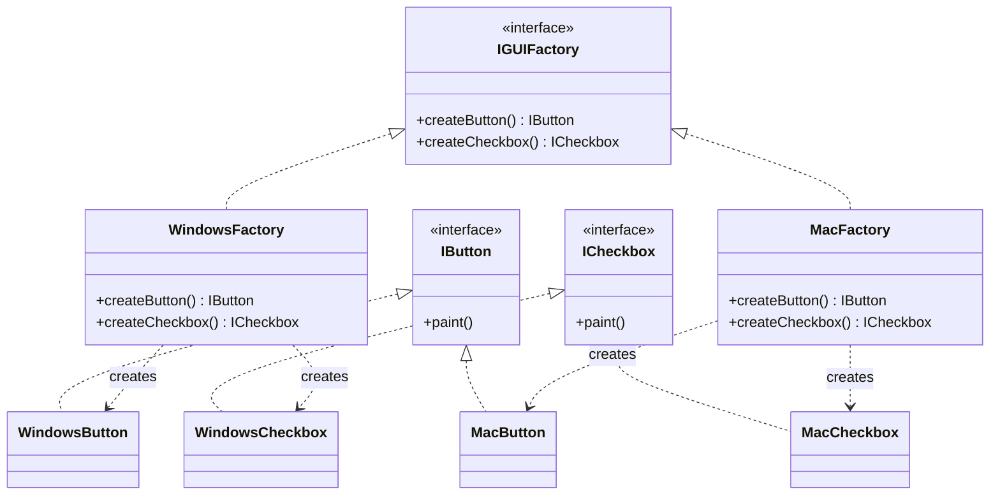
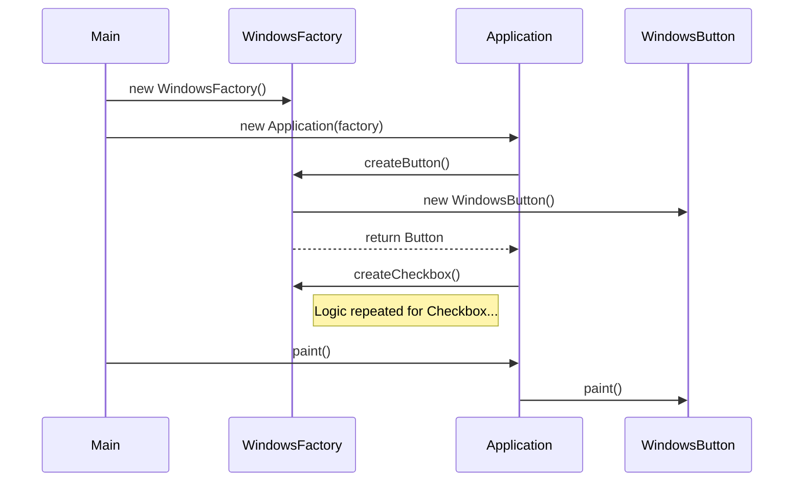

# 🏗️ Abstract Factory Design Pattern

## 📖 1. The Core Concept (The "Why")
The **Abstract Factory** pattern is a creational design pattern that allows you to produce **families of related objects** without specifying their concrete classes.

### ⚠️ The Problem: Suite of Related Products
As an application grows, you often need to create not just one object (like a Logger), but a **set of related objects** that must work together.
For example, a UI Toolkit might have:
- Buttons
- Checkboxes
- TextFields

If you are on **Windows**, you need the Windows versions of *all* three. If you are on **Mac**, you need the Mac versions of *all* three. Mixing a Windows Button with a Mac Checkbox would look terrible and might even crash the app.

### ✅ The Solution: Abstract Factory
Instead of having multiple Factory Methods scattered around, we define an **Abstract Factory Interface** (`IGUIFactory`) that has methods to create *each* product in the family:
- `createButton()`
- `createCheckbox()`

Then, we create **Concrete Factories** for each variant (`WindowsFactory`, `MacFactory`). Each factory ensures that all products it creates belong to the same family and are compatible.

---

## 📈 2. The Evolution (The Evolutionary Path)

To understand Abstract Factory, you must see the "Architectural Failure" of the previous steps:

### Stage 0: The Inconsistency Mess ([evolution/stage0](file:///e:/job-hunt/LLD/LLD-Design-Patterns-main/01-Creational/03-Abstract%20Factory%20Design%20Pattern/JAVA/evolution/stage0/))
A single factory trying to handle multiple products via string/enums.
- **Problem**: A developer can accidentally ask for a `Windows Button` and a `Mac Checkbox`. The compiler cannot stop this mismatch.
- **Result**: Broken / Inconsistent UI.

### Stage 1: The Factory Method Limitation ([evolution/stage1](file:///e:/job-hunt/LLD/LLD-Design-Patterns-main/01-Creational/03-Abstract%20Factory%20Design%20Pattern/JAVA/evolution/stage1/))
We have separate Factory Methods for each product.
- **Problem**: Each product is decoupled, but there is no **contract** ensuring they work together as a suite. The client must still remember to coordinate the factories.
- **Result**: High cognitive load on the developer to maintain consistency.

### Stage 2: The Abstract Factory (The Final Form)
We group related Factory Methods into a single **Factory Interface**.
- **The Win**: Consistency is enforced by the **Contract**. If you use `WindowsFactory`, it is mathematically impossible to get a `MacButton` from it.
- **Result**: Perfect "suite" consistency with zero effort from the client.

---

## 🏗️ 3. Architectural Blueprint

The pattern involves two Abstract hierarchies (Products) and one Factory hierarchy.



### ⚡ Runtime Sequence Analysis

How the components interact at runtime:



---

## 💻 3. Implementation Deep Dive (Java)

Our implementation is fully modularized to demonstrate professional enterprise standard:

-   **`abstract_factory/`**: Root package.
    -   **`products/`**: Contains interfaces (`IButton`, `ICheckbox`) and their OS-specific implementations.
    -   **`factories/`**: Contains the `IGUIFactory` interface and the OS-specific concrete factories.
    -   **`Application.java`**: The client class that is **fully decoupled** from concrete logic.
    -   **`Main.java`**: The entry point that injects the correct factory.

### Key Snippet: The Client Decoupling
```java
public class Application {
    private IButton button;
    private ICheckbox checkbox;

    // Dependency Injection of the Factory
    public Application(IGUIFactory factory) {
        this.button = factory.createButton();
        this.checkbox = factory.createCheckbox();
    }

    public void paint() {
        button.paint();
        checkbox.paint();
    }
}
```

### 💎 4. The Senior Edge: 10/10 Polish

For an SDE 2 role, simply knowing the pattern isn't enough. You must know how it scales in production:

#### 1. Dynamic Factory Loading (Ours: [DynamicMain.java](file:///e:/job-hunt/LLD/LLD-Design-Patterns-main/01-Creational/03-Abstract%20Factory%20Design%20Pattern/JAVA/abstract_factory/DynamicMain.java))
In a real system, you don't use `if/else` to pick a factory. You load the factory class name from a `.properties` file or Environment Variable and use **Reflection** to instantiate it. This makes the system **completely plug-and-play**.

#### 2. Unit Testing via Mock Factories (Ours: [MockTest.java](file:///e:/job-hunt/LLD/LLD-Design-Patterns-main/01-Creational/03-Abstract%20Factory%20Design%20Pattern/JAVA/abstract_factory/MockTest.java))
Abstract Factory allows you to test your business logic (`Application.java`) in total isolation. You can inject a `MockFactory` that returns fake products, allowing you to run tests in environments where real UI or real Databases don't exist.

---

## 🎭 5. Junior vs. Senior Implementation

| Feature | Junior Developer | Senior Developer |
|---|---|---|
| **Product Consistency** | Might accidentally mix `WindowsButton` with `MacCheckbox`. | Uses Abstract Factory to **enforce** that products from different families are never mixed. |
| **Encapsulation** | Concrete product classes are `public`. | Concrete products are often **package-private**, forcing the client to use the Factory. |
| **Single Responsibility** | Centralizes all creation logic in the Client. | Moves creation logic to Factories, keeping the Client focused on business logic. |
| **Scalability** | Adding a new Product family (e.g., Linux) requires changing the Client. | Adding a new family only requires a new Concrete Factory; the Client remains untouched. |

---

## 🏢 5. Real-World System Design

1.  **JDBC (Java Database Connectivity)**:
    Each database driver (MySQL, PostgreSQL, Oracle) is essentially a concrete factory. They all implement the same interfaces (`Connection`, `Statement`, `ResultSet`), ensuring that if you use a MySQL Connection, you get MySQL-compatible Statements.
2.  **Theme Engines**:
    Skins or themes in gaming or complex web apps. A `DarkThemeFactory` creates dark buttons, dark panels, and dark text, while a `LightThemeFactory` creates the light equivalents.
3.  **Cross-Platform OS APIs**:
    Frameworks like Qt or Electron use variations of this to provide uniform APIs that map to different underlying system calls.

---

## 🧠 6. FAANG Interview Q&A

**Q: What is the main difference between Factory Method and Abstract Factory?**
* **Factory Method**: Focuses on producing **one** type of product. It uses inheritance to let subclasses decide which product to instantiate.
* **Abstract Factory**: Focuses on producing **families** of related products. It uses composition (the Client contains a Factory object) and defines multiple methods for different products.

**Q: When should I NOT use Abstract Factory?**
* **A:** If you only have one product or if your products aren't actually "related." If adding a new product to the family requires changing the Factory interface (and thus all concrete factories), it's a sign of a "rigid" design. Abstract Factory is great for extending *families*, but hard for extending the *number of products* in those families.

---

## 🌍 7. Cross-Language: Abstract Factory

### 🐍 Python
In Python, we don't need interfaces. We can just pass the Factory class as a reference.
```python
class WindowsFactory:
    @staticmethod
    def create_button(): return WindowsButton()

def client_code(factory):
    btn = factory.create_button() # Works for any factory with this method
```

### 🟦 TypeScript
TypeScript's structural typing makes Abstract Factory very elegant. Any object that matches the `IGUIFactory` interface can be used.
```typescript
interface IGUIFactory {
    createButton(): IButton;
}
```

### 🐹 Go
Go uses interfaces and "constructor" functions.
```go
type GUIFactory interface {
    CreateButton() Button
}
```
