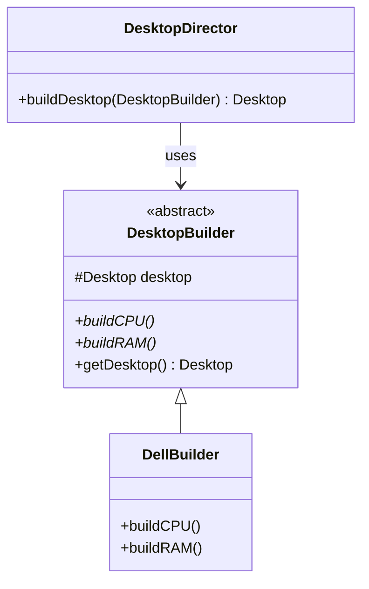

# 🏗️ Builder Design Pattern

## 📖 1. The Core Concept (The "Why")
The **Builder** pattern is a creational design pattern that lets you construct complex objects step by step. The pattern allows you to produce different types and representations of an object using the same construction code.

### ⚠️ The Problem: Constructor Hell
As objects become more complex, their constructors grow. 
1. **Telescoping Constructor**: You end up with 10 constructors where most parameters are `null`.
2. **JavaBeans (Setters)**: You use a default constructor and 10 setters, but the object is **mutable** and can be in an **inconsistent state** if a developer forgets a required field.

### ✅ The Solution: Builder
The Builder pattern provides a clean, readable way to set only the parameters you need, ensures **immutability** (final fields), and validates the object state before actually creating it.

---

## 📈 2. The Evolution (The Evolutionary Path)

### Stage 0: Telescoping Constructor ([evolution/Stage0Telescoping.java](file:///e:/job-hunt/LLD/LLD-Design-Patterns-main/01-Creational/04-Builder%20Design%20Pattern/JAVA/evolution/Stage0Telescoping.java))
Multiple constructors where each calls the next.
- **Problem**: Hard to read, easy to swap parameters of the same type (e.g., RAM vs Storage).
- **Result**: Maintenance nightmare.

### Stage 1: JavaBeans / Setters ([evolution/Stage1JavaBeans.java](file:///e:/job-hunt/LLD/LLD-Design-Patterns-main/01-Creational/04-Builder%20Design%20Pattern/JAVA/evolution/Stage1JavaBeans.java))
Using an empty constructor and then setters.
- **Problem**: The object is mutable. It can be modified after creation. It can also be used in a "half-baked" state.
- **Result**: Thread-safety risks and consistency issues.

### Stage 2: Modern Fluent Builder ([evolution/Stage2FluentBuilder.java](file:///e:/job-hunt/LLD/LLD-Design-Patterns-main/01-Creational/04-Builder%20Design%20Pattern/JAVA/evolution/Stage2FluentBuilder.java))
The "Industry Standard." A static inner class that builds the outer immutable object.
- **Problem**: None.
- **Result**: **Fluent API**, **Immutability**, and **Mandatory Field Validation**.

### Stage 3: The Director (Classical GoF) ([builder/Main.java](file:///e:/job-hunt/LLD/LLD-Design-Patterns-main/01-Creational/04-Builder%20Design%20Pattern/JAVA/builder/Main.java))
The classical approach where a **Director** class coordinates the builder.
- **Use Case**: When you have a fixed construction process but different representations (e.g., building a Dell vs building an HP Desktop).
- **Result**: High decoupling between construction logic and product details.

---

## 🏗️ 3. Architectural Blueprint

### Modern Fluent Builder
```mermaid
classDiagram
    class Computer {
        -CPU: String
        -RAM: String
        -Storage: String
        -GPU: String
        -Computer(Builder)
    }
    class Builder {
        -CPU: String
        -RAM: String
        -Storage: String
        -GPU: String
        +setCPU(String) Builder
        +setRAM(String) Builder
        +build() Computer
    }
    Computer +-- Builder : Static Inner Class
```

### Classical Director-based Builder


---

## 🎭 4. Junior vs. Senior Implementation

| Feature | Junior Developer | Senior Developer |
|---|---|---|
| **Immutability** | Uses public setters or public fields. | Makes fields **final** and private. Only the Builder can set them. |
| **Validation** | Checks for nulls everywhere in the business logic. | Performs all validation in the `.build()` method of the Builder. |
| **API Design** | Uses separate `builder.setA()`, `builder.setB()`. | Uses **Fluent API** (`return this`) for chaining. |
| **Director** | Hardcodes construction logic in `Main`. | Uses a **Director** when the construction algorithm is complex and reusable. |

---

## 🏢 5. Real-World System Design

1.  **Java `StringBuilder` / `StringBuffer`**:
    The most famous example. It builds a `String` (which is immutable) through a mutable buffer.
2.  **Lombok `@Builder`**:
    In modern Java production, we rarely write builders manually. We use the `@Builder` annotation from Lombok to auto-generate the Stage 2 code.
3.  **SQL Query Builders**:
    Libraries like jOOQ use fluent builders to construct complex SQL queries step-by-step while maintaining type safety.
4.  **Spring `UriComponentsBuilder`**:
    Used to build complex URLs fluently.

---

## 🧠 6. FAANG Interview Q&A

**Q: When should I use Builder instead of just a Constructor?**
* **A:** Rule of thumb: If there are more than 4 parameters, or if many parameters are optional, or if the object must be immutable.

**Q: Why make the Builder a Static Inner Class?**
* **A:** It allows the Builder to access the private constructor of the outer class, ensuring that the *only* way to create the object is through the Builder.

**Q: Builder vs Abstract Factory?**
* **A:** Builder focuses on the **step-by-step construction** of a *single* complex object. Abstract Factory focuses on creating **families** of *related* objects.
