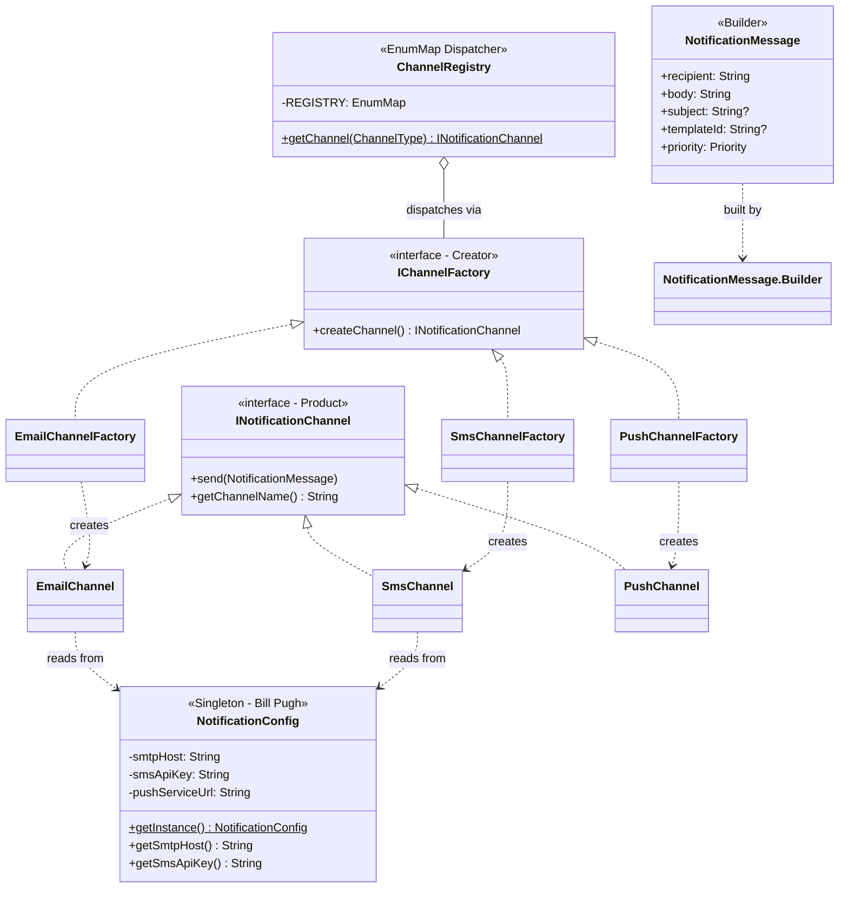

# 🔔 Combined Patterns Case Study: Notification System

> **Patterns Combined:** Singleton · Factory Method · Builder

---

## 🎯 1. The Problem Statement

You're building a notification system for an e-commerce platform. It must:
- Send **Email**, **SMS**, and **Push** notifications
- Messages can have optional fields: `subject`, `templateId`, `priority`, `correlationId`
- There is **one global config** (SMTP host, API keys) shared by all channels
- Adding a new channel (e.g., WhatsApp) must require **zero modification** to existing code

**The interview question:** *"Design a Notification System that is extensible, testable, and correctly handles object construction complexity."*

---

## 🧩 2. Which Pattern Solves Which Part

| Problem | Pattern | Justification |
|---|---|---|
| Global config (API keys, SMTP host) — loaded once | **Singleton** | Config is read-only after init. Cost is high (disk/network). Must be shared. |
| Picking Email vs SMS vs Push dynamically | **Factory Method** | OCP: adding WhatsApp = new class only, zero changes to existing code |
| Message has 6 fields, 4 are optional | **Builder** | Telescoping constructor anti-pattern avoided. Fluent, readable construction. |

---

## 🏗️ 3. Architecture



---

## 💻 4. Implementation Walk-Through

### Layer 1: Singleton — `NotificationConfig` (Bill Pugh)
```java
public final class NotificationConfig {
    private NotificationConfig() {
        this.smtpHost    = System.getenv("SMTP_HOST");  // Loaded ONCE
        this.smsApiKey   = System.getenv("SMS_API_KEY");
    }

    private static final class InstanceHolder {
        private static final NotificationConfig INSTANCE = new NotificationConfig();
    }

    public static NotificationConfig getInstance() {
        return InstanceHolder.INSTANCE;  // JVM guarantees single init
    }
}
```
**Why Bill Pugh here?** Config is complex to construct (env vars, validation). Double-checked locking would work too, but Bill Pugh has zero boilerplate and zero chance of the `volatile` bug.

---

### Layer 2: Builder — `NotificationMessage`
```java
NotificationMessage message = new NotificationMessage.Builder(
        "customer@example.com",         // required
        "Your order is confirmed!")     // required
    .subject("Order Confirmed ✅")      // optional
    .priority(Priority.NORMAL)          // optional
    .correlationId("ORD-9921")          // optional
    .build();
```
**Why Builder here?** 6 fields, 4 optional → Telescoping constructor would have 15 overloads. Builder gives a readable, safe, extensible construction API.

---

### Layer 3: Factory Method — `IChannelFactory` → `INotificationChannel`
```java
// Add WhatsApp: create two new files, touch ZERO existing code
public class WhatsAppChannelFactory implements IChannelFactory {
    @Override
    public INotificationChannel createChannel() {
        return new WhatsAppChannel();  // package-private constructor
    }
}

// Register in ChannelRegistry static block:
REGISTRY.put(ChannelType.WHATSAPP, new WhatsAppChannelFactory());
```
**Why Factory Method over Simple Factory?** Because channels have different initialization needs (Email reads SMTP config, SMS reads Twilio key, Push reads FCM URL). A single `switch` block mixes all of this together and violates SRP. Each factory is self-contained.

---

### Client Code — Clean and Decoupled
```java
// Client knows NOTHING about: EmailChannel class, NotificationConfig, SMTP setup
INotificationChannel channel = ChannelRegistry.getChannel(ChannelType.EMAIL);
channel.send(message);
```

---

## 🎭 5. Junior vs. Senior Comparison

| Concern | Junior Implementation | Senior Implementation |
|---|---|---|
| **Config access** | `new Config()` in every channel | `NotificationConfig.getInstance()` — shared, loaded once |
| **Channel selection** | `if (type == "email") return new EmailChannel()` in one class | Factory Method — each factory is isolated, OCP-compliant |
| **Message construction** | `new Message(to, body, subject, null, null, "NORMAL")` | Builder — self-documenting, impossible to mix up argument order |
| **Extensibility** | Modify existing classes for each new channel | Add two files (channel + factory). Touch nothing else. |
| **Testing** | Cannot mock config or channels | Inject mock `IChannelFactory` and mock `NotificationMessage` |

---

## 🧠 6. FAANG Interview Angles

**Q: "Why not just use a Simple Factory (`ChannelFactory.create("email")`) instead of Factory Method?"**
> Simple Factory centralizes all creation logic. When Email needs SMTP init and SMS needs Twilio auth and Push needs FCM URL, a single class becomes a massive SRP violation. Each Factory Method concrete creator is responsible for correctly initializing its own channel.

**Q: "The Singleton config is untestable — how do you handle testing?"**
> Two strategies:
> 1. Pass the config as a parameter to channel constructors (constructor injection), making channels testable without the Singleton
> 2. Use a DI framework (Spring `@Bean`) to manage the single instance, which allows swapping a test config easily
> The Singleton internal to channels is an architectural convenience for demos — production code should use DI

**Q: "What happens if you need to send via multiple channels simultaneously?"**
> Extend `ChannelRegistry.getChannels(ChannelType... types)` to return a `List<INotificationChannel>`. The client iterates and sends. The factory architecture handles this naturally because each factory is independent.

---

## 🚀 SDE-2+ Pragmatic Integration: The "Why" behind the "How"

In a production-grade system, patterns never live in isolation. This **Notification System** is a classic SDE-2 level problem because it requires you to balance flexibility, scalability, and clean configuration.

### 🏗️ Architectural Synergy
| Pattern | Role in this System | Senior Benefit |
| :--- | :--- | :--- |
| **Singleton** | `NotificationConfig` | Ensures we don't re-read expensive `.properties` or `.env` files 100 times per second. |
| **Builder** | `NotificationMessage` | Solves the "Constructor Hell" of notifications that might have optional fields (Subject, TemplateID, CorrelationID). |
| **Factory Method** | `ChannelRegistry` | Decouples the core logic from the specific transport (SMS, Email, Push). Adding a new 'Slack' channel requires zero changes to the `Main` logic. |

---

## 🌍 The Polyglot Perspective (Node/TS vs. Golang vs. Java)

### 🟢 Node/TS: The "Dynamic" Approach
In a Node production environment handling 10k users:
*   **Singleton:** Simply `export const config = loadConfig()`. Node caches the module automatically.
*   **Builder:** Often replaced by **Partial Objects** or **Interface-based config objects**. `sendNotification({ to: '...', body: '...', subject: '...' })`.
*   **Factory:** A simple object map: `const channels = { SMS: new SmsChannel(), EMAIL: new EmailChannel() };`.

### 🔵 Golang: The "Composition" Approach
In a Go-based microservice:
*   **Singleton:** `sync.Once` to initialize the global config.
*   **Builder:** **Functional Options Pattern**. `NewNotification(To("..."), Subject("..."))`.
*   **Factory:** A function returning the `NotificationChannel` interface.

---

## 🎓 Interview Tips: Creating "Strong Hire" Impact

### 1. "The Decoupling Argument"
*   **What to say:** *"By using a **Factory Method** for the notification channels, I've ensured that my business logic is 100% decoupled from the delivery infrastructure. If tomorrow we switch from Twilio (SMS) to AWS SNS, I only change one line in the Factory—the rest of the 50,000-line application remains untouched."*

### 2. "Configuration as a Singleton"
*   **What to say:** *"Loading configuration is an **I/O bound operation**. By making it a **Singleton**, I've ensured that we only hit the disk/env once. In a high-traffic system (10k+ concurrent users), this prevents unnecessary latency and resource contention."*

### 3. "Message Consistency via Builder"
*   **What to say:** *"Notifications are inherently 'messy'—some have subjects, some don't; some have template IDs, some are raw text. The **Builder Pattern** ensures that we only create a 'Valid' message. I perform mandatory field checks in the `.build()` method to ensure we never send an empty SMS to a customer."*

### 4. "Scaling the System"
*   **What to say:** *"To handle **10k concurrent users**, I would wrap this Factory-produced channel in an **Async Queue (RabbitMQ/Kafka)**. The Factory creates the 'Sender', but the queue ensures we don't overwhelm the downstream API (like SendGrid or Twilio) with bursts of traffic."*

---

## ✅ SDE-2+ Readiness Check
*   [ ] Can you explain why we used a Singleton for Config? (I/O performance).
*   [ ] Can you explain the difference between this and just using a big `switch` statement? (OCP and Decoupling).
*   [ ] How would you add a new 'WhatsApp' channel? (Add class + register in Factory; no change to Main).

---

## 🔗 7. Pattern Cross-References

| Pattern | Individual Module | This Case Study |
|---|---|---|
| **Singleton** | [`01-Singleton`](../../01-Singleton Design Pattern/README.md) | `NotificationConfig` |
| **Factory Method** | [`02-Factory Method`](../../02-Factory Method Design Pattern/README.md) | `IChannelFactory` hierarchy |
| **Builder** | [`04-Builder`](../../04-Builder Design Pattern/README.md) | `NotificationMessage.Builder` |
