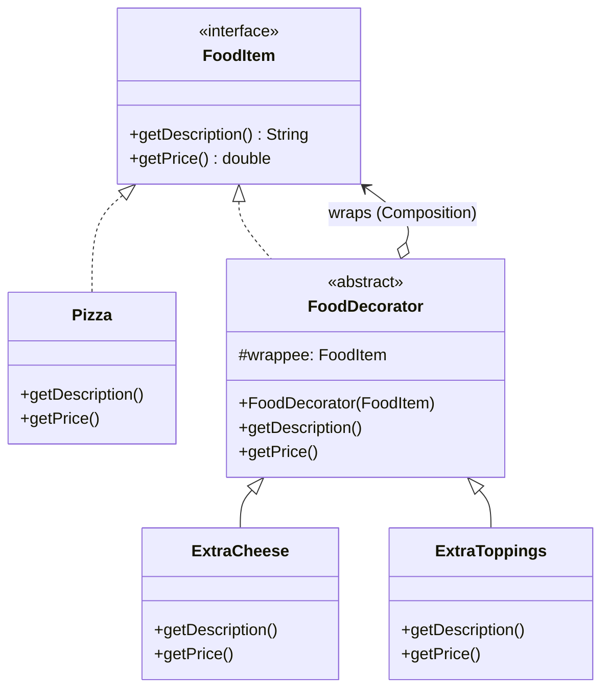

# 🌟 Decorator Design Pattern

## 📖 1. The Core Concept (The "Why")
The **Decorator** is a structural design pattern that lets you dynamically attach new behaviors to objects by placing these objects inside special wrapper objects that contain the behaviors.

Think of buying coffee. You start with a base `Coffee` object. You want to add milk? You put the coffee inside a `MilkDecorator`. Want caramel? You put that whole thing inside a `CaramelDecorator`. The final object is still treated as `Coffee`, but its cost and description have been "decorated" along the way.

### ⚠️ The Problem
When you need to add responsibilities to classes, the standard OOP answer is **Inheritance**. But inheritance is static (determined at compile-time) and leads to the infamous "Class Explosion". 
If you have a `Pizza` base class, and you create `CheesePizza`, `VeggiePizza`, and `CheeseAndVeggiePizza` subclasses, what happens when you introduce 10 more toppings? You end up with 1,000s of subclasses covering every possible combination. 

### ✅ The Solution
Use **Composition** instead of Inheritance. A Decorator implements the exact same interface as the object it's wrapping. When the client calls a method on the Decorator, the Decorator delegates the work to the wrapped object, and then alters the result (adds behavior/state) before returning it to the client.

Because Decorators implement the same interface, you can stack them infinitely at runtime!

---

## 🏗️ 2. Architectural Blueprint


*Key Insight: `FoodDecorator` both implements `FoodItem` AND contains a `FoodItem`. This recursive wrapping enables the pattern.*

---

## 💻 3. Implementation Deep Dive (Java)

Our implementation is a Food Delivery (Swiggy/Zomato) order system.

### Stage 1: The Base Components
```java
public interface FoodItem {
    String getDescription();
    double getPrice();
}

public class Pizza implements FoodItem { ... } // Base = 200 rs
```

### Stage 2: The Abstract Decorator
```java
public abstract class FoodDecorator implements FoodItem {
    protected final FoodItem wrappee; // Holds the object being decorated

    public FoodDecorator(FoodItem wrappee) {
        this.wrappee = wrappee;
    }
    
    // Default delegation
    public double getPrice() { return wrappee.getPrice(); } 
}
```

### Stage 3: The Concrete Decorators
```java
public class ExtraCheese extends FoodDecorator {
    public ExtraCheese(FoodItem item) { super(item); }

    @Override
    public double getPrice() {
        // Decorate the result!
        return super.getPrice() + 20.0; 
    }
}
```

### Stage 4: Stacking them
```java
FoodItem pizza = new Pizza();
pizza = new ExtraCheese(pizza);
pizza = new ExtraCheese(pizza); // Double cheese!
pizza = new ExtraToppings(pizza);
// pizza is STILL just a FoodItem to the client
```

---

## 🎭 4. Junior vs. Senior Implementation

| Concern | Junior Developer | Senior Developer |
|---|---|---|
| **Class Hierarchy** | Creates `CheesePizza`, `OlivePizza`, `DoubleCheeseOlivePizza` classes. (Class Explosion). | Creates one `Pizza`, one `CheeseDecorator`, one `OliveDecorator`. Composes them at runtime. |
| **Object Type** | Relies on the exact concrete type (`ExtraCheese pizza = ...`). | Uses the highest interface `FoodItem`. The client is unaware it's dealing with decorators. |
| **Decorator Base Class** | Skips the abstract `FoodDecorator` and makes concrete decorators wrap the component directly (bad code duplication). | Implements the abstract `FoodDecorator` to handle the boring delegation, so concrete decorators only implement the *diff*. |

---

## 🏢 5. Real-World System Design

1. **Java I/O Streams**: The most famous usage. `new BufferedReader(new InputStreamReader(new FileInputStream("data.txt")))`. `BufferedReader` is a Decorator adding caching behavior over an `InputStreamReader`, which decorates a `FileInputStream`.
2. **HTTP Request middleware**: Adding authentication headers, logging, or gzip compression to an HTTP Request. Each middleware layer acts as a decorator, modifying the request before passing it to the next layer.
3. **UI Toolkits**: Adding a `ScrollbarDecorator` or `BorderDecorator` around a base `TextBox` UI component.

---

## 🧠 6. FAANG Interview Q&A

**Q: What is the downside of the Decorator pattern?**
> **A:** It can result in a massive number of small wrapper classes (e.g., look at `java.io`). It can also make debugging harder because the actual execution jumps through 5 layers of wrappers before hitting the core base class.

**Q: If I need to change behavior at runtime, should I use Strategy or Decorator?**
> **A:** Use **Strategy** when you want to completely swap out the *guts* of an algorithm (e.g., swapping QuickSort for MergeSort). Use **Decorator** when you want to keep the base algorithm but wrap it in a *skin* that adds a pre-step or post-step (e.g., adding logging before sorting).

**Q: Can you remove a decorator at runtime?**
> **A:** Technically yes, if you keep references to the specific layers, but practically it's very difficult. Decorators are meant to be built up like an onion. If you need to peel layers off frequently, a List of interceptors/filters (Chain of Responsibility) is usually a better pattern.

---

## 🚀 SDE-2+ Pragmatic Perspective: The "Middleware" Pattern

In a senior-level system, the **Decorator Pattern** is the object-oriented implementation of **Middleware**.
*   **The Problem:** Cross-cutting concerns (Auth, Logging, Caching, Encryption) often clutter business logic. If you use inheritance to add these, you end up with a "Class Explosion" (e.g., `CachedAuthLoggedService`).
*   **The Solution:** Decorator allows you to "wrap" your business logic in layers of infrastructure logic at runtime.

### 🏗️ Why it matters for Scaling (10k+ Concurrency)
In your experience as a Founding Engineer:
1.  **On-the-fly Features:** You can enable or disable features like **Request Logging** or **Response Caching** globally or for specific users by simply wrapping (or not wrapping) the service.
2.  **Plugin Architecture:** Decorators are perfect for adding logic to **Closed Classes** (e.g., classes from an external library). You can't change their code, but you can wrap them.
3.  **Circuit Breaking:** You can implement a `CircuitBreakerDecorator` that wraps a 3rd party SDK call to handle failures gracefully.

---

## 🎓 Interview Tips: Creating "Strong Hire" Impact

### 1. "Composition over Inheritance"
*   **What to say:** *"Decorator is the ultimate proof of why **Composition is better than Inheritance**. It prevents rigid class hierarchies and allows for 'Dynamic Subclassing' where behaviors are mixed and matched at runtime."*

### 2. "Decorator vs. Proxy"
*   **What to say:** *"A **Proxy** usually manages the lifecycle of the object (Lazy loading, Access control). A **Decorator** adds new functionality to an existing object. Proxy has a 'Manager' role; Decorator has an 'Enhancer' role."*

### 3. "Java I/O Streams"
*   **What to say:** *"The classic example of the Decorator pattern is the **Java `java.io` package**. When I do `new BufferedReader(new InputStreamReader(System.in))`, I am using the Decorator pattern to add buffering and character-reading capabilities to a raw byte stream."*

---

## ⚠️ Edge Cases & Pitfalls
*   **Order Matters:** The order of decorators matters! `Auth(Logged(Service))` is different from `Logged(Auth(Service))`. If logging happens before auth, you might log unauthenticated requests.
*   **Interface Bloat:** Decorator only works well if the Component interface is **Lean**. If the interface has 50 methods, you have to delegate all 50 in your base decorator, which is massive boilerplate.

---

## ✅ SDE-2+ Readiness Check
*   [ ] Can you explain why Decorator solves the "Class Explosion" problem?
*   [ ] What is the difference between a Decorator and a Proxy?
*   [ ] How does the order of wrapping affect the system's behavior?

---

## 🌍 7. Cross-Language: Decorator

### 🐍 Python
Python has built-in syntax (`@decorator`) for the design pattern! Fun fact: Python decorators decorate *functions* or *classes*, essentially wrapping the function call in a higher-order function.
```python
def make_bold(func):
    def wrapper():
        return "<b>" + func() + "</b>"
    return wrapper

@make_bold
def get_hello():
    return "hello"
```

### 🟦 TypeScript
TypeScript also supports `@ decorators` natively (experimental decorators, common in Angular/NestJS) for class/method wrapping. Traditional OOP decorators are built exactly like Java.
```typescript
class ExtraCheese implements FoodItem {
    constructor(private wrappee: FoodItem) {}
    getPrice(): number { return this.wrappee.getPrice() + 20; }
}
```
