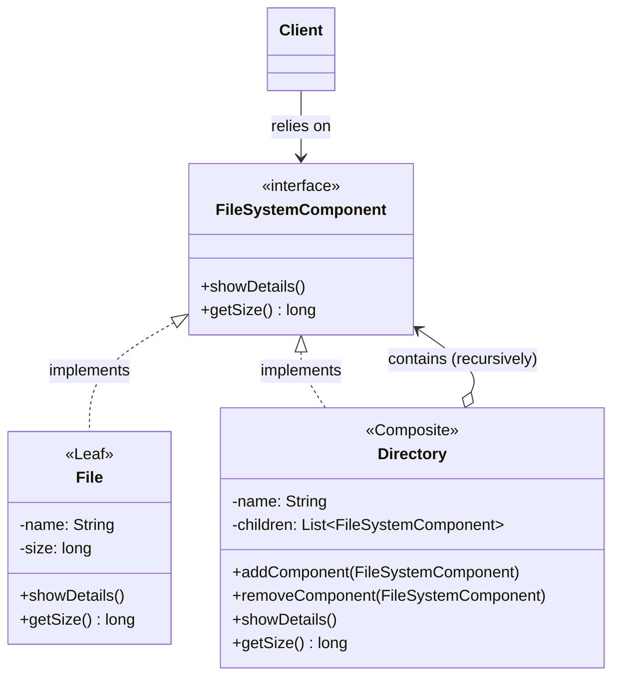

# 🌳 Composite Design Pattern

## 📖 1. The Core Concept (The "Why")
The **Composite** is a structural design pattern that lets you compose objects into tree structures and then work with these structures as if they were individual objects.

Imagine a UI application where you can group `Shape` objects. You can select a single `Circle` and call `color("red")`. Or, you can group a `Circle` and a `Square` into a `Group`. The magic happens when you select the `Group` and call `color("red")`—the group automatically delegates the coloring down to the circle and the square. From the user's perspective, they treated the Group exactly the same as a single Shape.

### ⚠️ The Problem
If your core model can be represented as a tree (e.g., File Systems, Organization Charts, UI component trees), your client code becomes cluttered with `instanceof` checks.
The client has to write: "If this is a leaf, calculate its size. If this is a branch, loop through its contents, see if they are leaves or branches, loop through them...". This hardcodes the tree traversal logic directly into the client.

### ✅ The Solution
The Composite pattern declares a common interface (the **Component**) for both the basic elements (**Leaves**) and the complex containers (**Composites**).
When the client calls a method on the Component interface, the leaves simply execute the method. The Composites automatically recursively delegate the call down their tree and aggregate the results. The client is blissfully unaware whether it's talking to a single leaf or an entire forest.

---

## 🏗️ 2. Architectural Blueprint


*Notice how Directory implements the interface AND contains a list of that exact same interface. This recursive composition is the heart of the pattern.*

---

## 💻 3. Implementation Deep Dive (Java)

Our implementation models a File System where directories can hold files or other directories.

### Stage 1: The Base Component Interface
```java
public interface FileSystemComponent {
    long getSize(); // The operation the client cares about
}
```

### Stage 2: The Leaf (Does the actual work)
```java
public class File implements FileSystemComponent {
    private final long sizeBytes;

    public long getSize() {
        return sizeBytes; // End of the recursive chain
    }
}
```

### Stage 3: The Composite (Delegates and Aggregates)
```java
public class Directory implements FileSystemComponent {
    // Holds the interface, not concrete Files!
    private final List<FileSystemComponent> children = new ArrayList<>();

    public void addComponent(FileSystemComponent component) {
        children.add(component);
    }

    public long getSize() {
        long total = 0;
        for (FileSystemComponent child : children) {
            // Recursive delegation!
            total += child.getSize(); 
        }
        return total;
    }
}
```

---

## 🎭 4. Junior vs. Senior Implementation

| Concern | Junior Developer | Senior Developer |
|---|---|---|
| **Client Traversal** | Client writes recursive functions and loops over `instanceof Directory` checks to add up folder sizes. | Client just calls `root.getSize()`. The Composite handles its own recursion implicitly through polymorphism. |
| **Interface Design** | Puts `addChild()` and `removeChild()` in the base interface, forcing Leaf nodes to implement empty/throwing methods. | Keeps tree-management methods strictly in the Composite class (Type-Safety priority), OR puts them in the base interface to prioritize absolute Transparency, but documents the trade-off. |
| **Coupling** | The Directory class holds a List of `File` objects and another List of `Directory` objects. | The Directory class holds a single List of `FileSystemComponent`. |

---

## 🏢 5. Real-World System Design

1. **UI Frameworks (DOM / React / Swing)**: The classic example. An HTML `<div>` is a composite. A `<p>` is a leaf. Calling `render()` on the DOM root recursively renders every node on the page.
2. **Organization Charts**: A `Company` has `Departments` which have `Teams` which have `Employees`. Calling `calculateBudget()` cascades down the entire org chart.
3. **Regex / Abstract Syntax Trees (AST)**: Parsers convert code into an AST. An expression like `(A + B) * C` is a composite tree. Evaluating the root node recursively evaluates the sub-expressions.

---

## 🧠 6. FAANG Interview Q&A

**Q: Should `add()` and `remove()` be in the Component interface or just in the Composite class?**
> **A:** This is the great Composite trade-off.
> - **Transparency (GoF standard):** Put them in the interface. Client treats everything identically. Bad part: Leaf nodes have to throw an `UnsupportedOperationException` if `add()` is called on them.
> - **Safety (Modern preference):** Put them only in the Composite class. Client knows it's a Directory if it needs to add files. Good part: No runtime exceptions. Bad part: You lose a bit of pure interface transparency.

**Q: What is the difference between Composite and Decorator?**
> **A:** Structurally they both rely on recursive composition. However, **Decorator** usually only wraps exactly *one* component to add behaviors. **Composite** aggregates *multiple* components to sum up/process their results. (Decorator = 1:1, Composite = 1:N).

**Q: Does Composite break the Single Responsibility Principle?**
> **A:** Arguably, yes. The `Directory` handles its core domain logic (`getSize()`) AND it handles tree-management logic (`add/remove`). However, in Design Patterns, sometimes architectural elegance (like client transparency) overrides strict, pedantic adherence to SOLID rules.

---

## 🚀 SDE-2+ Pragmatic Perspective: The "Recursive Uniformity"

The **Composite Pattern** is your tool for managing **Hierarchies**.
*   **The Core Rule:** Treat individual objects (Leaves) and compositions of objects (Composites) identically.
*   **The Senior Insight:** It’s all about **Recursion**. A Composite's method usually iterates over its children and calls the same method on them.

### 🏗️ Why it matters for Scaling (10k+ Concurrency)
In your experience as a Founding Engineer:
1.  **Complexity Shielding:** When building a complex UI (like a Dashboard with 50 widgets), the Composite pattern allows the renderer to just call `.render()` on the root. It doesn't need to know if a widget is a single Button or a complex Graph containing 10 other components.
2.  **Flexible Business Rules:** In a 10k user system, you might have complex **Pricing Rules** (Individual discounts vs. Bundle discounts). Composite allows you to calculate the final price by recursively traversing the order tree.

---

## 🎓 Interview Tips: Creating "Strong Hire" Impact

### 1. "Uniformity vs. Safety"
*   **What to say:** *"There is a trade-off in Composite design. If I put `add()` and `remove()` in the **Component interface**, I have **Uniformity** (client can call add on anything) but low **Safety** (calling add on a Leaf will throw an error). If I only put them in the **Composite class**, I have high safety but lose uniformity."*

### 2. "The Fat Interface Smell"
*   **What to say:** *"I avoid 'Fat Interfaces' in Composite patterns. If a Leaf (like a File) is forced to implement `add()` or `getChild()`, it violates the **Interface Segregation Principle**. I prefer keeping management methods specific to the Composite nodes when possible."*

### 3. "Caching the Aggregate"
*   **What to say:** *"In a high-performance system, recursively calculating values (like `getSize()` of a 1 million file directory) is slow. I use **Memoization (Caching)** inside the Composite nodes to store the aggregate result, invalidating it only when a child is added or removed."*

---

## ⚠️ Edge Cases & Pitfalls
*   **Cyclic References:** Be careful! If A contains B and B contains A, your recursive call will result in a **StackOverflowError**.
*   **Depth Limits:** For extremely deep trees, recursion can hit memory limits. Senior engineers sometimes use **Iterative Traversal** (using a Stack) instead of raw recursion.

---

## ✅ SDE-2+ Readiness Check
*   [ ] Can you explain the difference between the "Uniformity" and "Safety" approaches to Composite?
*   [ ] How do you prevent infinite loops in a Composite tree?
*   [ ] Why is the Composite pattern essential for building a DOM tree or a File System?

---

## 🌍 7. Cross-Language: Composite

### 🐍 Python
Python's dynamic typing makes Composite very clean. You don't even need a formal interface, just duck-typing (ensure both objects have a `get_size()` method).
```python
class Directory:
    def __init__(self):
        self.children = []
    
    def get_size(self):
        # List comprehension hitting the polymorphic method
        return sum(child.get_size() for child in self.children)
```

### 🐹 Go
Go leverages structural typing (Interfaces).
```go
type Component interface {
    GetSize() int
}

type Directory struct {
    children []Component // Slice of interfaces
}

func (d *Directory) GetSize() int {
    total := 0
    for _, child := range d.children {
        total += child.GetSize()
    }
    return total
}
```
