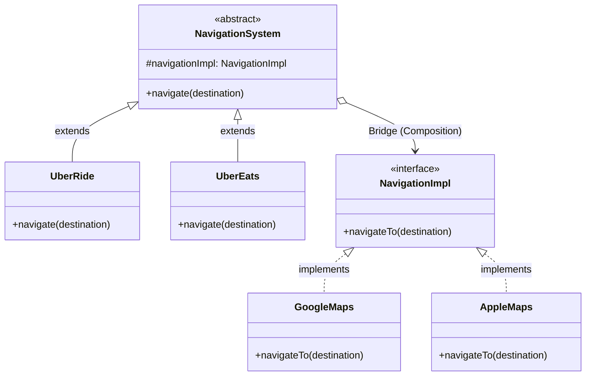

# 🌉 Bridge Design Pattern

## 📖 1. The Core Concept (The "Why")
The **Bridge** is a structural design pattern that lets you split a large class or a set of closely related classes into two separate hierarchies—**Abstraction** and **Implementation**—which can be developed independently of each other.

Imagine purchasing a remote control (`Abstraction`) for a TV (`Implementation`). You don't want to buy a specific `SonyRemote` and a `SamsungRemote`. You want a universal `RemoteControl` that holds a pluggable reference to a `Device` interface. 

### ⚠️ The Problem
When you rely strictly on inheritance to extend functionality across two independent dimensions, you encounter the **Cartesian Product Class Explosion**. 
Suppose you are building an Uber app. You have two services: `UberRide` and `UberEats`. You also have two mapping engines: `GoogleMaps` and `AppleMaps`. 
If you use inheritance, you must create:
- `UberRideGoogleMaps`
- `UberRideAppleMaps`
- `UberEatsGoogleMaps`
- `UberEatsAppleMaps`

Adding a third service (like `UberFreight`) and a third map (like `Waze`) explodes this into **3 × 3 = 9 classes**. 

### ✅ The Solution
Separate the dimensions into two separate class hierarchies.
1. Create a `NavigationSystem` hierarchy (The Abstraction: Ride, Eats, Freight).
2. Create a `NavigationImpl` hierarchy (The Implementation: Google, Apple, Waze).
3. The Abstraction holds a reference (a *bridge*) to the Implementation interface.

Now, adding `Waze` requires creating exactly *one* new class. (3 + 3 = 6 classes instead of 9).

---

## 🏗️ 2. Architectural Blueprint



---

## 💻 3. Implementation Deep Dive (Java)

### Stage 1: The Implementation Hierarchy (The Engine)
These contain the primitive, low-level logic.
```java
public interface NavigationImpl {
    void navigateTo(String destination);
}

public class GoogleMaps implements NavigationImpl { ... }
public class AppleMaps implements NavigationImpl { ... }
```

### Stage 2: The Abstraction Hierarchy (The UI/Client API)
The abstraction delegates the actual heavy lifting to the implementation object it was passed.
```java
public abstract class NavigationSystem {
    protected NavigationImpl navigationImpl; // The Bridge!
    
    public NavigationSystem(NavigationImpl impl) { this.navigationImpl = impl; }
    public abstract void navigate(String destination);
}

public class UberRide extends NavigationSystem {
    public void navigate(String destination) {
        System.out.println("Processing Ride payment...");
        navigationImpl.navigateTo(destination); // Delegation
    }
}
```

### Stage 3: The Client
```java
NavigationImpl engine = new GoogleMaps();
NavigationSystem ride = new UberRide(engine, "John Doe");
ride.navigate("Airport"); 
```

---

## 🎭 4. Junior vs. Senior Implementation

| Concern | Junior Developer | Senior Developer |
|---|---|---|
| **Scaling Dimensions** | Uses inheritance for multiple orthogonal traits. Creates `class RedCircle`, `class BlueCircle`, `class RedSquare`, etc. | Uses the Bridge pattern to separate `Shape` from `Color`. `Shape` holds a reference to a `Color` object. |
| **Runtime Flexibility** | The implementation is permanently hardcoded at compile-time into the subclass. | Because it uses composition, the Senior dev can swap the `NavigationImpl` engine from Google to Apple at runtime dynamically. |

---

## 🏢 5. Real-World System Design

1. **JDBC (Java Database Connectivity)**: The most famous Bridge. The `java.sql.Connection` and `Statement` interfaces represent the **Abstraction**. The database vendors (MySQL, PostgreSQL) provide the **Implementation** drivers. Your Java code stays exactly the same; you just swap the driver JAR to bridge to a new database.
2. **Cross-Platform UI Frameworks**: A `Button` class in Java (Abstraction) bridges to a specific `WindowsButtonPeer` or `MacButtonPeer` (Implementation) under the hood to render the native OS graphics.
3. **Loggers**: An application-level `Logger` facade (Abstraction) bridging to `Log4J`, `SLF4J`, or `Logback` (Implementations).

---

## 🧠 6. FAANG Interview Q&A

**Q: What is the difference between Bridge and Strategy? They both use composition and look identical!**
> **A:** This is a classic "Intent vs Structure" question. 
> - **Strategy** is a *behavioral* pattern meant to swap out an algorithm at runtime (e.g., swapping a sorting algorithm). The context class remains the same.
> - **Bridge** is a *structural* pattern meant to decouple an interface from its implementation so that **BOTH** hierarchies can evolve independently (e.g., adding new Types of Rides AND new Types of Maps). 

**Q: What is the difference between Bridge and Adapter?**
> **A:** **Adapter** is commonly applied to *existing code* to make two incompatible systems work together. **Bridge** is usually applied *up-front* in the architecture design phase to prevent two systems from becoming tightly coupled in the first place.

---

## 🚀 SDE-2+ Pragmatic Perspective: The "Cartesian Killer"

The **Bridge Pattern** is about **Decoupling Abstraction from Implementation**.
*   **The Problem:** Inheritance creates a "Cartesian Product" of classes. If you have `N` types of notifications and `M` delivery platforms, inheritance requires `N * M` classes.
*   **The Solution:** Bridge reduces this to `N + M` classes by using composition.

### 🏗️ Why it matters for Scaling (10k+ Concurrency)
In your experience as a Founding Engineer:
1.  **Platform Agnostic Logic:** When scaling a system to 10k users, you might need to support multiple cloud providers (AWS, Azure, GCP) or multiple DB engines. Bridge allows your core logic (`Abstraction`) to remain stable while the infrastructure (`Implementation`) can be swapped or added to without a "Class Explosion."
2.  **Runtime Switching:** Since the Bridge uses composition, you can switch the implementation at **runtime**. For example, if the SMS gateway is slow, the system can dynamically switch to Email delivery for non-critical alerts.

---

## 🎓 Interview Tips: Creating "Strong Hire" Impact

### 1. "Abstraction vs. Implementation"
*   **What to say:** *"In the Bridge pattern, **Abstraction** is the high-level control layer (the 'What'), and **Implementation** is the low-level platform layer (the 'How'). We bridge them using a reference so they can evolve on different axes of change."*

### 2. "Bridge vs. Adapter"
*   **What to say:** *"This is a classic senior question. **Adapter** makes two *existing* incompatible interfaces work together (Reactive). **Bridge** is a design-time decision to *separate* an interface from its implementations so they can be developed independently (Proactive)."*

### 3. "The Class Explosion Argument"
*   **What to say:** *"I use the Bridge pattern specifically to avoid **Class Explosion**. Whenever I see a hierarchy where subclasses are being multiplied by multiple dimensions (e.g., `WindowsButton`, `MacButton`, `LinuxButton`), I refactor to a Bridge."*

---

## ⚠️ Edge Cases & Pitfalls
*   **Double Indirection:** Bridge adds an extra layer of method calls, which can slightly impact performance in ultra-low-latency systems.
*   **Complexity:** For simple systems with only one implementation, Bridge is **Over-Engineering**. Use it only when multiple dimensions of change are proven.

---

## ✅ SDE-2+ Readiness Check
*   [ ] Can you explain the "Cartesian Product" problem in inheritance?
*   [ ] What is the difference between an Abstraction and an Implementation in the context of Bridge?
*   [ ] Why is the Bridge pattern considered a "Proactive" design decision?

---

## 🌍 7. Cross-Language: Bridge

### 🟦 TypeScript
TypeScript's strict interfaces make the Bridge pattern shine cleanly. 
```typescript
interface Color { fill(): string; }
class Red implements Color { fill() { return "Red"; } }

abstract class Shape {
    constructor(protected color: Color) {} // The Bridge
    abstract draw(): void;
}

class Circle extends Shape {
    draw() { console.log(`Drawing a ${this.color.fill()} Circle`); }
}
```

### 🐹 Go
Go natively rejects inheritance, so the Bridge is implemented purely through embedded iterfaces (Composition).
```go
// Implementation
type Renderer interface {
    RenderCircle(radius float32)
}

// Abstraction
type Shape interface {
    Draw()
}

// Concrete Abstraction holding the Bridge
type Circle struct {
    renderer Renderer
    radius   float32
}

func (c *Circle) Draw() {
    c.renderer.RenderCircle(c.radius)
}
```
