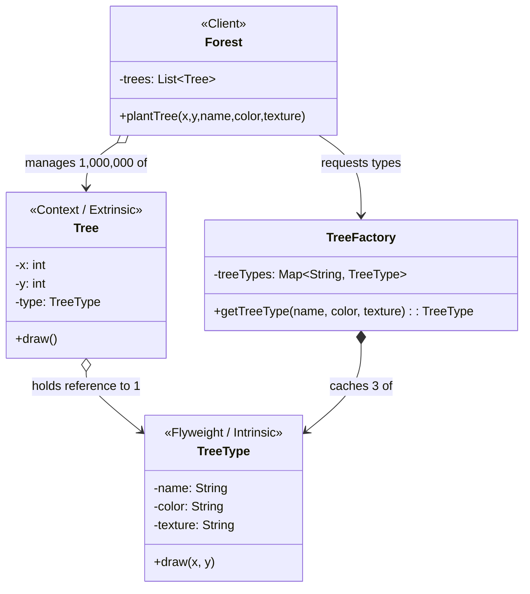

# 🪶 Flyweight Design Pattern

## 📖 1. The Core Concept (The "Why")
The **Flyweight** is a structural design pattern that allows programs to support vast quantities of objects by keeping their memory consumption low. It achieves this by sharing common parts of the state between multiple objects instead of keeping all the data in each object.

### ⚠️ The Problem
Imagine you are building a video game or a text editor. 
- In a game, you might render an entire forest with **1,000,000 trees**. Each `Tree` object contains an X,Y coordinate, but also a 1MB high-resolution texture. 1,000,000 trees × 1MB = **1 Terabyte of RAM**. Your game crashes immediately.
- In a text editor, a document might have **100,000 characters**. If every `Character` object stores its font family, font size, color, bold status, and binary glyph data, the application will consume gigabytes of memory just to open a text file.

### ✅ The Solution
The Flyweight pattern splits the object's state into two parts:
1. **Intrinsic State:** The data that is constant, shared, and immutable (e.g., the 1MB Tree texture, or the biological species of the tree). We extract this into a single shared object called a **Flyweight**.
2. **Extrinsic State:** The data that is unique and changes based on context (e.g., the X,Y coordinates of the tree). This is passed to the Flyweight from the outside when needed.

We create a **Flyweight Factory** to cache and return the shared intrinsic objects. Now, instead of 1,000,000 1MB trees, we have **3 Flyweight TreeTypes (3MB total)**, and 1,000,000 tiny Context objects that just hold references to the Flyweight and X,Y coords. 1 TB becomes ~30 MB.

---

## 🏗️ 2. Architectural Blueprint



---

## 💻 3. Implementation Deep Dive (Java)

Our Java implementation mimics the Game Forest scenario.

### Stage 1: The Flyweight (Intrinsic State)
Contains the heavy data. Is totally immutable. Does *not* store X and Y!
```java
public class TreeType {
    private final String heavyTexture; // 1MB 
    
    // The Extrinsic state is passed via method parameters!
    public void draw(int x, int y) { ... }
}
```

### Stage 2: The Flyweight Factory
Guarantees we never create duplicate Flyweights.
```java
public class TreeFactory {
    private static Map<String, TreeType> cache = new HashMap<>();

    public static TreeType getTreeType(String name) {
        if (!cache.containsKey(name)) {
            cache.put(name, new TreeType(name));
        }
        return cache.get(name);
    }
}
```

### Stage 3: The Context (Extrinsic State)
Extremely lightweight. Contains only highly volatile coordinates and a pointer to the Flyweight.
```java
public class Tree {
    private int x, y;
    private TreeType type;

    public void draw() {
        type.draw(x, y); // Passes extrinsic to intrinsic
    }
}
```

---

## 🎭 4. Junior vs. Senior Implementation

| Concern | Junior Developer | Senior Developer |
|---|---|---|
| **RAM Usage** | Combines X/Y coords and heavy textures into a single `Tree` class. App crashes out of memory at scale. | Splits object into Context and Flyweight. Supports millions of instances gracefully. |
| **Immutability** | Provides setter methods to the cached object (e.g., `treeType.setColor()`), which accidentally changes the color for *every* tree sharing it. | Ensures the Intrinsic Flyweight class is strictly `final` and absolutely **immutable**. |

---

## 🏢 5. Real-World System Design

1. **Java String Pool**: The absolute most famous example. `String a = "hello"; String b = "hello";` Both point to the exact same memory address. The JVM caches string literals using the Flyweight pattern to prevent RAM exhaustion.
2. **Java `Integer.valueOf(int)`**: Java caches Integers between -128 and 127. If you call `Integer.valueOf(5)` ten times, you get the exact same object reference back ten times.
3. **Web Browsers (DOM)**: Browsers use flyweights for text characters and CSS styles. If 1,000 paragraphs use `font-family: Arial`, the browser doesn't load Arial into memory 1,000 times.

---

## 🧠 6. FAANG Interview Q&A

**Q: What is the difference between Flyweight and Singleton?**
> **A:** 
> - **Singleton:** There is only ONE instance of the class in the entire application. It is primarily used to control *access* to a shared resource.
> - **Flyweight:** There are *multiple* instances of the Flyweight (e.g., one for Oak, one for Pine, one for Birch). It is primarily used to save *memory*. Furthermore, Singletons are usually mutable, while Flyweights must be totally immutable.

**Q: What is the difference between Flyweight and Object Pool?**
> **A:**
> - **Object Pool:** You have a pool of 10 database connections. A thread checks one out, mutates its state, uses it, and returns it. Nobody else can use it while it's checked out.
> - **Flyweight:** You have 3 cached TreeTypes. 1,000,000 tree contexts are referencing those 3 types *simultaneously*. The flyweights are read-only and shared at the exact same time.

---

## 🚀 SDE-2+ Pragmatic Perspective: The "Memory Shield"

The **Flyweight Pattern** is your primary tool for **Resource Efficiency** in high-scale systems.
*   **The Problem:** You need to manage 10,000+ objects (users, game units, data rows) but they all share common metadata. Keeping that metadata in every object leads to **Out Of Memory (OOM)** errors.
*   **The Solution:** Split the state into:
    1.  **Intrinsic State (Shared):** Data that is constant and immutable across all objects (e.g., "Oak Tree Texture").
    2.  **Extrinsic State (Unique):** Data that varies per instance (e.g., "Tree X/Y Coordinates").

### 🏗️ Why it matters for Scaling (10k+ Concurrency)
In your experience as a Founding Engineer:
1.  **RAM Savings:** If a metadata object takes 100KB and you have 10k users, Flyweight saves you **1GB of RAM**.
2.  **GC Optimization:** Fewer objects mean less work for the **Garbage Collector (GC)**. This reduces "Stop the World" pauses, making your 10k user app feel smoother.
3.  **Database Interning:** Flyweight is the OOD equivalent of "Lookup Tables." Instead of duplicating large strings in your DB, you store an ID that "bridges" to a shared metadata table.

---

## 🎓 Interview Tips: Creating "Strong Hire" Impact

### 1. "Intrinsic vs. Extrinsic State"
*   **What to say:** *"The key to Flyweight is identifying the **Intrinsic state**. It MUST be immutable because it's shared. If one object changes the shared state, it affects all 10,000 others. The **Extrinsic state** is passed into the Flyweight's methods as parameters."*

### 2. "Flyweight in Java"
*   **What to say:** *"Java uses Flyweight in its core library. `String.intern()`, `Boolean.TRUE/FALSE`, and `Integer.valueOf(int)` (which caches integers from -128 to 127) are all Flyweights. This saves significant memory in common Java operations."*

### 3. "Flyweight vs. Singleton"
*   **What to say:** *"A **Singleton** ensures there is only ONE instance of a class for the whole app. **Flyweight** allows multiple instances of 'Shared State' objects, managed via a **Factory** (e.g., one Oak flyweight, one Pine flyweight)."*

---

## ⚠️ Edge Cases & Pitfalls
*   **Concurrency:** The Flyweight Factory (the Map) must be thread-safe if 10k threads are requesting flyweights simultaneously. Use `ConcurrentHashMap`.
*   **Memory Leaks:** If your Flyweight Factory never clears the cache, and roles are constantly being created/deleted, you might have a memory leak. Consider using **WeakReferences**.

---

## ✅ SDE-2+ Readiness Check
*   [ ] What is the difference between Intrinsic and Extrinsic state?
*   [ ] Why must the Intrinsic state be immutable?
*   [ ] How does Java's `Integer` class use the Flyweight pattern?

---

## 🌍 7. Cross-Language: Flyweight

### 🐍 Python
Python naturally flyweights small integers (-5 to 256) and short strings!
```python
a = 256
b = 256
print(a is b) # True! (Flyweight at work)

a = 257
b = 257
print(a is b) # False. (Outside the Flyweight cache range)
```

### 🐹 Go
Go leverages maps and pointer sharing to elegantly implement Flyweight caches.
```go
type TreeType struct {
    Texture []byte
}

var cache = make(map[string]*TreeType)

func GetTreeType(name string) *TreeType {
    if _, exists := cache[name]; !exists {
        cache[name] = &TreeType{Texture: loadHeavyData()}
    }
    return cache[name] // Return pointer to shared memory
}
```
