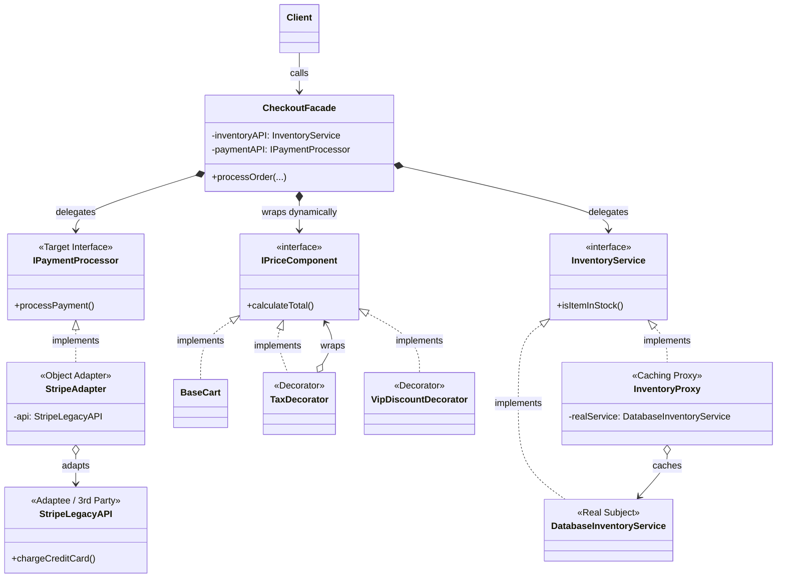

# 🛒 Structural Masterclass: E-Commerce Checkout

## 📖 The Architecture
This case study perfectly demonstrates how to integrate **4 Structural Patterns** simultaneously to build a scalable, highly optimized E-Commerce Checkout Engine. 

When you look at the `Main.java` Client, it is incredibly clean—two lines of code. However, beneath the surface is a robust architecture:

1. **Facade (`CheckoutFacade`)**: The orchestrator. It receives the client request and delegates the workflow to the Inventory, Pricing, and Payment subsystems.
2. **Proxy (`InventoryProxy`)**: The performance booster. It acts as a shield for the slow `DatabaseInventoryService`, intercepting stock checks and serving immediate responses if the item is cached locally.
3. **Decorator (`TaxDecorator`, `VipDiscountDecorator`)**: The math engine. It recursively wraps the base shopping cart to dynamically calculate flat discounts, percentage bonuses, and state taxes without hardcoding logic into a massive monolithic Order class.
4. **Adapter (`StripeAdapter`)**: The anti-corruption layer. It takes an incompatible third-party library (`StripeLegacyAPI`) and forces it to conform to our pristine internal `IPaymentProcessor` interface.

---

## 🏗️ System Diagram

---

## 💡 Senior Interview Takeaway
Interviews rarely ask you to recite a single pattern. They ask you to design a system. 
When asked "How would you design Amazon Checkout?", your answer should hit these points:
> *"I'd expose a **Facade** to the mobile client so they only make 1 network call. Internally, I'd prevent DB thrashing by wrapping the Inventory service in a Redis-backed **Proxy**. To calculate complex jurisdictional taxes and promotional coupons, I'd wrap the cart in Pricing **Decorators**. Finally, I'd define an internal Payment interface and build **Adapters** around Stripe and PayPal SDKs to prevent vendor lock-in."*
