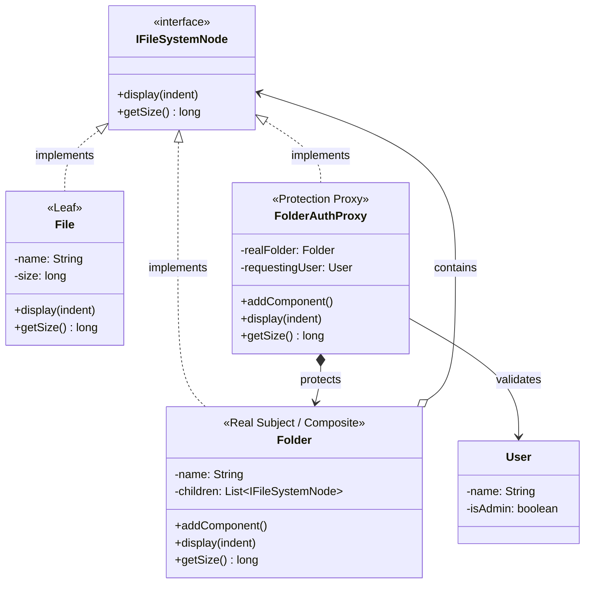

# ☁️ LLD: Cloud Storage Permission System

## 📖 The Architecture
This LLD problem requires calculating the size of massive nested directories (tree traversal) while simultaneously enforcing strict Role-Based Access Control (RBAC) on folder mutations. 

To solve this we combine two structural patterns: **Composite** and **Protection Proxy**.

1. **Composite (`Folder`, `File`)**: We implement the `IFileSystemNode` interface. This allows the client to call `.getSize()` on the Root folder, completely eliminating the need to write massive nested `for` loops with `instanceof File` checks. The composite nodes natively recurse through their children.
2. **Proxy (`FolderAuthProxy`)**: We do NOT put user authentication inside the `Folder` class! That would violate the Single Responsibility Principle. Instead, we wrap the `Folder` in an `AuthProxy`. The Proxy intercepts `.addComponent()`, verifies the `User` role, and throws a Security Exception if a Guest tries to write data.

---

## 🏗️ System Diagram

---

## 💡 Senior Interview Takeaway
> *"When building a recursive structure like a Cloud File System, I would use the **Composite Pattern** to ensure absolute traversal transparency between single files and deeply nested branch folders. However, placing networking or security logic inside the core Domain `Folder` class violates the Single Responsibility Principle. Therefore, before the request ever reaches the `Folder`, I would route it through a **Protection Proxy** to validate the JWT Auth Token."*
