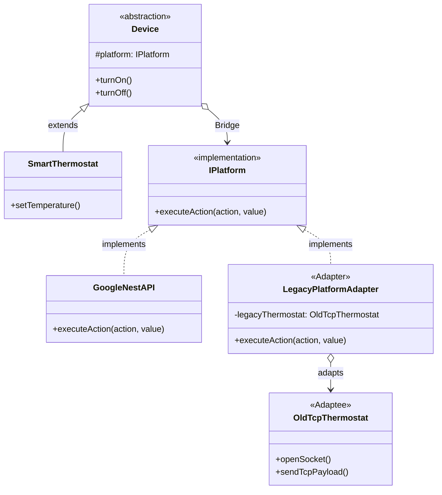

# 🏠 LLD: Smart Home IoT Hub

## 📖 The Architecture
This LLD problem requires building a highly scalable Smart Home architecture that supports orthogonal expansion (new Devices vs new Platforms) while simultaneously supporting ancient legacy hardware. 

To solve this we combine two structural patterns: **Bridge** and **Adapter**.

1. **Bridge (`Device` ↔ `IPlatform`)**: We split the domain into two hierarchies. The `SmartThermostat` extends the `Device` abstraction. The `GoogleNestAPI` implements the `IPlatform` protocol. The `Device` holds a reference to the `IPlatform`. This prevents the catastrophic Cartesian Product class explosion (e.g., `GoogleNestThermostat`, `PhilipsHueThermostat`, `SamsungThermostat`, `GoogleNestLight`...).
2. **Adapter (`LegacyPlatformAdapter`)**: The client has a 15-year-old `OldTcpThermostat` that communicates via raw TCP sockets instead of REST APIs. We don't want to pollute our pure `Device` abstractions with TCP logic. Instead, we create an adapter that implements the `IPlatform` interface, and secretly translates the calls down into the `OldTcpThermostat`.

---

## 🏗️ System Diagram

---

## 💡 Senior Interview Takeaway
> *"When building a Smart Home Hub, inheritance is a trap. I would utilize the **Bridge Pattern** to strictly separate the hardware Abstraction layer (Thermostats, Lights) from the vendor Implementation layer (Google, Apple). When forced to integrate a legacy hardware device that breaks my modern interface contract, I would build an **Object Adapter** that implements the modern vendor interface but translates the payload into the required legacy TCP sockets. This keeps the core domain pristine."*
