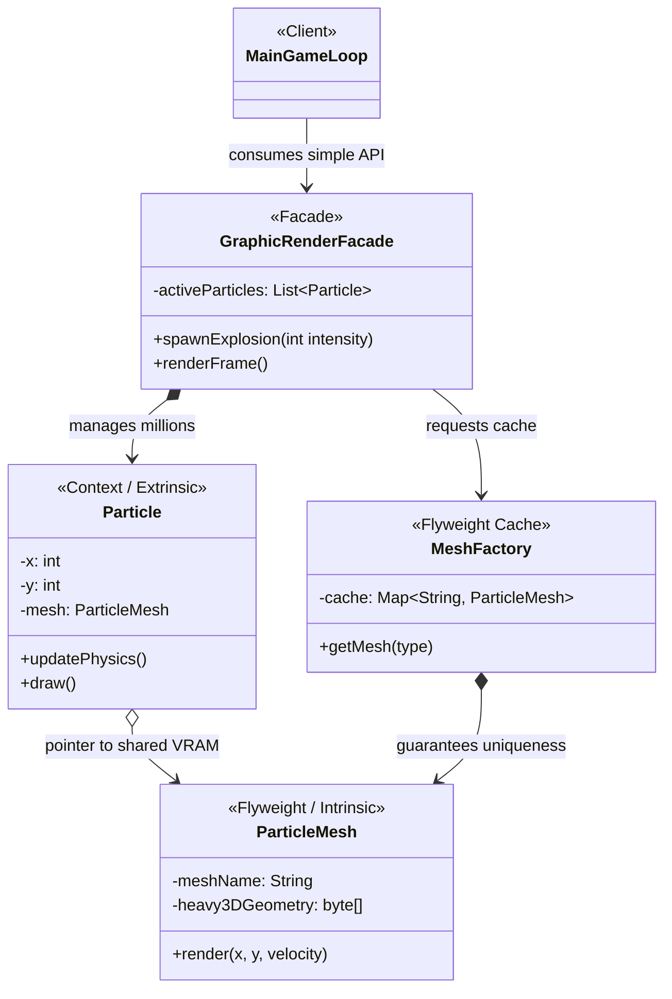

# 🎮 LLD: RPG Game Rendering Engine

## 📖 The Architecture
This LLD problem requires building a 3D Graphic Rendering API that can handle massive explosions (spawning 5,000+ particle objects simultaneously) without exhausting VRAM (Video RAM), while simultaneously keeping the API incredibly simple for the junior developers writing the main `while(true)` Game Loop.

To solve this we combine two structural patterns: **Flyweight** and **Facade**.

1. **Flyweight (`ParticleMesh`, `MeshFactory`)**: If 5,000 particles each instantiated their own 5MB Fire texture, the game would require 25,000MB (25GB) of VRAM and instantly crash. We split the object. The `ParticleMesh` (Intrinsic) holds the 5MB geometry and is cached by the Factory. The `Particle` (Extrinsic Context) is a tiny wrapper that just holds volatile `x`/`y` coordinates and a pointer to the shared mesh. 5,000 tiny wrappers + two cached 5MB meshes = ~10MB total footprint.
2. **Facade (`GraphicRenderFacade`)**: Building 5,000 contexts, querying the Factory cache, managing a list, and executing physics `.update()` methods require too much coordination. We wrap all this complexity in a single `GraphicRenderFacade`. The game loop developer simply calls `facade.spawnExplosion(x, y, 5000)` and `facade.renderFrame()`. They have no idea Flyweights are saving their memory.

---

## 🏗️ System Diagram

---

## 💡 Senior Interview Takeaway
> *"When building a high-performance engine simulating thousands of entities, I must prevent OutOfMemory crashes. I would apply the **Flyweight Pattern** to strip out the immutable, heavy 3D Texture data into a singleton-like shared object, leaving only volatile coordinates inside the millions of entity instances. To prevent this complex Factory and Context management logic from bleeding into the main Game Loop, I would hide it behind a **Facade Pattern**, exposing only primitive intent-based methods like `spawnExplosion()`."*
