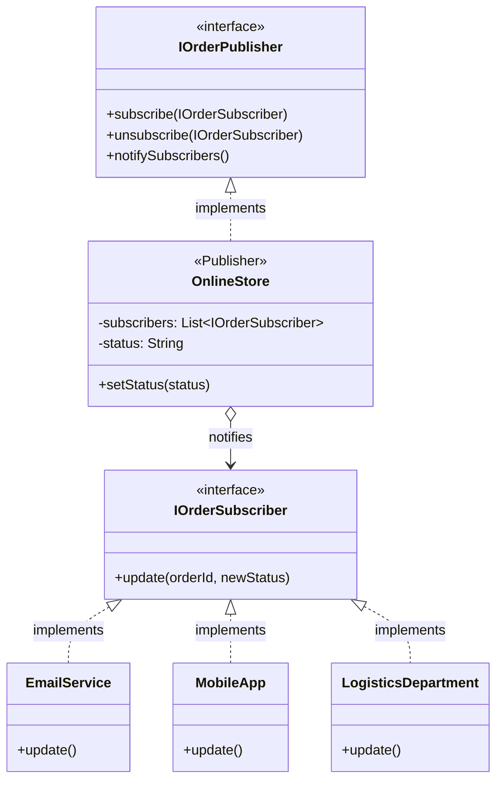

# 📡 Observer Design Pattern

## 📖 1. The Core Concept (The "Why")
The **Observer** is a behavioral design pattern that defines a one-to-many dependency between objects so that when one object changes state, all its dependents are notified and updated automatically.

It is the foundation of **Event-Driven Architecture (EDA)**, **Pub/Sub (Publish/Subscribe)**, and reactive UI frameworks. Imagine a YouTube channel. You do not refresh the YouTuber's page 1,000 times a day to see if they uploaded. You click "Subscribe." When they upload (`State Change`), Youtube pushes a notification to you (`Notify Subcribers`). 

### ⚠️ The Problem
If a `User` wants to be notified when an `iPhone` comes back in stock, the junior way to build this is **Polling**:
```java
// Anti-pattern
while (true) {
    if (iPhone.isInStock()) {
        sendEmail();
        break;
    }
    Thread.sleep(1000); // Massive waste of CPU and DB calls!
}
```
If 10,000 users are polling your database every second, your server will go down.

### ✅ The Solution
Turn the `iPhone` into a **Publisher** and the users into **Subscribers**. When the iPhone's inventory count changes from 0 to 1, the iPhone object iterates through its list of subscribers and calls their `update()` method.

---

## 🏗️ 2. Architectural Blueprint



---

## 💻 3. Implementation Deep Dive (Java)

1. **The Subscriber Interface:**
```java
public interface IOrderSubscriber {
    void update(String orderId, String newStatus);
}
```
2. **The Publisher:**
```java
public class OnlineStore {
    private List<IOrderSubscriber> subs = new ArrayList<>();
    
    public void subscribe(IOrderSubscriber s) { subs.add(s); }
    
    // When state changes, push to everyone!
    public void setStatus(String status) {
        for(IOrderSubscriber s : subs) {
            s.update(this.orderId, status);
        }
    }
}
```

---

## 🚀 4. SDE-2+ Pragmatic Perspective: The Pub/Sub Architect

In a senior-level architecture, the **Observer Pattern** scales out from simple memory pointers into distributed system components. 

*   **The Problem:** Microservices need to react to events in other microservices without being tightly coupled via synchronous REST API calls. If `OrderService` synchronously calls `EmailService`, `InventoryService`, and `ShippingService`, a failure in *Emails* will rollback the *Order*.
*   **The Solution:** Distributed Observer Pattern (Pub/Sub).

### 🏗️ Why it matters for Scaling (10k+ Concurrency)
1.  **Asynchronous Decoupling:** In real FAANG systems, the "Publisher" is Apache Kafka, RabbitMQ, or AWS SNS, and the "Subscribers" are entire microservices. The OrderService drops an `OrderCreatedEvent` into Kafka and immediately returns `200 OK` to the user.
2.  **Dynamic Topologies:** You can add a brand new `FraudDetectionService` to your cluster, tell it to subscribe to the `OrderCreatedEvent` topic, and the `OrderService` never even has to be recompiled or restarted.
3.  **UI Data Binding:** In Frontend land (React, Vue, Swift), Observer is how state management works (e.g. Redux, RxJS, or React `useEffect`). State changes, UI re-renders automatically.

---

## 🎓 5. Interview Tips: Creating "Strong Hire" Impact

### 1. "Push vs. Pull Mechanism"
*   **What to say:** *"In the **Push** model, the Publisher sends the changed data directly to the Subscriber (e.g., `update(String newStatus)`). In the **Pull** model, the Publisher just says 'I changed!', and the Subscriber has to call the Publisher's getters to retrieve the data they care about. I prefer Push for small data, and Pull for massive state objects to avoid copying data nobody asked for."*

### 2. "The Lapsed Listener Problem (Memory Leak)"
*   **What to say:** *"A classic Java pitfall with Observers is the **Lapsed Listener Problem**. If an active Publisher keeps a strong reference to a Subscriber in its List, the Garbage Collector will NEVER destroy that Subscriber, even if the user closes that UI window. To prevent this memory leak, we must actively call `unsubscribe()`, or use `WeakReference` in the Publisher's list."*

### 3. "Observer vs. Mediator"
*   **What to say:** *"In **Observer**, the communication is dynamically formed one-to-many (Publisher -> Subscribers). In **Mediator**, the communication is statically mapped many-to-many, forced through an air-traffic controller object. Observers don't know who is listening; Mediators know exactly who is talking."*

---

## ⚠️ 6. Edge Cases & Pitfalls
*   **Synchronous Blocking:** In standard Java, the `notifySubscribers()` `for` loop is synchronous. If one Subscriber's `update()` method takes 5 seconds, all other Subscribers are delayed, and the Publisher is blocked. Senior engineers solve this by having the Publisher dispatch events to an asynchronous thread pool.
*   **Cascading Updates:** If A observes B, and B observes C, and C observes A... you can create an infinite loop of death.

---

## ✅ SDE-2+ Readiness Check
*   [ ] Can you explain the difference between Polling and Pushing?
*   [ ] What is the "Lapsed Listener" memory leak and how do you fix it?
*   [ ] How does Pub/Sub (like Kafka) relate to the Observer pattern?

---

## 🌍 7. Cross-Language: Observer

### 🐍 Python
```python
class Publisher:
    def __init__(self): self.subs = []
    def sub(self, s): self.subs.append(s)
    def notify(self, data):
        for s in self.subs: s.update(data)
```

### 🟦 TypeScript (Web Native)
TypeScript/JS uses Observers natively via EventListeners or RxJS.
```typescript
interface Observer {
    update(data: string): void;
}
// DOM uses this natively: 
// document.getElementById('btn').addEventListener('click', () => { /* Observer Code */ });
```
