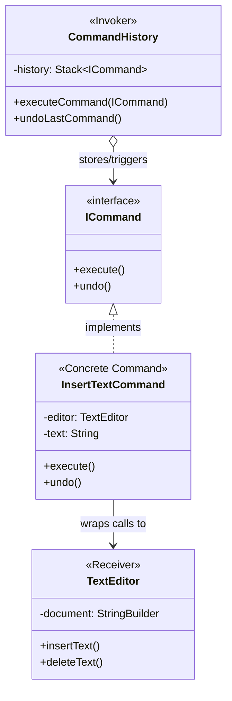

# 🎮 Command Design Pattern

## 📖 1. The Core Concept (The "Why")
The **Command** is a behavioral design pattern that turns a request into a stand-alone object containing all information about the request. 

This transformation lets you pass requests as method arguments, delay or queue a request's execution, and support undoable operations.

Imagine replacing a physical light switch. A junior developer hardcodes the light switch to execute `LightBulb.turnOn()`. If you want the switch to turn on a TV instead, you have to rewrite the switch. Using the **Command** pattern, the Switch (Invoker) doesn't know what a LightBulb is. It just holds a `Command` object and calls `.execute()`. You can wire any command to that switch.

### ⚠️ The Problem
If you are building a GUI text editor, you have buttons for "Copy", "Paste", and "Undo". If you hardcode the logic for "Copying" directly into the `CopyButton` class's click listener, you violate the **Single Responsibility Principle**. What happens when you also want a keyboard shortcut (Ctrl+C) or a Right-Click context menu to execute the exact same "Copy" logic? You end up duplicating code across multiple UI components.

### ✅ The Solution
Extract the "Copy" logic into a standalone `CopyCommand` class. The Button, the Keyboard Shortcut Listener, and the Context Menu all just hold a reference to the `CopyCommand` object and call `.execute()`. 
Furthermore, because the Command is an object, you can store it in an array! This is how you build an "Undo History."

---

## 🏗️ 2. Architectural Blueprint



---

## 💻 3. Implementation Deep Dive (Java)

1. **The Receiver (The Brains):** Has the actual `StringBuilder` business logic.
```java
public class TextEditor {
    public void insertText(String text) { /* actual logic */ }
}
```
2. **The Command (The Wrapper):** Wraps the Receiver.
```java
public class InsertTextCommand implements ICommand {
    private TextEditor editor;
    private String text;
    
    public void execute() { editor.insertText(text); }
    public void undo() { editor.deleteText(text.length()); }
}
```
3. **The Invoker (The Button/History Queue):** Just pushes the button.
```java
public class CommandHistory {
    private Stack<ICommand> history = new Stack<>();
    
    public void executeCommand(ICommand cmd) {
        cmd.execute();
        history.push(cmd);
    }
}
```

---

## 🚀 4. SDE-2+ Pragmatic Perspective: The "Transaction" Pattern

In modern enterprise architectures, the Command pattern is heavily used for **Queuing** and **Rollbacks (Sagas)**.

### 🏗️ Why it matters for Scaling (10k+ Concurrency)
1.  **Asynchronous Message Queues:** In a distributed system, you serialize a Command object into JSON and push it into a RabbitMQ or SQS queue. A dedicated worker pool pulls the messages and calls `.execute()`. This handles insane high-traffic load spikes.
2.  **Saga Pattern (Microservice Rollbacks):** If you are booking a Holiday (Flight + Hotel + Car). You execute 3 commands. If the Car command fails, you iterate backwards through your success list and call `.undo()` on the Hotel and Flight to refund the user.
3.  **Audit Logging / Replay:** If every action a user takes is a Command object, you can serialize them to a database. If the system crashes, you reboot the system empty, query the DB, and `.execute()` every command since the beginning of time to restore the exact state (Event Sourcing).

---

## 🎓 5. Interview Tips: Creating "Strong Hire" Impact

### 1. "Command vs. Strategy"
*   **What to say:** *"They look similar structurally. But **Strategy** is about replacing 'HOW' something is done (e.g., How to sort data). **Command** is about encapsulating 'WHAT' is done (e.g., A specific request to sort data right now, which can be queued or undone). Strategy configures a class; Command parameterizes a method call."*

### 2. "Thick vs. Thin Commands"
*   **What to say:** *"A **Thin Command** just delegates to the Receiver (best practice). A **Thick Command** actually contains the heavy business logic inside its own `execute()` method. Thick commands are anti-patterns because they mix control flow with domain logic."*

### 3. "CQRS Pattern"
*   **What to say:** *"The Command pattern is half of the famous **CQRS (Command-Query Responsibility Segregation)** architecture. In CQRS, every action that mutates the database is modeled as a Command, while every path that reads data is a Query, allowing them to scale on completely different databases."*

---

## ⚠️ 6. Edge Cases & Pitfalls
*   **Undo is Hard:** Writing `.undo()` sounds easy until the Command relies on complex database states. Sometimes, Undo requires storing a massive snapshot of the system inside the Command object (bringing it close to the Memento pattern), which explodes memory usage.
*   **Class Explosion:** For a simple app, making a class for every single button click is ridiculous over-engineering. Don't use Command unless you specifically need Queuing, Scheduling, or Undo functionality.

---

## ✅ SDE-2+ Readiness Check
*   [ ] Can you build a system that supports "Ctrl+Z" Undo?
*   [ ] How does the Command pattern enable distributed Queues?
*   [ ] What is the difference between an Invoker and a Receiver?

---

## 🌍 7. Cross-Language: Command

### 🐍 Python
```python
class Command:
    def execute(self): pass

class TurnOnLight(Command):
    def __init__(self, light): self.light = light
    def execute(self): self.light.on()

# Function as a Command (Pythonic)
def make_command(light):
    return lambda: light.on()
```

### 🟦 C#
C# leverages this natively in Windows Presentation Foundation (WPF) and MAUI via the `ICommand` interface, heavily used in MVVM architecture to bind UI buttons to ViewModel methods.
```csharp
public class RelayCommand : ICommand {
    private Action _execute;
    public RelayCommand(Action execute) { _execute = execute; }
    public void Execute(object parameter) { _execute(); }
}
```
