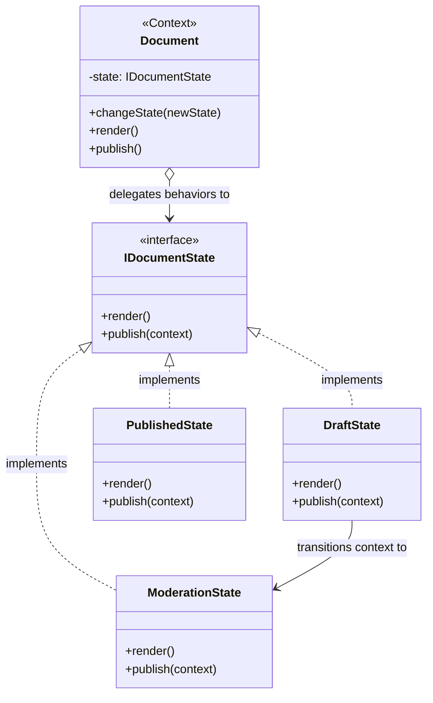

# 🚥 State Design Pattern

## 📖 1. The Core Concept (The "Why")
The **State** is a behavioral design pattern that allows an object to alter its behavior when its internal state changes. It appears as if the object changed its class.

Imagine an e-commerce `Order`. An order can be in multiple states: `New`, `Paid`, `Shipped`, or `Cancelled`.
If a user clicks "Cancel":
- In `New` state: Cancel immediately.
- In `Paid` state: Cancel and issue a refund.
- In `Shipped` state: Throw an error (cannot cancel).

### ⚠️ The Problem
If you handle this inside the `Order` class, you end up with massive, unreadable `switch` statements for every single method:
```java
// Anti-pattern
public void cancel() {
    if (state == NEW) { /* logic */ }
    else if (state == PAID) { /* refund logic */ }
    else if (state == SHIPPED) { throw Error; }
}

public void ship() {
    // Another massive switch statement
}
```
Adding a new state (like `Processing`) requires you to modify every single method in the `Order` class, violating the Open/Closed Principle and creating a bug factory.

### ✅ The Solution
Extract state-specific behaviors into distinct **State classes** (`NewState`, `PaidState`, `ShippedState`). The original `Order` class (the Context) just holds a reference to the current state object and delegates all work to it. When an action occurs, the State object itself optionally replaces the Context's state with a new State object.

---

## 🏗️ 2. Architectural Blueprint



---

## 💻 3. Implementation Deep Dive (Java)

1. **The State Interface:** Defines actions that depend on state.
```java
public interface IDocumentState {
    void publish(Document context, User user);
}
```
2. **Concrete States:** Implement logic AND handle transitions.
```java
public class DraftState implements IDocumentState {
    public void publish(Document context, User user) {
        // Drafts transition to Moderation when published!
        context.changeState(new ModerationState());
    }
}
```
3. **The Context:** Wraps the current state.
```java
public class Document {
    private IDocumentState currentState = new DraftState();
    
    public void changeState(IDocumentState newState) { currentState = newState; }
    
    // Delegation without IF statements!
    public void publish(User user) { currentState.publish(this, user); }
}
```

---

## 🚀 4. SDE-2+ Pragmatic Perspective: The FSM Architect

In senior-level system design, the State pattern is the object-oriented realization of a **Finite State Machine (FSM)**.

### 🏗️ Why it matters for Scaling 
1.  **Workflow Engines:** If you are building JIRA (with Tickets moving from `To-Do` ➔ `In-Progress` ➔ `Done`), or Uber (Ride moving from `Requested` ➔ `DriverAssigned` ➔ `InTransit`), using the State pattern is mandatory. It mathematically guarantees that invalid transitions (e.g., jump from `Requested` directly to `Completed`) are impossible.
2.  **Stateless Microservices:** While the State pattern is object-oriented, in modern distributed systems, we often persist the *string* of the state ("DRAFT") in Postgres, and use a factory or Spring Bean factory to inject the correct State singleton to handle the incoming stateless HTTP request.
3.  **Spring State Machine:** Real Java enterprises rarely write manual state logic; they use frameworks like `Spring State Machine` which uses this exact pattern under the hood to manage complex distributed transactions.

---

## 🎓 5. Interview Tips: Creating "Strong Hire" Impact

### 1. "State vs. Strategy"
*   **What to say:** *"Structurally, they are identical—relying on composition and delegation. The difference is intent. In **Strategy**, the client injects the algorithm (`cart.checkout(new PayPalStrategy())`), and Strategies don't know about each other. In **State**, the state objects mutate the Context automatically from the inside (`context.changeState(new PaidState())`), and states natively understand transitions."*

### 2. "Who Manages the Transitions?"
*   **What to say:** *"There are two ways to invoke transitions. The **Context** can manage it (via huge `if/else` logic), which defeats the purpose. The superior approach is letting the **Concrete States** manage the transitions (e.g., `DraftState` dictates that it turns into `ModerationState`). This scatters transition logic but keeps the Context completely agnostic and clean."*

### 3. "State Singletons"
*   **What to say:** *"If State objects do not contain instance variables (meaning they are purely functional logic), I implement them as **Flyweights or Singletons** to save memory, rather than creating a `new DraftState()` every time a document is created."*

---

## ⚠️ 6. Edge Cases & Pitfalls
*   **Class Explosion for Simple States:** If your Document only has two states (`Open`, `Closed`) and rarely changes, creating 4 extra classes is massive over-engineering. Just use a boolean flag. State is for *complex* FSMs with 3+ states and heavy logic.
*   **Circular Dependencies:** Because States often instantiate other States to trigger a transition, they can become tightly coupled to each other.

---

## ✅ SDE-2+ Readiness Check
*   [ ] Can you list 3 real-world entities that require a Finite State Machine?
*   [ ] Explain why `switch(state)` is considered an anti-pattern in object-oriented design.
*   [ ] What is the structural relationship between State and Strategy?

---

## 🌍 7. Cross-Language: State

### 🐍 Python
```python
class State:
    def action(self, context): pass

class OffState(State):
    def action(self, context):
        print("Turning ON")
        context.state = OnState()

class Context:
    def __init__(self): self.state = OffState()
    def request(self): self.state.action(self)
```

### 🐹 Go
```go
type State interface { doAction(context *Context) }

type StartState struct{}
func (s *StartState) doAction(c *Context) {
    fmt.Println("Start State")
    c.setState(&StopState{})
}

type Context struct { state State }
```
