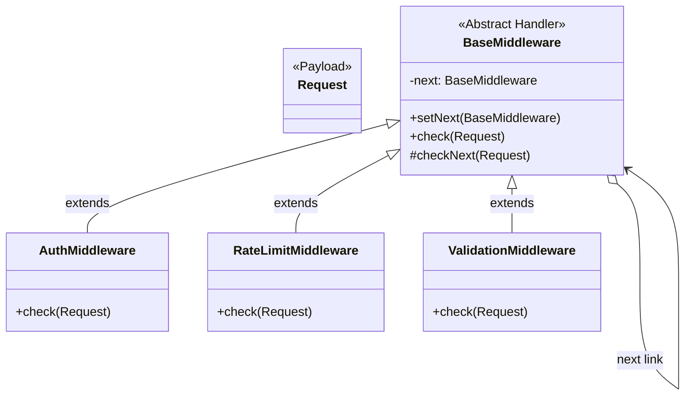

# 🔗 Chain of Responsibility Design Pattern

## 📖 1. The Core Concept (The "Why")
The **Chain of Responsibility (CoR)** is a behavioral design pattern that lets you pass requests along a chain of handlers. Upon receiving a request, each handler decides either to process the request or to pass it to the next handler in the chain.

Imagine calling Customer Support. You talk to a Tier 1 robot. If it can't solve your problem, it passes you to a Tier 2 agent. If they can't solve it, they pass you to a Tier 3 Manager. The request travels down a linear pipeline until someone handles it (or it's rejected).

### ⚠️ The Problem
When building an API, you usually restrict access. So, you add an authentication check. Then you realize people are brute-forcing it, so you add a rate-limiter. Then you realize payloads are malformed, so you add a validation check.
```java
// Anti-pattern: The Controller gets massive
public Response handleRestCall(Request req) {
    if (!auth(req)) return 401;
    if (!rateLimit(req)) return 429;
    if (!isValid(req)) return 400;
    
    // Actual business logic (only 2 lines long, buried under 50 lines of security)
}
```
As you add caching or CORS constraints, this monolithic method becomes impossible to maintain or test.

### ✅ The Solution
Extract those boolean checks into standalone objects called **Handlers**. Link the handlers together in a chain `Auth -> RateLimit -> Validation`. When a request comes in, it enters the `Auth` handler. If `Auth` passes, it explicitly calls `.checkNext()`. If any link in the chain fails, it returns `false`, halting the entire pipeline before it ever reaches your business logic.

---

## 🏗️ 2. Architectural Blueprint



---

## 💻 3. Implementation Deep Dive (Java)

1. **The Base Handler:** Houses the `next` pointer so concrete classes don't have to duplicate the linking logic.
```java
public abstract class BaseMiddleware {
    private BaseMiddleware next;

    public BaseMiddleware setNext(BaseMiddleware next) {
        this.next = next;
        return next; // Returns next to allow fluent chaining: a.setNext(b).setNext(c);
    }
    
    public abstract boolean check(Request req);

    protected boolean checkNext(Request req) {
        if (next == null) return true;
        return next.check(req);
    }
}
```
2. **Concrete Handlers:** Focus strictly on their single responsibility.
```java
public class AuthMiddleware extends BaseMiddleware {
    public boolean check(Request req) {
        if (!validPassword) return false; // HALT
        return checkNext(req); // PROCEED
    }
}
```

---

## 🚀 4. SDE-2+ Pragmatic Perspective: The Middleware Architect

In a senior-level system, this is the exact architecture behind **Web Framework Middleware** (Express.js, Spring Filter Chains, Django Middleware).

### 🏗️ Why it matters for Scaling 
1.  **Dynamic Pipelines:** Because the Chain is linked at runtime, you can alter the pipeline on the fly. During Black Friday, you might dynamically insert a `CachingMiddleware` into the front of the chain to prevent database hits.
2.  **Single Responsibility Principle (SRP):** Your `OrderController` literally only contains code related to creating an order. It trusts the pipeline blindly, knowing that if the request reached it, it is authenticated, validated, and rate-limited.
3.  **UI Event Bubbling:** In Frontend development (HTML DOM / React), clicking a Button creates an Event. If the Button doesn't handle the click, the event "bubbles up" the DOM tree to the `div`, then the `body`, until a handler catches it. This is a reverse CoR!

---

## 🎓 5. Interview Tips: Creating "Strong Hire" Impact

### 1. "Chain of Responsibility vs. Decorator"
*   **What to say:** *"They both use composition to link objects. However, a **Decorator** wraps an object to *enhance* it, and ALL decorators in the stack are usually executed. In the **Chain of Responsibility**, the objects are independent nodes, and ANY node has the power to completely *halt* execution and stop the request from travelling further."*

### 2. "The 'Unhandled Request' Pitfall"
*   **What to say:** *"A common issue with CoR is that a request might reach the end of the chain and nobody handled it, causing it to disappear silently. For a 'handling' chain (like Support Tickets), the final node usually throws an `UnhandledRequestException`. For a 'filtering' chain (like API Middleware), reaching the end implies total success."*

### 3. "Spring Security Filter Chain"
*   **What to say:** *"If asked 'Where have you used CoR?', my go-to answer is the **Spring Security Filter Chain**. The `UsernamePasswordAuthenticationFilter`, `CorsFilter`, and `CsrfFilter` are just concrete handlers linked together. If my auth token is bad, the auth filter intercepts and returns an HTTP 401, halting the chain before it reaches my Controller."*

---

## ⚠️ 6. Edge Cases & Pitfalls
*   **Deep Call Stacks:** If your chain has 50 links, stepping through it in a debugger is a nightmare due to the nested `checkNext()` calls resulting in a massive stack trace.
*   **Infinite Loops:** If `A` points to `B`, and `B` accidentally points back to `A`, your app will instantly crash with a `StackOverflowException`.

---

## ✅ SDE-2+ Readiness Check
*   [ ] Can you explain how Express.js `next()` or Spring `FilterChain.doFilter()` relates to CoR?
*   [ ] Why is CoR generally preferred over throwing logic inside the Controller?
*   [ ] What happens if no object in the chain can handle the request?

---

## 🌍 7. Cross-Language: Chain of Responsibility

### 🟦 TypeScript / Express.js
Express natively uses CoR for its entire web routing layer.
```typescript
// Auth Middleware (Handler 1)
app.use((req, res, next) => {
    if (!req.headers.auth) return res.status(401).send();
    next(); // checkNext()
});

// Controller (End of the Chain)
app.get('/', (req, res) => {
    res.send("If you see this, you passed the chain!");
});
```
