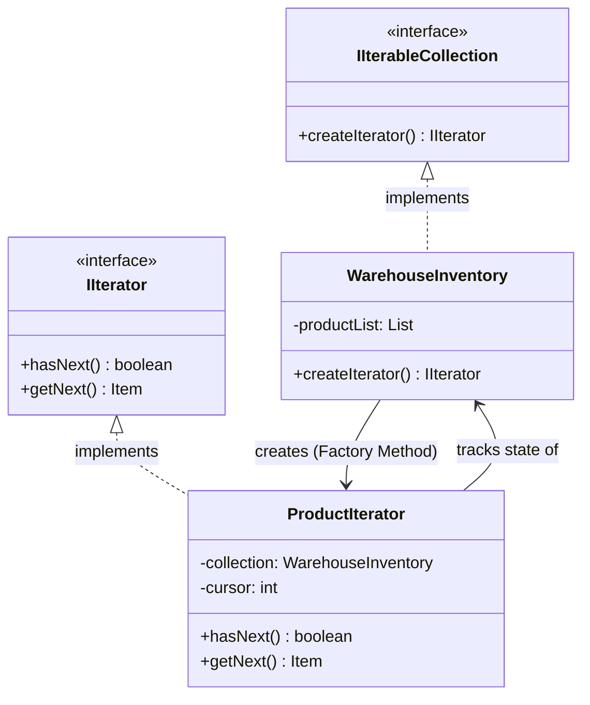

# 🔄 Iterator Design Pattern

## 📖 1. The Core Concept (The "Why")
The **Iterator** is a behavioral design pattern that lets you traverse elements of a collection without exposing its underlying internal representation (list, stack, tree, graph, etc.).

Imagine you have a `SocialNetwork` class that stores Users. Today, the users are stored in a simple Array `User[]`. Your client code writes a `for(int i=0; i < array.length)` loop to find a specific user. 
Tomorrow, the database scales, and the internal array is replaced with a complex **Red-Black Tree** to make searches faster. 
Because your client code was hardcoded to expect an Array, **your entire client application breaks.** 

### ⚠️ The Problem
Client algorithms should not care *how* data is stored. They just want to look at element 1, then element 2, then element 3. If you expose the underlying data structure (by writing `public List<User> getUsers()`), you tightly couple your client to that specific data structure.

### ✅ The Solution
Extract the traversal behavior of a collection into a separate object called an **Iterator**. 
The Iterator object possesses a standard interface (`hasNext()` and `getNext()`). It tracks the traversal state (the current cursor position) entirely on its own. 
The Collection just needs a factory method `createIterator()` that returns this standard iterator. Now, if the Collection changes from an Array to a Tree, the Client code doesn't change at all—the Collection simply returns a `TreeIterator` instead of an `ArrayIterator`.

---

## 🏗️ 2. Architectural Blueprint



---

## 💻 3. Implementation Deep Dive (Java)

1. **The Iterator Interface:**
```java
public interface IIterator {
    boolean hasNext();
    Product getNext();
}
```
2. **The Concrete Iterator:** Tracks the cursor!
```java
public class ProductIterator implements IIterator {
    private List<Product> list;
    private int cursor = 0; // State!

    public boolean hasNext() { return cursor < list.size(); }
    public Product getNext() { return list.get(cursor++); }
}
```
3. **The Collection Interface & Concrete Collection:**
```java
public interface IAmazonInventory {
    IIterator createIterator();
}

public class WarehouseInventory implements IAmazonInventory {
    private List<Product> privateList = new ArrayList<>();
    
    // Abstract Factory pattern used here!
    public IIterator createIterator() {
        return new ProductIterator(privateList);
    }
}
```

---

## 🚀 4. SDE-2+ Pragmatic Perspective: The Hidden Giant

In modern enterprise architectures (especially Java and C#), you use the Iterator pattern literally every single day, often without realizing it.

### 🏗️ Why it matters for Scaling 
1.  **Multiple Simultaneous Traversals:** Because the traversal state (the `cursor`) is stored inside the *Iterator object*, and not the *Collection object*, you can have 5 different threads looping over the exact same Warehouse Inventory at the same time at different speeds. 
2.  **Lazy Evaluation (Pagination):** When dealing with 1 Billion database rows, a `DatabaseIterator` doesn't load 1B rows into RAM. Its `getNext()` method transparently executes a `SELECT * LIMIT 100 OFFSET X` SQL query when it runs out of cached rows. The client just keeps calling `.getNext()` in a `while` loop, completely ignorant of the chunked network pagination happening underneath!
3.  **The "Enhanced For-Loop":** In Java, the syntax `for (String s : stringList)` is literally just syntactic sugar compiled down into `Iterator i = stringList.iterator(); while(i.hasNext()) { String s = i.next(); }`.

---

## 🎓 5. Interview Tips: Creating "Strong Hire" Impact

### 1. "Separation of Concerns"
*   **What to say:** *"The primary purpose of the Iterator is the Single Responsibility Principle. A Collection's job is **Data Storage**. If you force the Collection to also handle **Data Traversal** (e.g. by adding a `getNext()` method directly on the Array class), you violate SRP and make simultaneous iterations impossible."*

### 2. "Iterator vs. Visitor"
*   **What to say:** *"An **Iterator** traverses elements to do something with them in the *Client* code. A **Visitor** traverses (or is run across) elements to execute an algorithm defined *inside the Visitor itself*."*

### 3. "ConcurrentModificationException"
*   **What to say:** *"A classic senior Java interview question is what happens if you add to a List while an Iterator is traversing it. Standard Iterators are **fail-fast**. They track a `modCount` (modification count). If the Collection's modCount changes while the Iterator is working, the Iterator instantly throws a `ConcurrentModificationException` to prevent reading corrupted memory. To fix it, you either use the Iterator's own `.remove()` method, or use a thread-safe `CopyOnWriteArrayList`."*

---

## ⚠️ 6. Edge Cases & Pitfalls
*   **Overhead:** Creating an Iterator object for a tiny array of 2 elements in an ultra-high-frequency game loop can cause Garbage Collection spikes. In C++, raw pointers are often used instead for performance.
*   **Complex Graph Traversals:** Writing an Iterator for a complex bi-directional Graph structure requires you to maintain a `Set<Node> visited` inside the Iterator to prevent infinite looping.

---

## ✅ SDE-2+ Readiness Check
*   [ ] Can you explain why the "Enhanced For-Loop" in Java requires the `Iterable` interface?
*   [ ] How does the Iterator pattern enable Lazy Loading of Database Records?
*   [ ] What causes a `ConcurrentModificationException`?

---

## 🌍 7. Cross-Language: Iterator

### 🐍 Python
Python abstracts this perfectly. Any class with `__iter__` and `__next__` is an iterator. Furthermore, the `yield` keyword automatically generates a lazy iterator function (a generator).
```python
def fibonacci(limit):
    a, b = 0, 1
    for _ in range(limit):
        yield a # Halts execution here and returns 'a' lazily!
        a, b = b, a + b

for num in fibonacci(5):
    print(num)
```

### 🟦 C#
C# uses `IEnumerable` and `IEnumerator`. Like Python, C# has `yield return` for automatic lazy iterators.
```csharp
public IEnumerable<int> GetNumbers() {
    yield return 1;
    yield return 2;
    yield return 3;
}
```
