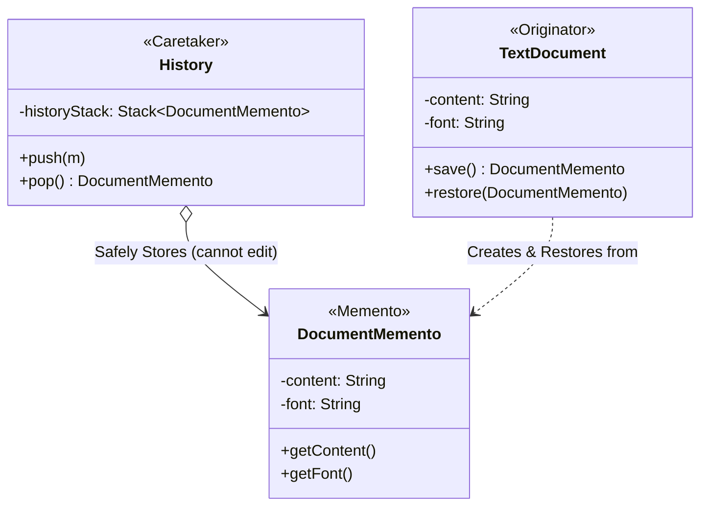

# 📸 Memento Design Pattern

## 📖 1. The Core Concept (The "Why")
The **Memento** is a behavioral design pattern that allows you to make snapshots of an object’s state and restore it in the future without violating encapsulation.

Imagine you are building a Video Game. You want a "Save Game" feature. Your `Player` class has `health`, `mana`, and `inventory`.

### ⚠️ The Problem
The junior approach is to make `health`, `mana`, and `inventory` `public` so the `SaveGameManager` can read them and write them to a file. By making everything public, you destroy **Encapsulation**. Any other class can now maliciously mutate the player's health. 
Alternatively, putting the save-to-database logic *inside* the `Player` class violates the **Single Responsibility Principle**.

### ✅ The Solution
The **Memento Pattern** delegates creating the state snapshots to the actual owner of that state (the `Originator`/Player). 
1. The `Player` creates a `Memento` (a locked box containing health, mana, etc).
2. The `Player` hands this locked box to the `Caretaker` (SaveGameManager). 
3. The `Caretaker` stores it, but **cannot look inside it**. 
4. Later, the `Caretaker` hands the locked box back to the `Player` to restore their state.

---

## 🏗️ 2. Architectural Blueprint



---

## 💻 3. Implementation Deep Dive (Java)

1. **The Memento:** An immutable value object.
```java
public class DocumentMemento {
    private final String content; // Immutable! No setters!
    public DocumentMemento(String c) { this.content = c; }
    public String getContent() { return content; } // Used ONLY by Originator
}
```
2. **The Originator:** The internal state holder.
```java
public class TextDocument {
    private String content; // The actual state
    
    public DocumentMemento save() { return new DocumentMemento(content); }
    
    public void restore(DocumentMemento m) { this.content = m.getContent(); }
}
```
3. **The Caretaker:** The history stack.
```java
public class History {
    // Only holds Mementos. Never looks inside them.
    private Stack<DocumentMemento> stack = new Stack<>();
    public void push(DocumentMemento m) { stack.push(m); }
    public DocumentMemento pop() { return stack.pop(); }
}
```

---

## 🚀 4. SDE-2+ Pragmatic Perspective: The Command's Best Friend

In senior-level architecture, the **Memento** pattern is rarely used completely alone. It is almost always paired with the **Command pattern** to implement robust Undo/Redo or Database Transactions.

### 🏗️ Why it matters for Scaling 
1.  **Fault Tolerance:** If a complex system crashes halfway through a multi-step workflow, you can pop the last Memento from the Caretaker's queue and reboot the state exactly as it was before the crash.
2.  **Strict Encapsulation in Public APIs:** In Java, you can put the Originator and Memento classes in the same `package`, and make the Memento's getters `protected` or `package-private`. This physically ensures that the `Caretaker` (which lives in a different package) cannot even *compile* if it tries to read the Memento's data!
3.  **React State Management:** In frontend development, tools like **Redux** use an architecture heavily inspired by Memento. The "Store" (Caretaker) holds immutable state trees (Mementos) generated by reducers. "Time-travel debugging" in Redux is literally just popping Mementos off a stack.

---

## 🎓 5. Interview Tips: Creating "Strong Hire" Impact

### 1. "Command Undo vs. Memento Undo"
*   **What to say:** *"You can build 'Undo' via the Command pattern or the Memento pattern. In **Command**, you save the *inverse action* (e.g., if you added 'hello', the undo command deletes 'hello'). This saves memory but requires complex reverse-logic. In **Memento**, you save a full snapshot of the *entire state*. This uses massively more memory, but the restoration logic is incredibly simple and bug-free."*

### 2. "The Serialization Approach"
*   **What to say:** *"If an object has 50 nested properties, writing a Memento class to wrap all 50 properties is tedious. The pragmatic senior approach is to just serialize the Originator into a JSON String or a byte array, and store the String as the Memento. When restoring, you deserialize the JSON back into the object."*

---

## ⚠️ 6. Edge Cases & Pitfalls
*   **RAM Explosion:** If you are snapping a 200MB dataset every time the user types a character, your RAM will hit OutOfMemory (OOM) in seconds. Mementos are heavy. 
*   **Garbage Collection:** Caretakers often store Mementos in unbounded `List` or `Stack` collections. If you don't limit the size of the history stack (e.g., `max_undos = 50`), this becomes a permanent Memory Leak.

---

## ✅ SDE-2+ Readiness Check
*   [ ] Can you explain the roles of Originator, Memento, and Caretaker?
*   [ ] How does Memento protect Encapsulation?
*   [ ] What are the memory trade-offs when using Memento vs. Command for Undo?

---

## 🌍 7. Cross-Language: Memento

### 🐍 Python
Python lacks package-private access modifiers, so encapsulation relies on convention (`_content`). To avoid writing explicit Memento classes, Python developers often use the built-in `copy` module!
```python
import copy

class Originator:
    def __init__(self, state): self.state = state
    
    # The 'Memento' is literally just a deepcopy!
    def save(self): return copy.deepcopy(self.state) 
    
    def restore(self, memento): self.state = memento
```
