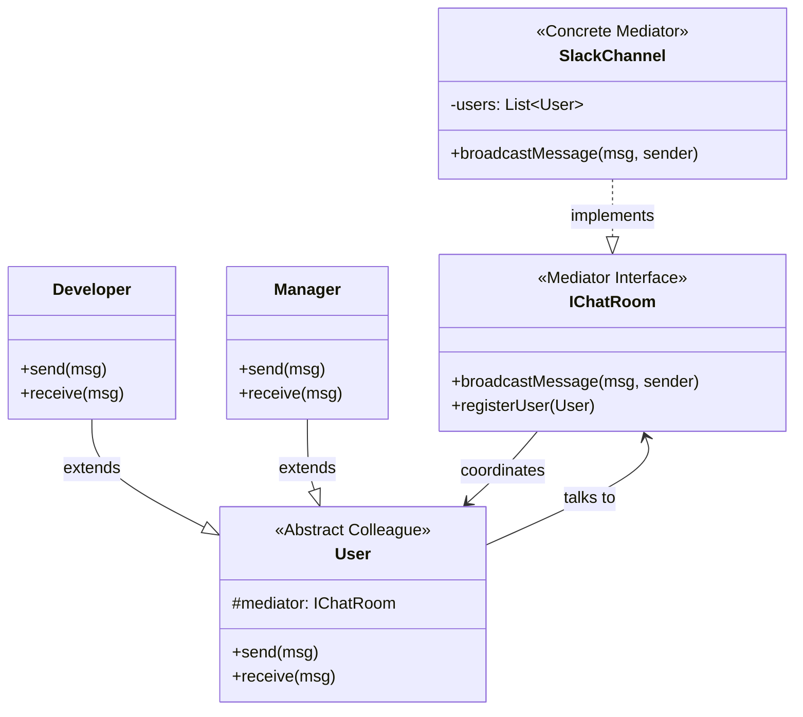

# 🔀 Mediator Design Pattern

## 📖 1. The Core Concept (The "Why")
The **Mediator** is a behavioral design pattern that reduces chaotic dependencies between objects. The pattern restricts direct communications between the objects and forces them to collaborate only via a mediator object.

Imagine an airport. If planes had to talk directly to every other plane in the sky to negotiate who lands first, it would be a chaotic, deeply coupled web of communication (and explosions). Instead, planes NEVER talk to each other. They talk to the **Air Traffic Control Tower** (The Mediator). The Tower knows the state of all planes and orchestrates the landings.

### ⚠️ The Problem
If you are building a GUI Dialog box. You have a `Checkbox` (I am married), a `SubmitButton`, and a `TextField` (Spouse Name). 
If the user checks the box, the `TextField` should become editable. If the text field is empty, the `SubmitButton` should be disabled.
If you put all this logic directly into the UI components, the `Checkbox` needs a reference to the `TextField`. The `TextField` needs a reference to the `Button`. 
You create a massive "spiderweb" of tight coupling. You can never reuse the `Checkbox` class in another project because it is permanently hardcoded to look for a specific `TextField`.

### ✅ The Solution
Extract all the UI relationship logic into a central **Mediator** class (often the `DialogWindow` itself). 
The `Checkbox` simply says to the Mediator: *"Hey, my state changed!"*
The Mediator thinks: *"Ah, the checkbox changed. Let me enable the text field."*
The components don't even know each other exist. They only know about the Mediator.

---

## 🏗️ 2. Architectural Blueprint



---

## 💻 3. Implementation Deep Dive (Java)

1. **The Mediator:** 
```java
public interface IChatRoom {
    void broadcast(String msg, User sender);
}

public class SlackChannel implements IChatRoom {
    private List<User> users = new ArrayList<>();
    
    // The central routing logic
    public void broadcast(String msg, User sender) {
        for(User u : users) {
             if(u != sender) u.receive(msg); 
        }
    }
}
```
2. **The Colleague:** Possesses a back-reference to the Mediator.
```java
public class Developer extends User {
    public void send(String msg) {
        // DOES NOT talk to Bob directly! Sends to Mediator.
        mediator.broadcast(msg, this); 
    }
}
```

---

## 🚀 4. SDE-2+ Pragmatic Perspective: The UI Architect

In senior-level architecture, you will rarely write a pure Mediator for backend logic, but you use it constantly in **Frontend and SOA (Service Oriented Architecture)**.

### 🏗️ Why it matters for Scaling 
1.  **Frontend State Management:** If you use React, Redux, or Vuex, the Central Store is literally a Mediator. Component A dispatches an action to the Store. The Store updates. Component B reads from the store. Components A and B never talk.
2.  **Microservice Event Bus:** If `InventoryService` needs to talk to `BillingService` and `ShippingService`, a direct HTTP connection is an anti-pattern. Instead, they all talk to `Kafka` or an `EventBus` (The Mediator). The Event bus routes the domain events appropriately.
3.  **God Object Risk:** The biggest danger of the Mediator pattern is that the Mediator class absorbs so much logic that it becomes an unmaintainable "God Object" with 10,000 lines of code.

---

## 🎓 5. Interview Tips: Creating "Strong Hire" Impact

### 1. "Mediator vs. Observer"
*   **What to say:** *"They are highly related and often used together. The difference is structure. **Observer** distributes communication (Publisher broadcasts to whoever is listening, one-to-many). **Mediator** centralizes communication (All components talk explicitly to a central hub, many-to-many). In fact, many modern Mediators are implemented using the Observer pattern under the hood (e.g., an EventBus)."*

### 2. "Mediator vs. Facade"
*   **What to say:** *"A **Facade** provides a simplified dumb interface to a complex subsystem (unidirectional—the client calls the Facade, but the subsystem doesn't call back). A **Mediator** centralizes communication *between* complex components (bidirectional—the components call the Mediator, and the Mediator calls them back)."*

---

## ⚠️ 6. Edge Cases & Pitfalls
*   **The God Object:** As mentioned, taking all logic out of the Domain models and putting it into the Mediator creates an anaemic domain model and a bloated Mediator. You must ensure the Mediator only handles *routing and coordination*, not *core business logic*.

---

## ✅ SDE-2+ Readiness Check
*   [ ] Explain why tight coupling between GUI components is dangerous.
*   [ ] What is the "God Object" anti-pattern and how does Mediator encourage it?
*   [ ] How does an Event Bus (like Kafka) fulfill the definition of a Mediator?

---

## 🌍 7. Cross-Language: Mediator

### 🟦 C#
C# heavily relies on an open-source library called **MediatR** for implementing the CQRS (Command Query Responsibility Segregation) pattern. Controllers don't talk to Services. Controllers send a Command to `MediatR` (the Mediator), and MediatR finds the correct Service to handle it.
```csharp
// Controller
public async Task<IActionResult> CreateOrder() {
    // Controller knows NOTHING about the OrderService.
    var response = await _mediator.Send(new CreateOrderCommand());
    return Ok(response);
}
```
