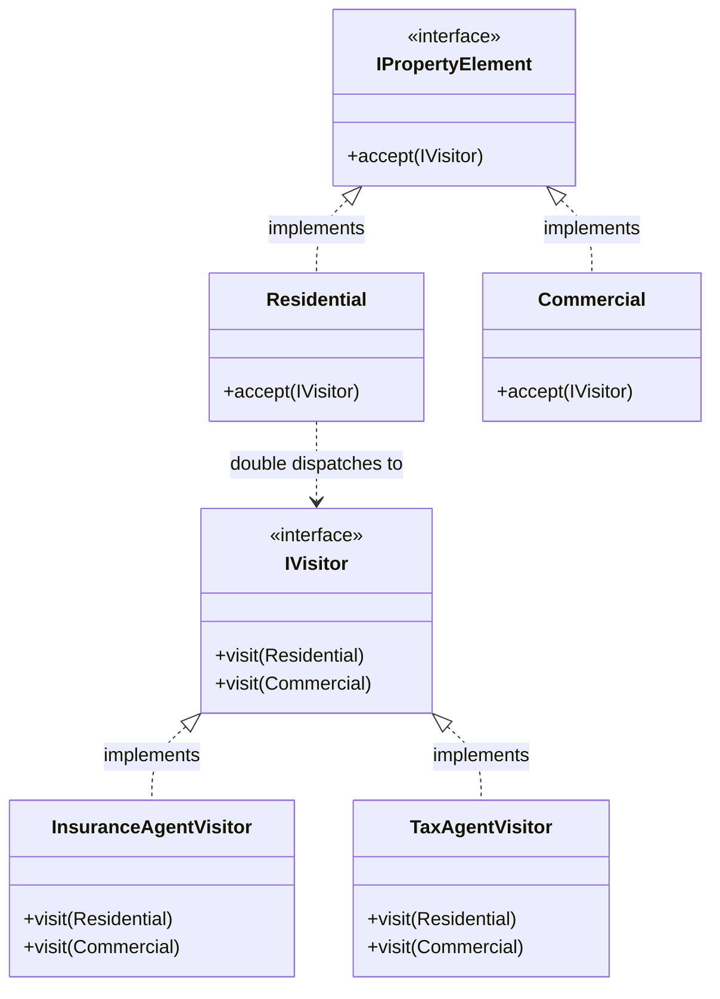

# 🕵️ Visitor Design Pattern

## 📖 1. The Core Concept (The "Why")
The **Visitor** is a behavioral design pattern that allows you to add new behaviors to existing class hierarchies without altering any existing code in those classes.

Imagine you have a complex 3D graphic structure with Nodes: `City`, `Industry`, and `Sightseeing`. You want to export them all into an XML file.

### ⚠️ The Problem
The junior approach is to add an `exportToXML()` method into the `City`, `Industry`, and `Sightseeing` classes. 
But wait—what if next week you need to export them to JSON? You have to modify all the classes again. What if you need to calculate their tax revenue? You modify them again. The geometric classes become horribly bloated with unrelated business logic (XML, JSON, Taxes), violating the **Single Responsibility Principle**. Furthermore, you might not even have permission to edit the Node classes if they belong to a third-party library!

### ✅ The Solution
Leave the `City` and `Industry` classes alone! Instead, extract the XML-exporting algorithms into a completely new class called the **Visitor** (`XMLVisitor`). 
To make this work, the elements just need one tiny method: `accept(Visitor v)`, which literally just calls `v.visit(this);`. This guarantees that if you have 50 elements, you can create 100 new visitor actions over the next 10 years without EVER touching the 50 element classes again.

---

## 🏗️ 2. Architectural Blueprint



---

## 💻 3. Implementation Deep Dive (Java)

1. **The Elements:** Add the `accept` boiler-plate.
```java
public class Residential implements IPropertyElement {
    // This looks redundant, but is required for Double Dispatch
    public void accept(IVisitor visitor) {
        visitor.visit(this); // 'this' is strictly typed as Residential!
    }
}
```
2. **The Visitor Interface:** Contains overloads for every element type.
```java
public interface IVisitor {
    void visit(Residential r);
    void visit(Commercial c);
}
```
3. **The Concrete Visitor:** The actual extracted algorithm.
```java
public class InsuranceAgentVisitor implements IVisitor {
    public void visit(Residential r) { print("Residential Insurance: $1000"); }
    public void visit(Commercial c) { print("Commercial Insurance: $5000"); }
}
```

---

## 🚀 4. SDE-2+ Pragmatic Perspective: The AST Architect

In senior-level software engineering, the single most famous usage of the Visitor pattern is in **Compilers and Abstract Syntax Trees (AST)**.

### 🏗️ Why it matters for Scaling 
1.  **Code Compilers:** When you write a Java program, `javac` compiles it into an AST (A massive tree of `IfNode`, `MethodNode`, `ExpressionNode`). To run type-checking, the compiler sends a `TypeCheckVisitor` across the tree. To optimize the code, it sends an `OptimizeVisitor`. To generate byte-code, it sends a `ByteCodeGenVisitor`. The AST elements themselves literally never change.
2.  **Open/Closed Guarantee:** The Visitor pattern is the ultimate manifestation of the Open/Closed Principle. If your object hierarchy (the elements) is stable and locked, but you anticipate performing hundreds of unrelated operations on them in the future, Visitor is the only way to do it cleanly.

---

## 🎓 5. Interview Tips: Creating "Strong Hire" Impact

### 1. "Double Dispatch"
*   **What to say:** *"The Visitor pattern relies on a trick called **Double Dispatch**. In Java (and C#), method overloading is resolved at **compile-time**, not runtime! If you have a `List<Element>` and loop through it, calling `visitor.visit(item)`, the compiler will crash because it only sees the interface `Element`, not the underlying `Residential` type. To fix this, we call `item.accept(visitor)` (Dispatch 1: Runtime polymorphism resolves the exact Element). Inside `accept`, the object calls `visitor.visit(this)` (Dispatch 2: The compiler now knows `this` is specifically `Residential`, so it triggers the correct overloaded method)."*

### 2. "The Crucial Constraint of Visitor"
*   **What to say:** *"The Visitor pattern is only useful if the Element Hierarchy is **stable** (it rarely changes). If you add a new Element type (e.g., `FactoryElement`), you must open up the `IVisitor` interface and add `visit(FactoryElement)`. This forces you to update EVERY Concrete Visitor in the entire codebase. Only use Visitor if algorithms change frequently, but elements do not."*

---

## ⚠️ 6. Edge Cases & Pitfalls
*   **Encapsulation Breach:** A major flaw of the Visitor pattern is that the Visitor often needs to access the internal state of the Elements to do its job. This forces you to make variables `public` or add `public getters`, weakening the Element's encapsulation.

---

## ✅ SDE-2+ Readiness Check
*   [ ] Can you verbally explain what Double Dispatch is and why Java requires it?
*   [ ] What happens to your code if you add a new Element class to a Visitor architecture?
*   [ ] Why is Visitor used heavily in compilers and AST parsing?

---

## 🌍 7. Cross-Language: Visitor

### 🐍 Python
Python does NOT natively support method overloading! Thus, Double Dispatch doesn't work out-of-the-box in Python. Python engineers use `functools.singledispatch` or dynamic decorators to artificially recreate the Visitor pattern.
```python
class Visitor:
    def visit_residential(self, res): pass
    def visit_commercial(self, com): pass

class Residential:
    def accept(self, visitor): visitor.visit_residential(self)
```
