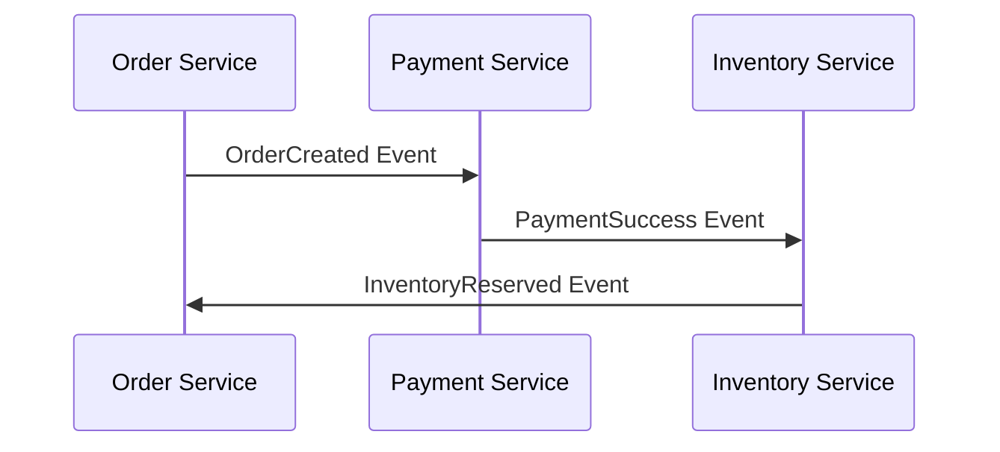
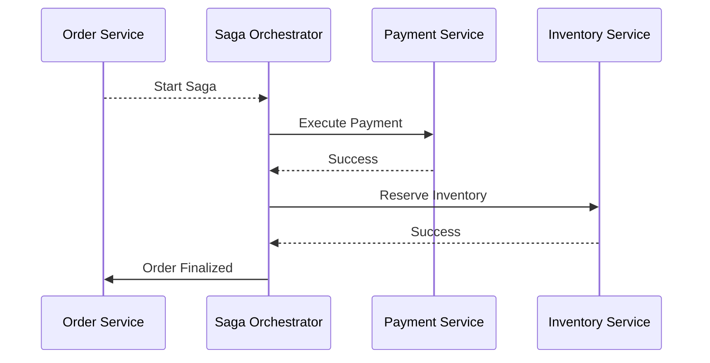

# 🤝 08 - Distributed Transactions (The SDE-3 Edge)

## 📖 The Concept
In a microservices architecture, a single business workflow (e.g., Booking a trip: Flight + Hotel + Car) spans multiple independent databases. Ensuring all succeed, or all fail together, is the problem of Distributed Transactions.

## 📊 The SDE-2 Trade-off Table: 2PC vs Saga

| Feature | Two-Phase Commit (2PC) | Saga Pattern |
| :--- | :--- | :--- |
| **Mechanism** | Coordinator asks all DBs to prepare, then commit. | Sequence of local transactions triggering the next via events. |
| **Consistency** | **Strong Consistency** (ACID). | **Eventual Consistency** (BASE). |
| **Performance** | Slow. Locks resources across services during the "prepare" phase. | Fast. No cross-service locking. |
| **Failure Handling** | Built-in abort/rollback. | Requires writing custom **Compensating Transactions** (Undo operations). |

## 🚫 The Interview Trap
**"I will use Two-Phase Commit to ensure data integrity."**
2PC is notoriously anti-scalable. It is a blocking protocol. If one node is slow, the entire transaction blocks. It is rarely used in modern microservices.
*Better Answer:* "2PC doesn't scale well for high-throughput microservices. I will use the Saga Pattern to maintain eventual consistency and high availability."

## 🚀 3. Saga: Choreography vs. Orchestration

### Choreography (Event-based)

### Orchestration (Command-based)

---

## 🛠️ 4. The TCC Pattern (Try-Confirm-Cancel)
For scenarios where you need more control than a Saga but can't afford 2PC locks.
1.  **Try**: Reserve resources (e.g., "Soft-lock" an item).
2.  **Confirm**: Finalize the reservation (Hard-commit).
3.  **Cancel**: Release the soft-lock if anything fails.

**Senior Signal:** "We used the **Saga Orchestrator** pattern for our checkout flow because it provides a centralized state machine that makes it trivial to handle complex, multi-service rollbacks and monitoring, which is a nightmare with pure choreography."

---
