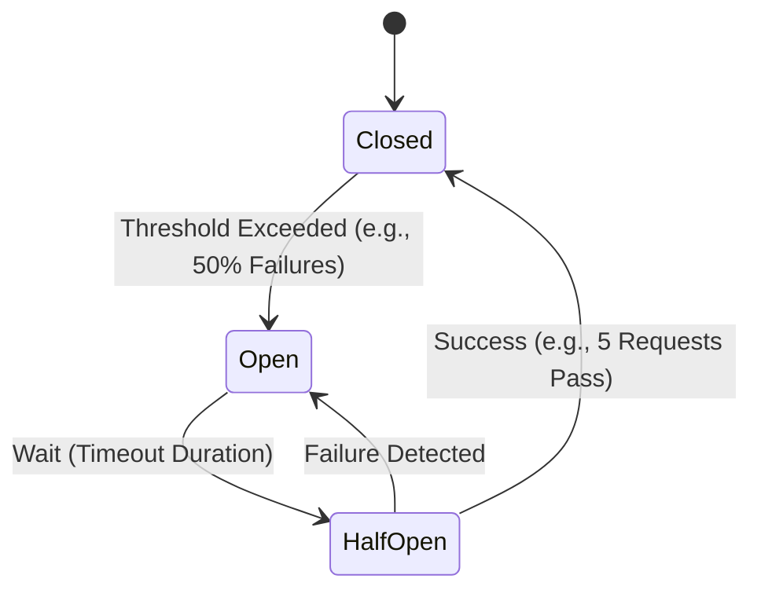

# 🛡️ 09 - System Resiliency (The SDE-3 Edge)

## 📖 The Concept
Distributed systems *will* fail. Resiliency is the ability of a system to recover from failures and continue to function, preventing a single broken component from taking down the entire architecture.

## 📊 The SDE-2 Trade-off Table: Resiliency Patterns

| Pattern | How it Works | When to Use It |
| :--- | :--- | :--- |
| **Circuit Breaker** | Stops making calls to a failing downstream service for a set time. | When a 3rd party API is timing out, preventing your threads from hanging. |
| **Bulkhead** | Isolates resources (e.g., Thread pools) so one failure doesn't consume everything. | When Service A and Service B share a server; if B spikes, A shouldn't crash. |
| **Rate Limiting** | Restricts the number of requests a client can make. | To prevent DDoS attacks or abusive clients from hogging resources. |
| **Retry w/ Backoff** | Automatically retries failed network calls with increasing delays. | For transient network blips (e.g., a momentary 503 error). |

## 🛠️ 2. Circuit Breaker: The State Machine

An SDE-2 must explain *how* a circuit breaker knows when to close again.

*   **Closed:** Normal operation. Requests flow through.
*   **Open:** Service is failing. Requests are rejected immediately (Fast-Fail) to protect the caller.
*   **Half-Open:** Testing the waters. A limited number of requests are allowed through to see if the downstream service has recovered.

---

## 🚀 The SDE-3 Edge: Idempotency & Dead Letter Queues

### 1. Idempotency Keys (Crucial for Payments)
If a retry happens, how do you prevent charging the customer twice?
**The Senior Answer:** "Every request must include a unique **Idempotency-Key** (UUID) generated by the client. The server stores this key in Redis/DB with the result of the initial operation. If a second request arrives with the same key, the server simply returns the cached result without re-executing the logic."

### 2. Dead Letter Queues (DLQ)
What happens if a message fails to be processed after all retries?
**The Senior Answer:** "We don't just drop it. We move it to a **Dead Letter Queue (DLQ)**. This isolates problematic requests for manual inspection and debugging without blocking the main event-processing pipeline."

**Senior Signal:** "We implement **Observability** on our DLQs. If the DLQ size spikes, it triggers an alert, alerting us to a potential bug in our consumer logic or a schema mismatch."

---
