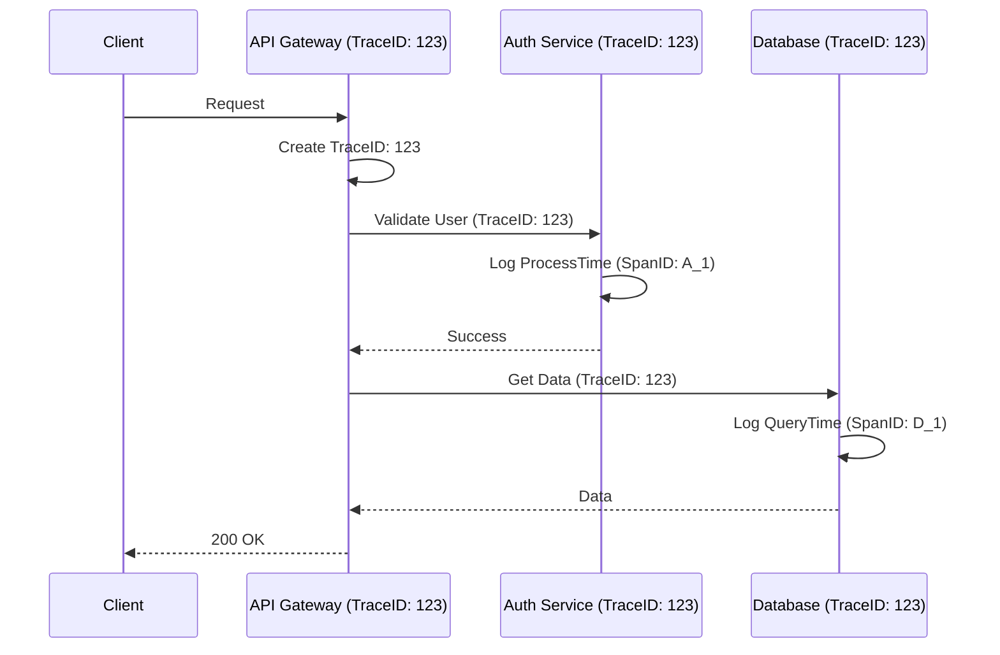

# 📡 12 - Observability & Ops (C137-C145)

## 🧭 Observability & Ops Study Path
Use this structured path aligned with your **Google Sheet Tracker** to master system monitoring, debugging, and resilience operations:

### 🟢 1. Foundations & Instrumentation
*   [C137 - The Three Pillars (Metrics, Logs, Traces)](./01-Three-Pillars.md)
*   [C138 - Metrics Collection](./02-Metrics-Collection.md)
*   [C139 - Log Aggregation](./03-Log-Aggregation.md)
*   [C140 - Distributed Tracing](./04-Distributed-Tracing.md)

### 🟡 2. Reliability Mathematics
*   [C141 - SLIs, SLOs, and SLAs](./05-SLI-SLO-SLA.md)
*   [C142 - Latency Budgets & Percentiles](./06-Latency-Budgets.md)

### 🔴 3. Operational Control & Troubleshooting
*   [C143 - Alerting & On-Call Excellence](./07-Alerting.md)
*   [C144 - Identifying Bottlenecks](./08-Identify-Bottlenecks.md)

### 🟣 4. Chaos & Proactive Resiliency
*   [C145 - Chaos Engineering](./09-Chaos-Engineering.md)

---

## 📊 1. The Three Pillars

| Pillar | Purpose | Tools |
| :--- | :--- | :--- |
| **Metrics** | Numerical data over time (aggregatable). | Prometheus, Grafana, Datadog. |
| **Logging** | Discrete events (textual). | ELK Stack (Elastic, Logstash, Kibana), Loki. |
| **Tracing** | Following a request across service boundaries. | Jaeger, Zipkin, AWS X-Ray. |

---

## ⚖️ 2. SLIs, SLOs, and SLAs

- **SLI (Service Level Indicator)**: The actual metric (e.g., "Latency is 150ms").
- **SLO (Service Level Objective)**: The target goal (e.g., "99% of requests must be < 200ms").
- **SLA (Service Level Agreement)**: The legal contract (e.g., "If availability drops below 99.9%, we refund the customer").

---

## 🚨 3. Distributed Tracing: The Visibility Engine

In a 10k+ user system, a single request might hit 10 different services. How do you find the slow one?

### The SDE-3 Edge: Sampling Strategies
At scale (1M+ requests), you cannot trace *everything* because the storage cost would exceed the value.
*   **Head-based Sampling:** Decide to trace a request at the **start** (e.g., sample 1%). Easiest to implement.
*   **Tail-based Sampling:** Trace everything in memory, but only **save** the traces that take > 200ms or return an error. **The Senior Choice** for finding bugs while keeping costs low.

---

## 🔔 4. Alerting & On-Call Excellence

- **The Trap:** Alerting on **Causes** (e.g., "CPU > 80%"). This leads to "Alert Fatigue" and ignored pages.
- **The Gold Standard:** Alert on **Symptoms** (e.g., "P99 Latency > 500ms" or "HTTP 5xx error rate > 1%"). These are the only things that directly impact your users.

**Senior Signal:** "We follow the **RED Pattern** for our microservices: **R**ate (Requests/sec), **E**rrors (Failed requests/sec), and **D**uration (Latency distribution). We only page engineers when these high-level signals deviate from our SLOs."

---
