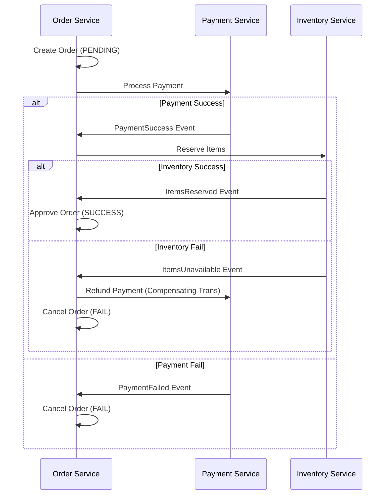

# 🏗️ 13 - Architectural Patterns (Monolith, Microservices, & Beyond)

Choosing the right architectural style is the most fundamental decision in a project. It determines how your team scales, how you deploy, and how you handle failure.

---

## 🏢 1. Monolith vs. Microservices

| Feature | Monolithic | Microservices |
| :--- | :--- | :--- |
| **Complexity** | Low (Single codebase). | High (Network, Service Discovery). |
| **Deployment** | All-or-nothing. | Independent deployments. |
| **Scalability** | Scale the whole app. | Scale specific bottlenecks. |
| **Reliability** | One crash can kill everything. | Fault isolation (Bulkheads). |

*Founding Engineer Pro-Tip:* Start with a **Modular Monolith**. It gives you clean boundaries without the "distributed systems tax" until you actually have 10k+ concurrent users.

---

## 🌊 2. Event-Driven Architecture (EDA)
Instead of services calling each other directly (Request-Response), they communicate via **Events**.

### CQRS (Command Query Responsibility Segregation)
- **Commands**: Writes (Create/Update/Delete). Optimized for consistency.
- **Queries**: Reads. Optimized for performance (often uses a separate Read DB/Cache).

### Saga Pattern
How to handle distributed transactions without 2PC (Two-Phase Commit).

| Feature | Choreography (Event-based) | Orchestration (Command-based) |
| :--- | :--- | :--- |
| **Logic** | Distributed across services. | Centralized in an "Orchestrator". |
| **Coupling** | Low (Services just listen to events). | High (Orchestrator knows about all services). |
| **Complexity** | High (Hard to track the whole flow). | Lower (Easy to see the state). |
| **Use Case** | Simple workflows. | Complex, multi-step business logic. |

#### Example: Food Delivery Saga (Mermaid)

---

## 🚀 The SDE-3 Edge: The Transactional Outbox Pattern

**The Problem:** You update the Database and then send a Message to Kafka. If the message send fails (network blip) but the DB commit succeeds, your system is **Inconsistent**.

**The SDE-3 Solution:**
1. Instead of sending directly to Kafka, you write the message into an `OUTBOX` table in the *same* database transaction as your business logic.
2. A separate **Message Relayer** (or CDC tool like Debezium) polls the `OUTBOX` table and publishes to Kafka.
3. This guarantees **At-Least-Once Delivery** and ensures the DB and Message Broker are always in sync.

---

## 🚀 The SDE-4/Architect Signal: Cell-Based Architecture
If asked how to scale a social network to 100M+ users without a single point of failure:
"We use **Cell-Based Architecture**. We partition our entire stack (LB, Web, DB) into independent 'Cells' (e.g., 1M users per cell). If Cell A goes down, it has **zero impact** on Cell B. This limits the 'Blast Radius' of any failure."

---

## 🛡️ 3. Idempotency 
An operation is **Idempotent** if performing it multiple times has the same effect as performing it once.
- *Crucial for:* Retry logic in distributed systems.
- *Implementation:* Use an **Idempotency Key** (e.g., Request UUID) stored in Redis/DB.

---

## 🚪 4. API Gateways & Proxies 

### API Gateway
A single entry point for all clients. Handles:
- Authentication & Authorization.
- Rate Limiting.
- Request Routing & Aggregation.

### Reverse Proxy (Nginx/HAProxy)
- Terminates SSL.
- Handles Load Balancing.
- Caches static content.

---

## 🚀 The SDE-2 Interview Tip
If you suggest Microservices, the interviewer will ask: **"How do you handle a failure in Service B when Service A calls it?"**
*Answer:* "I would use a **Circuit Breaker** to stop cascading failures and provide a **Fallback** response."
