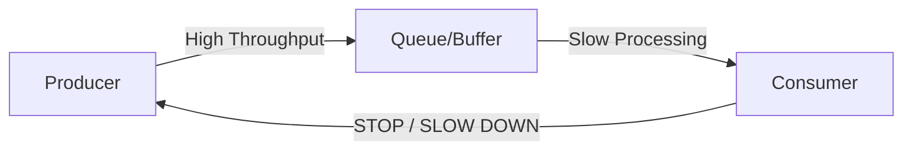

# 🌊 15 - Stream Processing & Backpressure

## 📖 1. The Concept
In a 10k+ user system, data doesn't just sit in a DB; it **flows**. Stream processing is the ability to analyze and act on data in real-time as it arrives.

---

## 📊 2. Batch vs. Stream Processing

| Feature | Batch (Hadoop, Spark) | Stream (Kafka Streams, Flink) |
| :--- | :--- | :--- |
| **Latency** | Hours/Days. | Seconds/Milliseconds. |
| **Data Scope** | All data (Finite). | Unbounded (Infinite). |
| **Use Case** | Monthly Payroll, Nightly Reports. | Fraud Detection, Real-time Leaderboards. |

---

## 🛑 3. Flow Control: Backpressure

In a 10k+ user system, if the Producer sends 10k events/sec but the Consumer only handles 1k, the system will crash.

### The SDE-2 Backpressure Toolkit:
1.  **Load Shedding**: Dropping the least important messages (e.g., non-critical logging) when the buffer is 90% full.
2.  **Adaptive Rate Limiting**: The client automatically slows down when it sees an upward trend in latency.
3.  **Pull-based Processing**: Consumers poll for data only when they have CPU/Memory capacity available (The "Karka" way).

---

## 🪟 4. Windowing Strategy
How do you count "T-Shirt sales in the last hour" on a stream?
- **Tumbling Window**: Fixed-size, non-overlapping (e.g., 10:00-11:00, 11:00-12:00).
- **Sliding Window**: Overlapping (e.g., "Last 60 mins" updated every 5 mins).
- **Session Window**: Groups by user activity burst. Closes after X minutes of inactivity.

---

## 🚀 5. The SDE-3 Edge: Exactly-Once Processing
In a distributed stream, how do you ensure an event isn't processed twice?
**The Solution:** Use **Idempotency Keys** and **Checkpointing** (e.g., Apache Flink). The system periodically takes a "Snapshot" of all consumer offsets and internal states. If a node fails, it rolls back to the last consistent snapshot.

**Senior Signal:** "We chose **Flink** over Spark Streaming for our billing pipeline because of its native support for **Exactly-Once Semantics** and its efficient **Watermarking** mechanism to handle out-of-order events."

---
