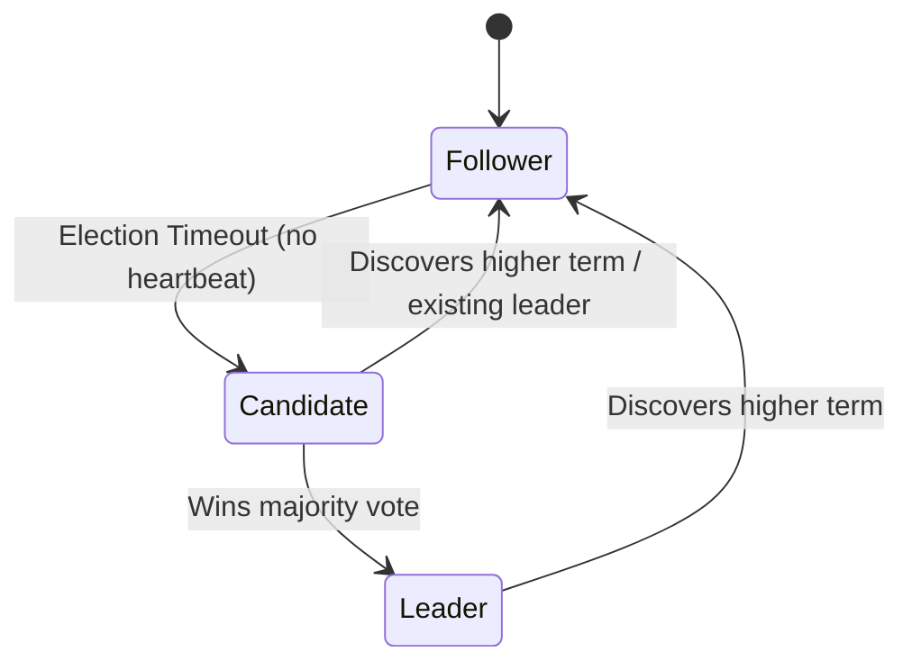

# ⚡ 10 - Raft Consensus

## 📋 Tracker Metadata
| Column | Value / Status |
| :--- | :--- |
| **Concept ID** | C084 |
| **Category** | Distributed Consensus |
| **Difficulty** | 🔥 Hard |
| **Interview Frequency** | 🔥 High |
| **Understanding** | [🔴 None / 🟡 Conceptual / 🟢 Applied] |
| **Can Explain** | [ ] Yes / [ ] No |
| **Whiteboard Drawn** | [ ] Yes / [ ] No |
| **Taught Someone** | [ ] Yes / [ ] No |
| **Next Review** | YYYY-MM-DD |
| **Mastery** | [🔴 Familiar / 🟡 Competent / 🟢 Expert] |

---

## ⚡ 1. The Core Definition & Trigger
*   **Two-Sentence Trigger:** Raft is a consensus algorithm designed to be understandable and practically implementable, providing the same strong consistency guarantees as Paxos but decomposing the problem into three independently solved sub-problems: Leader Election, Log Replication, and Safety. A single elected Leader is the only node allowed to accept client writes, replicating log entries to a quorum of Followers before committing.
*   **Scalability Dimension:** Primary: **Strong Consistency (Linearizability)** & **High Availability (Automatic Failover)**. Secondary: Negative impact on **Write Latency (quorum round-trip)** & **Write Throughput (single-leader bottleneck)**.

---

## ⚖️ 2. Trade-offs & Deep Dive

### The Three Sub-Problems

**1. Leader Election:**
*   Every node starts as a **Follower**.
*   If a Follower does not receive a heartbeat within its randomized election timeout (150–300ms), it transitions to **Candidate**, increments its term, votes for itself, and requests votes from all other nodes.
*   A Candidate becomes **Leader** if it receives a majority ($\lfloor N/2 \rfloor + 1$) of votes.
*   **Randomized timeouts** prevent all nodes from becoming candidates simultaneously (split votes).

**2. Log Replication:**
*   Leader receives a client write request and appends it to its log (uncommitted).
*   Leader sends `AppendEntries(entry, term)` RPC to all Followers in parallel.
*   Once a **quorum** of Followers acknowledge the entry, the Leader **commits** it (applies to state machine) and responds to the client.
*   On the next heartbeat, Followers learn the entry is committed and apply it locally.

**3. Safety (The Log Matching Property):**
*   Two log entries with the same index and term are guaranteed to contain the same command.
*   If an entry is committed, all future leaders will have that entry in their log (guaranteed by election restriction: candidates must have a log at least as up-to-date as the majority they receive votes from).

### State Transitions


---

## 💥 3. Resiliency & Operations
*   **Observability (The "Signal"):**
    *   `Raft Term Number`: Rapidly incrementing terms indicate cluster instability, frequent elections, or network partitions.
    *   `Commit Lag (Leader vs. Follower log index delta)`: High lag indicates followers are falling behind, increasing risk of data loss on failover.
    *   `Election Duration`: Time from leader crash to new leader commit acceptance. This is the write outage window.
*   **Blast Radius (The "Impact"):**
    *   **Leader crash:** Followers detect heartbeat timeout → election → **1–3 seconds of write unavailability** typical.
    *   **Network Partition (minority side):** The minority partition cannot elect a new leader (no quorum) — clients are refused writes, preventing split-brain. The majority partition continues serving.
*   **Numbers to Know:**
    *   Typical heartbeat interval: **50–150ms**.
    *   Typical election timeout range: **150–300ms (randomized)**.
    *   Raft can tolerate up to $\lfloor (N-1)/2 \rfloor$ node failures.

---

## 🚫 4. Interview Playbook

### Common Mistakes (The "Junior" Signals)
*   Stating "Raft sacrifices consistency for availability" — the opposite is true. Raft is a **CP** (Consistent + Partition-Tolerant) system. It sacrifices availability during leader election windows.
*   Saying all nodes in Raft can accept writes (only the **Leader** can accept client writes in standard Raft).
*   Forgetting that the election timeout must be randomized — fixed timeouts cause perpetual split votes.

### Interview Tip (The "Strong Hire" Signal)
> *"We use etcd's Raft implementation for our distributed lock service and leader election. Raft gives us **linearizable reads and writes** — any committed state is immediately visible to all clients. The trade-off is write latency (one quorum round-trip per commit, ~10–20ms in a data center) and a 1–3 second unavailability window during leader re-election."*

---

## 💡 5. My Custom Study Notes & Whiteboard
```
Raft Write Path (Happy Path):

Client ──► Leader: "Write X=5"
Leader: Appends to local log (uncommitted)
Leader ──► Followers: AppendEntries(X=5, term=7)
Followers ──► Leader: ACK
(Quorum ACK received)
Leader: Commits entry → applies to state machine → replies to Client: "OK"
(Next heartbeat) → Followers learn committed → apply locally

Failure Scenario:
Leader crashes after quorum ACK but before client reply:
→ New leader elected with entry in its log (won election because it had the up-to-date log)
→ New leader commits the entry
→ Client retries and succeeds (idempotent operations required!)
```
