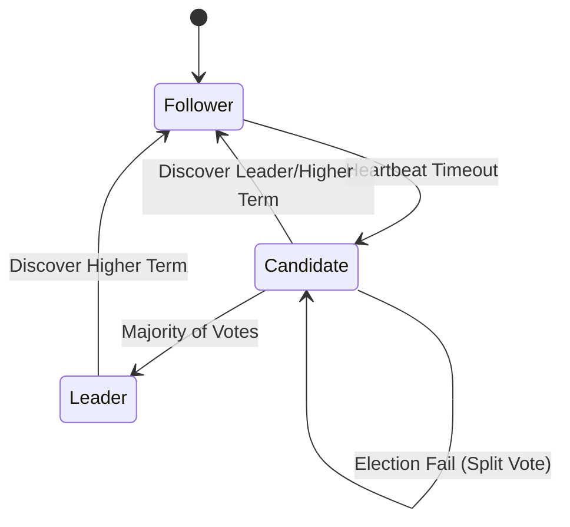

# 🤝 20 - Distributed Consensus (C075-C088)

## 🧭 Distributed Consensus Study Path
Use this structured path aligned with your **Google Sheet Tracker** to master distributed systems primitives:

### 🟢 1. Coordination & Failure Detection
*   [C086 - Distributed Locking](./01-Distributed-Locking.md)
*   [C087 - Fencing Tokens](./02-Fencing-Tokens.md)
*   [C075 - Heartbeat Mechanism](./04-Heartbeat-Mechanism.md)
*   [C082 - Leader Election](./07-Leader-Election.md)

### 🟡 2. Cluster Membership & Data Integrity
*   [C076 - Gossip Protocol](./03-Gossip-Protocol.md)
*   [C081 - Merkle Trees](./08-Merkle-Trees.md)
*   [C030 - Bloom Filters](../04-Caching-Deep-Dive/16-Bloom-Filters.md)

### 🟡 3. Logical Time & Ordering
*   [C077 - Lamport Timestamps](./05-Lamport-Timestamps.md)
*   [C078 - Vector Clocks](./06-Vector-Clocks.md)

### 🔴 4. Consensus Algorithms
*   [C085 - Quorum](./11-Quorum.md)
*   [C083 - Paxos Algorithm](./09-Paxos-Algorithm.md)
*   [C084 - Raft Consensus](./10-Raft-Consensus.md)

---

## 📖 1. The Concept
In a distributed system with 10k nodes, how do they all agree on a single value (e.g., "Who is the Master?") despite network failures? This is **Consensus**.

---

## 🏛️ 2. The Raft Algorithm: State Machine

An SDE-2 must explain how Raft handles failures through its three primary states.

### The "Split Brain" Problem
What if two candidates start an election at the exact same time? 
- **The Solution:** **Randomized Election Timeouts**. This ensures that one candidate will likely time out before the other, starting its election and securing a majority while the other is still waiting.

---

## ⚡ 3. The SDE-3 Edge: Linearizability vs. Eventual Consistency
When would you *not* use Raft?
- **Trade-off:** Consensus adds **Latency** because every write must wait for a network round-trip to a majority ($N/2 + 1$) of nodes.
- **Decision:** If your scale (100k+ writes/sec) exceeds what a few nodes can handle, you might drop Consensus for **Eventual Consistency** (e.g., Gossip Protocol in DynamoDB).

**Senior Signal:** "We use **etcd** for our service discovery and leader election because its Raft implementation provides **Linearizable Reads**, ensuring that all components have a globally consistent view of the cluster state, preventing the catastrophic 'Dual Master' scenario."

---
