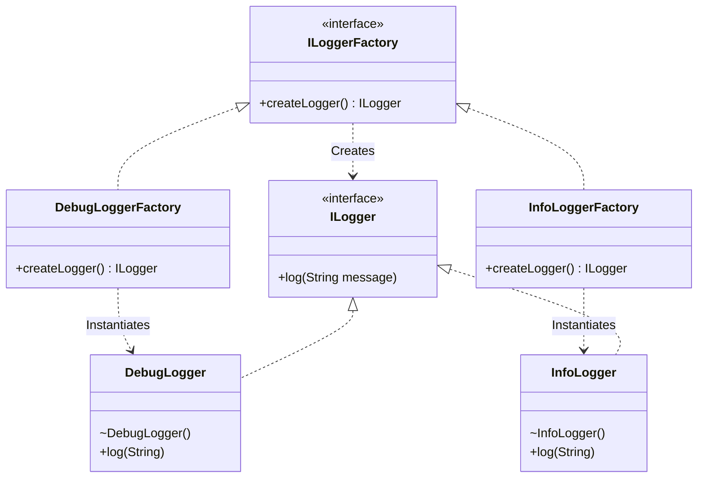

# 🏭 Factory Method Design Pattern

## 📖 1. The Core Concept (The "Why")
The **Factory Method** pattern is a creational design pattern that provides an interface for creating objects in a superclass, but allows subclasses to alter the type of objects that will be created.

### ⚠️ The Problem: Simple Factory goes wrong (Open/Closed Violation)
A Simple Factory (`LoggerFactory.java` with a big `switch` statement) is a great starting point. But what happens when you have a massive application and need to add 5 new loggers? Every time you add a new logger, you have to open the centralized `LoggerFactory` and add another `case` or `else if` branch. 

This violates the **Open/Closed Principle (OCP)**. The factory class is open for *modification* every time a new product is added. In highly concurrent or large team environments, modifying a centralized factory constantly causes merge conflicts and instability.

### ✅ The Solution: Factory Method
Instead of one massive factory, we completely decentralize object creation.
We define a **Creator Interface** (`ILoggerFactory`) with a method `createLogger()`. Then, we create specific **Concrete Creators** (`DebugLoggerFactory`, `ErrorLoggerFactory`) that implement this interface and instantiate only their corresponding product.

Now, to add a `CloudLogger`, you never touch existing code. You simply create `CloudLogger.java` and `CloudLoggerFactory.java`. The system is closed for modification, but open for extension.

---

## 🏗️ 2. Architectural Blueprint

The Factory Method pattern generally consists of two parallel hierarchies:
1. **The Product Hierarchy**: `ILogger` (Interface) -> `DebugLogger`, `InfoLogger`
2. **The Creator Hierarchy**: `ILoggerFactory` (Interface) -> `DebugLoggerFactory`, `InfoLoggerFactory`



---

## 💻 3. Implementation Deep Dive (Java)

Our implementation is split into two evolutionary stages to demonstrate the "Why":

### Stage 0: The Simple Factory Violation (00-Before-Factory-Method)
Run it: `java before.Main`
This package demonstrates the anti-pattern:
```java
public static ILogger createLogger(String type) {
    if (type.equalsIgnoreCase("DEBUG")) return new DebugLogger();
    else if (type.equalsIgnoreCase("INFO")) return new InfoLogger();
    // VIOLATION: Adding a new logger forces modifying this method!
}
```

### Stage 1: The Factory Method (logger package)
Run it: `java Main`
By completely abstracting the factory into an interface, we rely purely on polymorphism:

```java
// The Creator Interface
public interface ILoggerFactory {
    ILogger createLogger();
}

// The Concrete Creator - CLOSED for modification!
public class ErrorLoggerFactory implements ILoggerFactory {
    @Override
    public ILogger createLogger() {
        return new ErrorLogger();
    }
}
```

The Client (`Main.java`) never calls `new` on the product directly, nor does it pass strings to a giant switch statement. It receives an `ILoggerFactory` (often via Dependency Injection) and simply asks it to create the logger.

---

## 🧩 4. Factory Method vs. SOLID Principles (The Senior Perspective)

The Factory Method pattern is a fundamental enabler for SOLID principles, specifically OCP and SRP.

- **S - Single Responsibility Principle (SRP): ✅ Adheres**
  It delegates the responsibility of *instantiating* an object away from the class that *uses* it. The creator class only creates; the client class only consumes.
- **O - Open/Closed Principle (OCP): ✅ Adheres**
  This is the pattern's superpower. You can introduce new product types into the program without breaking existing client code (you just add a new `ConcreteCreator` and `ConcreteProduct`).
- **L - Liskov Substitution Principle (LSP): ✅ Adheres**
  As long as all `ConcreteProducts` strictly adhere to the `Product` interface contracts, clients can blindly substitute them.
- **I - Interface Segregation Principle (ISP): ✅ Unaffected**
  Depends on how the `Product` interface is designed, but the pattern itself doesn't force fat interfaces.
- **D - Dependency Inversion Principle (DIP): ✅ Adheres**
  Clients depend on the abstract `Creator` and `Product` interfaces, completely decoupling them from concrete classes.

---

## 🎭 5. Junior vs. Senior Implementation

| Feature | Junior Developer | Senior Developer |
|---|---|---|
| **Product Constructors** | `public DebugLogger()` | **`package-private`** — Forces the client to use the factory! If constructors are public, the pattern is easily bypassed. |
| **Client Decoupling** | Client instantiates the specific factory `new DebugLoggerFactory().createLogger()` | Client receives `ILoggerFactory` via **Dependency Injection** `@Inject ILoggerFactory factory;` |
| **When to use** | Uses Factory Method for everything, resulting in "Class Explosion" (100 products = 100 factories). | Starts with Simple Factory. Upgrades to Factory Method ONLY when OCP violations become painful or frameworks demand it. |

---

## 🏢 6. Real-World System Design

The Factory Method pattern is overwhelmingly common in frameworks and libraries where the framework defines the *wiring* but the developer defines the *products*.

1. **Spring Framework (`FactoryBean`)**: 
   Spring’s `FactoryBean<T>` interface is exactly a Factory Method. You implement `getObject()` to tell Spring how to instantiate your complex, custom objects.
2. **Java `Iterable<T>`**:
   Every collection in Java implements `Iterable`, which has the method `iterator()`. This is a Factory Method! `ArrayList` returns an `Itr`, while `LinkedList` returns a `ListItr`.
3. **Database Connectors (JDBC)**:
   You don't instantiate MySQL connections directly. You configure a proxy or a factory, and it hands you an implementation of the `Connection` interface.

---

## 🧠 7. FAANG Interview Q&A

**Q: What is the exact difference between Simple Factory, Factory Method, and Abstract Factory?**
* **Simple Factory**: A single class with an `if/else` block creating products. Not an official GoF pattern. Violates OCP.
* **Factory Method**: An interface defining a creation method. Subclasses (Concrete Creators) decide which actual product to instantiate. (Focuses on one product family).
* **Abstract Factory**: An interface containing *multiple* Factory Methods, designed to create a *suite* of related objects (e.g., MacButton, MacCheckbox vs WinButton, WinCheckbox).

**Q: Isn't creating a whole new Factory class for every single Product class a massive overkill? (Class Explosion)**
* **A:** Yes! It is the biggest drawback of the Factory Method pattern. If you don't actually intend to leverage polymorphism (i.e. if clients always hardcode `new DebugLoggerFactory()`), the pattern is useless boilerplate. Senior developers usually start with a **Simple Factory** or strict **Constructors** and refactor to **Factory Method** only when required by framework architecture or serious OCP pain.

---

## ✅ SDE-2+ Readiness Check
*   [ ] Can you explain how Factory Method solves the "Open/Closed" violation of a Simple Factory?
*   [ ] What is the "Class Explosion" problem and how do you decide when the pattern is overkill?
*   [ ] Why is it a best practice to make the Product constructors package-private?

---

## 🧠 Tracker Integration

*   **Trigger Phrases:** "Let subclasses decide which object to create", "Decentralize object creation", "Plug-in architecture", "Open for extension, closed for modification".
*   **SOLID Connection:** Primarily addresses **OCP** (add new product = new creator subclass) and **SRP** (separates the logic of object creation from the logic of object use).
*   **Confuses With:** 
    *   **Simple Factory:** (Hook: Simple Factory is a single class with a `switch` statement; Factory Method is an interface/abstract class with multiple creator subclasses).
    *   **Abstract Factory:** (Hook: Factory Method creates ONE product type; Abstract Factory creates a **family** of related products).
*   **Anti-Freeze Starter Code:** 
    ```java
    public interface Creator { Product createProduct(); }
    public class ConcreteCreator implements Creator {
        public Product createProduct() { return new ConcreteProduct(); }
    }
    ```
*   **Self-Assessment Prompts:** 
    1. How do you prevent a client from bypassing your factory and using `new` directly (constructor visibility)?
    2. When is a "Simple Factory" (switch statement) actually a better choice than a "Factory Method"?
    3. Can you explain the "Parallel Hierarchy" between Products and Creators?

---

## 🌍 8. Cross-Language: Factory Method in Python, TypeScript, and Go

### 🐍 Python
Because Python classes are first-class objects (you can pass the class itself as a variable), the Factory Method pattern is rarely needed in Python. You just pass the class you want to instantiate!
```python
# In Python, the "Factory" is just passing the class reference
def client_code(logger_class):
    logger = logger_class()
    logger.log("Hello")

client_code(DebugLogger)
```

### 🟦 TypeScript
TypeScript supports traditional OOP Java-style Factory Methods. However, thanks to structural typing and functional paradigms, TypeScript developers often just pass a factory function instead of a heavy class hierarchy:
```typescript
type LoggerFactory = () => ILogger;

const debugLoggerFactory: LoggerFactory = () => new DebugLogger();

function useLogger(factory: LoggerFactory) {
    const logger = factory();
    logger.log("Hello");
}
```

### 🐹 Go
Go does not have inheritance or classes, so the classical Factory Method pattern doesn't strictly exist. However, Go uses interfaces and functions to achieve the exact same decoupling:
```go
type Logger interface { Log(string) }

// The "Factory Interface" equivalent
type LoggerFactory interface { Create() Logger }

// Alternatively, just inject a func()
func ProcessData(factory func() Logger) {
    logger := factory()
    logger.Log("Processing...")
}
```
> **The Senior Insight**: Languages with first-class functions (Python, TS, Go) heavily diminish the need for dedicated "Factory Classes." A simple function reference or class reference does the exact same job with 1/10th the boilerplate. In Java, prior to Lambdas, the Factory Method class hierarchy was mandatory to pass behavior around.
