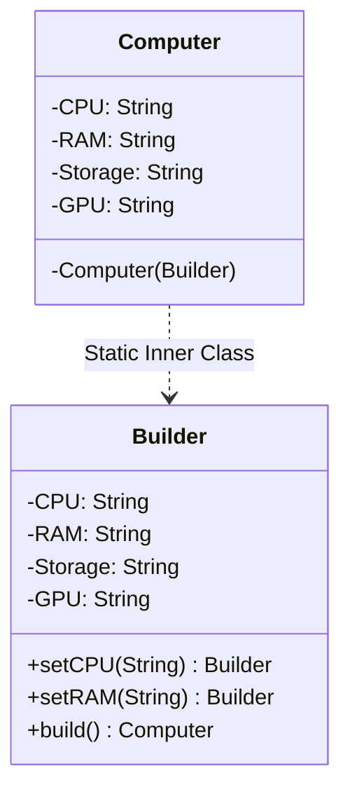
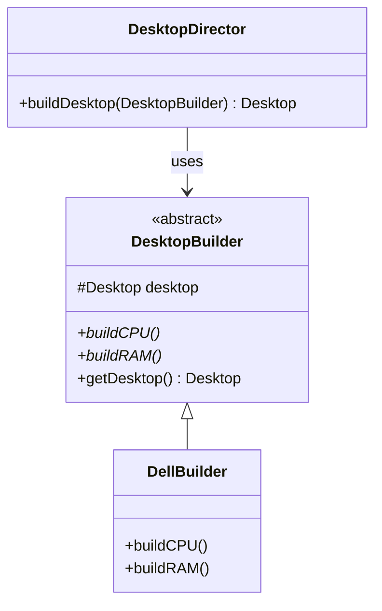

# 🏗️ Builder Design Pattern

## 📖 1. The Core Concept (The "Why")
The **Builder** pattern is a creational design pattern that lets you construct complex objects step by step. The pattern allows you to produce different types and representations of an object using the same construction code.

### ⚠️ The Problem: Constructor Hell
As objects become more complex, their constructors grow. 
1. **Telescoping Constructor**: You end up with 10 constructors where most parameters are `null`.
2. **JavaBeans (Setters)**: You use a default constructor and 10 setters, but the object is **mutable** and can be in an **inconsistent state** if a developer forgets a required field.

### ✅ The Solution: Builder
The Builder pattern provides a clean, readable way to set only the parameters you need, ensures **immutability** (final fields), and validates the object state before actually creating it.

---

## 📈 2. The Evolution (The Evolutionary Path)

### Stage 0: Telescoping Constructor ([evolution/Stage0Telescoping.java](./JAVA/evolution/Stage0Telescoping.java))
Multiple constructors where each calls the next.
- **Problem**: Hard to read, easy to swap parameters of the same type (e.g., RAM vs Storage).
- **Result**: Maintenance nightmare.

### Stage 1: JavaBeans / Setters ([evolution/Stage1JavaBeans.java](./JAVA/evolution/Stage1JavaBeans.java))
Using an empty constructor and then setters.
- **Problem**: The object is mutable. It can be modified after creation. It can also be used in a "half-baked" state.
- **Result**: Thread-safety risks and consistency issues.

### Stage 2: Modern Fluent Builder ([evolution/Stage2FluentBuilder.java](./JAVA/evolution/Stage2FluentBuilder.java))
The "Industry Standard." A static inner class that builds the outer immutable object.
- **Problem**: None.
- **Result**: **Fluent API**, **Immutability**, and **Mandatory Field Validation**.

### Stage 3: The Director (Classical GoF) ([builder/Main.java](./JAVA/builder/Main.java))
The classical approach where a **Director** class coordinates the builder.
- **Use Case**: When you have a fixed construction process but different representations (e.g., building a Dell vs building an HP Desktop).
- **Result**: High decoupling between construction logic and product details.

---

## 🏗️ 3. Architectural Blueprint

### Modern Fluent Builder


### Classical Director-based Builder


---

## 🎭 4. Junior vs. Senior Implementation

| Feature | Junior Developer | Senior Developer |
|---|---|---|
| **Immutability** | Uses public setters or public fields. | Makes fields **final** and private. Only the Builder can set them. |
| **Validation** | Checks for nulls everywhere in the business logic. | Performs all validation in the `.build()` method of the Builder. |
| **API Design** | Uses separate `builder.setA()`, `builder.setB()`. | Uses **Fluent API** (`return this`) for chaining. |
| **Director** | Hardcodes construction logic in `Main`. | Uses a **Director** when the construction algorithm is complex and reusable. |

---

## 🏢 5. Real-World System Design

1.  **Java `StringBuilder` / `StringBuffer`**:
    The most famous example. It builds a `String` (which is immutable) through a mutable buffer.
2.  **Lombok `@Builder`**:
    In modern Java production, we rarely write builders manually. We use the `@Builder` annotation from Lombok to auto-generate the Stage 2 code.
3.  **SQL Query Builders**:
    Libraries like jOOQ use fluent builders to construct complex SQL queries step-by-step while maintaining type safety.
4.  **Spring `UriComponentsBuilder`**:
    Used to build complex URLs fluently.

---

## 🚀 6. Advanced Edge Cases (SDE-2+)

### 6.1 The Step Builder Pattern (Compile-Time Safety)
A standard Fluent Builder allows `.build()` to be called at any time, which might result in a runtime exception if a mandatory field was missed. The **Step Builder Pattern** uses a chain of distinct interfaces to force the developer to set mandatory fields in a specific order at compile time.
```java
// Interface chain enforces order
public interface CPUPhase { RAMPhase setCPU(String cpu); }
public interface RAMPhase { BuildPhase setRAM(String ram); }
public interface BuildPhase { 
    BuildPhase setGPU(String gpu); // Optional
    Computer build(); 
}
// Usage: The compiler will reject this if .setRAM() is skipped.
Computer pc = Computer.stepBuilder().setCPU("i7").setRAM("16GB").build();
```

### 6.2 Builder with Inheritance (CRTP)
When dealing with inheritance (e.g., `VehicleBuilder` and `CarBuilder extends VehicleBuilder`), calling a base class method `.setWheels(4)` returns a `VehicleBuilder`. This breaks fluent chaining because you can no longer call a `Car`-specific method like `.setSunroof()`.
**The Senior Fix:** Use the **Curiously Recurring Template Pattern (CRTP)** with Java Generics.
```java
abstract class VehicleBuilder<T extends VehicleBuilder<T>> {
    protected int wheels;
    public T setWheels(int wheels) {
        this.wheels = wheels;
        return self(); // Abstract method returning 'this'
    }
    protected abstract T self();
}

class CarBuilder extends VehicleBuilder<CarBuilder> {
    @Override protected CarBuilder self() { return this; }
    public CarBuilder setSunroof(boolean hasSunroof) { /*...*/ return this; }
}
// Now chaining works perfectly:
new CarBuilder().setWheels(4).setSunroof(true).build();
```

### 6.3 Lombok `@Builder` Production Reality
In modern Java, you rarely write builders manually; you use Lombok. However, seniors know these edge cases:
- **`@Builder.Default`:** If you initialize a field like `private int cores = 4;` and use `@Builder`, Lombok will ignore your default and set it to `0` if not explicitly provided. You must annotate it with `@Builder.Default`.
- **`toBuilder = true`:** Adding `@Builder(toBuilder = true)` generates a `.toBuilder()` method on the instance. This creates a new builder initialized with the existing object's state—an elegant way to safely "copy and modify" an immutable object.

### 6.4 Thread-Safety: Builder vs. Built Object
While the final product (`Computer`) is deeply immutable and completely thread-safe, **the `Builder` instance itself is highly mutable and NOT thread-safe**. 
- **Rule:** A Builder instance must be strictly confined to local method scope. Never store a Builder as a class field or share it across multiple threads.

---

## 🧠 7. FAANG Interview Q&A

**Q: When should I use Builder instead of just a Constructor?**
* **A:** Rule of thumb: If there are more than 4 parameters, or if many parameters are optional, or if the object must be immutable.

**Q: Why make the Builder a Static Inner Class?**
* **A:** It allows the Builder to access the private constructor of the outer class, ensuring that the *only* way to create the object is through the Builder.

**Q: Builder vs Abstract Factory?**
* **A:** Builder focuses on the **step-by-step construction** of a *single* complex object. Abstract Factory focuses on creating **families** of *related* objects.

---

## ✅ 8. SDE-2+ Readiness Check
*   [ ] Why is the Builder usually implemented as a static inner class?
*   [ ] Where should the validation logic reside (the constructor or the `.build()` method)?
*   [ ] How does the "Director" class differ from the "Fluent Builder" approach?

---

## 🧠 9. Tracker Integration

*   **Trigger Phrases:** "Complex object construction", "Step-by-step creation", "Telescoping constructor", "Immutable object with many fields", "Fluent API".
*   **SOLID Connection:** Primarily addresses **SRP** (isolates building logic from the product class).
*   **Confuses With:** 
    *   **Factory Patterns:** (Hook: Factory = *which* type to create; Builder = *how* to build a specific complex object).
*   **Anti-Freeze Starter Code:** 
    ```java
    public class Product {
        private Product(Builder b) {}
        public static class Builder {
            public Builder setX(int x) { return this; }
            public Product build() { return new Product(this); }
        }
    }
    ```
*   **Self-Assessment Prompts:** 
    1. Why is the Builder usually implemented as a static inner class?
    2. Where should the validation logic reside (the constructor or the `.build()` method)?
    3. How does the "Director" class differ from the "Fluent Builder" approach?
