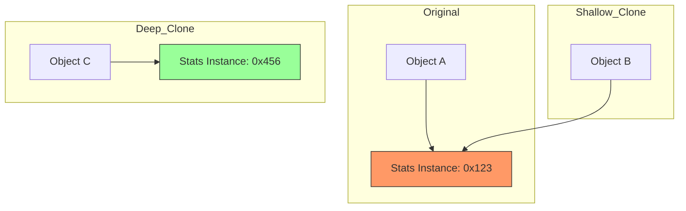

# 🧬 Prototype Design Pattern

## 📖 1. The Core Concept (The "Why")
The **Prototype** pattern is a creational design pattern that lets you copy existing objects without making your code dependent on their classes.

### ⚠️ The Problem: Costly Creation
1. **Expensive Initialization**: Some objects require complex database queries or network calls to initialize.
2. **Similar Objects**: You need 100 "Orc" enemies in a game that are 99% identical. Doing `new Orc()` 100 times and setting 50 fields each time is slow and redundant.

### ✅ The Solution: Cloning
Instead of creating a fresh object from scratch, you take an existing "Prototype" object and **clone** it. This follows the "Copy-Paste-Modify" approach.

---

## 📈 2. The Evolution (The Evolutionary Path)

### Stage 0: Shallow Copy Mess ([evolution/stage0/Stage0ShallowCopy.java](./JAVA/evolution/stage0/Stage0ShallowCopy.java))
The most common bug. You copy the object, but you accidentally share the internal references (like a `Stats` object).
- **The Bug**: Modifying the health of the clone accidentally modifies the health of the original!

### Stage 1: Java's `Cloneable` ([evolution/stage1/Stage1Cloneable.java](./JAVA/evolution/stage1/Stage1Cloneable.java))
The traditional Java approach using `super.clone()`.
- **The Verdict**: **Broken.** It requires manual deep cloning of every nested object, throws checked exceptions, and is generally avoided in modern enterprise Java.

### Stage 2: Copy Constructors ([evolution/stage2/Stage2CopyConstructor.java](./JAVA/evolution/stage2/Stage2CopyConstructor.java))
The "Senior" way. A constructor that takes an instance of the same class and copies its values.
- **The Benefit**: Clean, type-safe, handles deep copies natively, and doesn't require casting.

### Stage 3: Prototype Registry ([registry/Stage3Registry.java](./JAVA/registry/Stage3Registry.java))
The "Enterprise" manager. A centralized cache (HashMap) of pre-configured prototypes.
- **The Benefit**: Clients don't even need to know the prototypes exist; they just ask for "Warrior" or "Mage" by name.

---

## 🏗️ 3. Architectural Blueprint

### Deep vs. Shallow Copy


---

## 🎭 4. Junior vs. Senior Implementation

| Feature | Junior Developer | Senior Developer |
|---|---|---|
| **Cloning Method** | Uses `Cloneable` or manual field copying in `Main`. | Uses **Copy Constructors** or specialized **Deep Copy** utilities. |
| **Object Graph** | Forget to clone nested objects (Shallow copy bugs). | Implements a recursive deep copy or uses Builders for cloning. |
| **Centralization** | Keeps prototypes scattered in `static` variables. | Uses a **Prototype Registry** for centralized management. |
| **Immutability** | Clones mutable objects frequently. | Prefers **Immutable** objects to avoid the need for cloning entirely. |

---

## 🏢 5. Real-World System Design

1.  **Game Engines (Unity/Unreal)**:
    "Prefabs" are essentially prototypes. When you "Spawn" an enemy, you are cloning a prefab prototype.
2.  **OS Process Forking**:
    The `fork()` command in Linux clones the entire parent process to create a child.
3.  **UI Frameworks**:
    In complex dashboards, "Template Widgets" are cloned to fill the screen with data without re-rendering the layout from scratch.

---

---

## 🚀 6. Advanced Edge Cases (SDE-2+)

### 6.1 The Serialization Hack (The Modern Deep Copy)
Writing manual copy constructors for an object graph with 15 nested levels is brutal, tedious, and error-prone. 
**The Senior Hack:** Use a fast JSON serialization library (like Jackson or Gson). Serialize the original object to a JSON string, and immediately deserialize it back into a new object. This guarantees a 100% accurate, deeply disconnected clone with just two lines of code, bypassing the need for manual copy constructors entirely.

### 6.2 The Circular Reference Nightmare
If `Object A` has a reference to `Object B`, and `Object B` has a reference back to `Object A`, a standard recursive deep copy will trigger an infinite loop, crashing your application with a `StackOverflowError`.
**The Senior Fix:** When performing a complex deep copy, you must pass an `IdentityHashMap<Object, Object> visited` map through your copy constructors. Before cloning an object, you check if it exists in the `visited` map. If it does, you return the already-cloned reference instead of recursing again.

### 6.3 Immutability: The Ultimate Prototype Killer
The only reason the Prototype pattern exists is so that we can safely *modify* a copy without affecting the original.
**The Senior Rule:** If your object is perfectly **Immutable** (like Java's `String`), you *never* need the Prototype pattern. You can simply pass the exact same reference around safely. In modern architecture, converting a complex mutable object into an immutable one is often the ultimate fix that eliminates the need for cloning altogether.

---

## 🧠 7. FAANG Interview Q&A

**Q: Why is Java's `Cloneable` considered a mistake?**
* **A:** It’s a marker interface without a `clone()` method. It forces you to deal with `CloneNotSupportedException` and doesn't enforce deep cloning of final fields.

**Q: Deep Copy vs. Shallow Copy?**
* **A:** Shallow Copy copies values and references (shared nested objects). Deep Copy creates completely new instances of nested objects (independent copies).

**Q: When should I avoid Prototype?**
* **A:** When objects are very simple or if you have a massive object graph with circular references, which makes deep cloning extremely complex and error-prone.

---

## ✅ 8. SDE-2+ Readiness Check
*   [ ] Can you explain why Java's `Cloneable` is considered a mistake?
*   [ ] What is the difference between a Shallow Copy and a Deep Copy?
*   [ ] How does a Prototype Registry improve system performance?

---

## 🧠 9. Tracker Integration

*   **Trigger Phrases:** "Clone/Copy an existing object", "Expensive object creation", "Avoid 'new' keyword for similar objects", "Copy-Paste-Modify pattern".
*   **SOLID Connection:** Primarily addresses **SRP** by keeping the cloning logic inside the object itself, rather than forcing the client to manually copy fields.
*   **Confuses With:** 
    *   **Factory Method:** (Hook: Factory creates a *fresh* object from a class; Prototype creates a *new* object by copying an *existing* instance).
*   **Anti-Freeze Starter Code:** 
    ```java
    public interface Prototype { Prototype clone(); }
    public class ConcreteProduct implements Prototype {
        public ConcreteProduct(ConcreteProduct source) { /* deep copy fields */ }
        public Prototype clone() { return new ConcreteProduct(this); }
    }
    ```
*   **Self-Assessment Prompts:** 
    1. Why is a Copy Constructor preferred over the `Cloneable` interface in modern Java?
    2. When would you use a "Prototype Registry" instead of a simple `new` call?
    3. How do you handle circular references during a deep copy?

