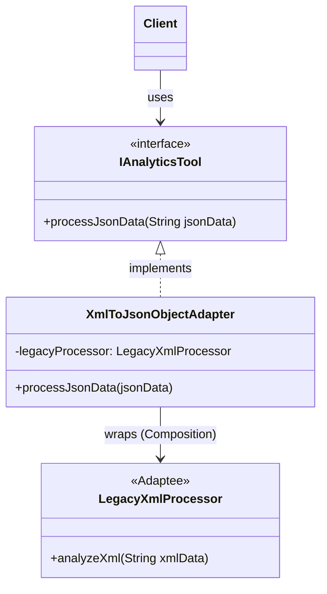

# 🔌 Adapter Design Pattern

## 📖 1. The Core Concept (The "Why")
The **Adapter** is a structural design pattern that allows objects with incompatible interfaces to collaborate. 

Imagine you are traveling to Europe from the US. Your laptop plug (the client) has two flat prongs, but the European wall outlet (the adaptee) takes two round pins. You cannot change your laptop, and you cannot rebuild the hotel wall. You use a power adapter to bridge the gap.

### ⚠️ The Problem
In enterprise software, you frequently encounter **3rd-party libraries, legacy code, or external APIs** that provide exactly the functionality you need. However, your modern system expects data in JSON, while the legacy system strictly requires XML. You cannot modify the legacy code (closed for modification, or no source access). 

### ✅ The Solution
Create an **Adapter** class. This class implements the interface your modern system expects (the Target interface), and under the hood, securely translates requests and delegates them to the legacy object (the Adaptee).

---

## 🏗️ 2. Architectural Blueprint

There are two ways to implement an Adapter: **Object Adapter** (Composition) and **Class Adapter** (Inheritance).

### The Object Adapter (Preferred)

*Notice how the Adapter strictly uses composition (wraps the Adaptee).*

---

## 💻 3. Implementation Deep Dive (Java)

### Stage 1: The Target & Adaptee
```java
// What our system expects
public interface IAnalyticsTool {
    void processJsonData(String jsonData);
}

// What the legacy system requires
public class LegacyXmlProcessor {
    public void analyzeXml(String xmlData) { /* processes xml */ }
}
```

### Stage 2: The Object Adapter (Composition)
```java
public class XmlToJsonObjectAdapter implements IAnalyticsTool {
    private final LegacyXmlProcessor legacyProcessor;

    public XmlToJsonObjectAdapter(LegacyXmlProcessor proc) {
        this.legacyProcessor = proc;
    }

    @Override
    public void processJsonData(String jsonData) {
        String xmlData = convertJsonToXml(jsonData);
        legacyProcessor.analyzeXml(xmlData); // Delegate!
    }
}
```

### Stage 3: The Class Adapter (Inheritance)
Instead of wrapping, the adapter officially *extends* the legacy class.
```java
// Requires extending LegacySystem and implementing our Target interface
public class DatabaseClassAdapter extends LegacySystem implements IDatabaseReader {
    @Override
    public void readData() {
        this.fetchExistingRecords(); // Inherited from LegacySystem!
    }
}
```

---

## 🎭 4. Junior vs. Senior Implementation

| Concern | Junior Developer | Senior Developer |
|---|---|---|
| **Approach** | Prefers **Class Adapter** (Extends the legacy class) because it seems like less code. | Prefers **Object Adapter** (Composition) to prevent tight coupling and adhere to "Prefer Composition over Inheritance." |
| **Logic Placement** | Puts heavy business logic inside the Adapter itself. | Keeps the Adapter strictly for translation/mapping. Business logic stays in domain classes. |
| **Testing** | Tight coupling makes mapping hard to test without the real legacy system. | Injects the Adaptee dependency, allowing the Adaptee to be mocked out during unit tests of the Adapter. |

---

## 🏢 5. Real-World System Design

1. **`java.util.Arrays.asList(T...)`**: Adapts an Array to essentially act like a `List`.
2. **`java.io.InputStreamReader`**: Adapts a byte stream (`InputStream`) to a character stream (`Reader`).
3. **Database Drivers / ORMs**: Adapting your domain objects into SQL statements and database table rows.
4. **Third-Party Payment Gateways**: You write an internal `IPaymentProcessor` interface, and build an `StripeAdapter` and `PayPalAdapter` to map their incoming/outgoing structures to your secure boundary.

---

## 🧠 6. FAANG Interview Q&A

**Q: When should I use Object Adapter vs Class Adapter?**
> **A:** Always favor the Object Adapter (Composition). Class Adapters require multiple inheritance, forcing your adapter to be permanently bound to a specific legacy class. If you use an Object Adapter, you can pass in subclasses of the legacy system cleanly. 

**Q: What is the difference between Adapter and Decorator?**
> **A:** **Adapter** changes an incompatible interface to a compatible one (A -> B). **Decorator** maintains the exact same interface but adds new behaviors dynamically at runtime (A -> Enhanced A).

**Q: What is the difference between Adapter and Facade?**
> **A:** An **Adapter** makes two incompatible interfaces work together. A **Facade** simplifies a complex subsystem by providing a single, unified interface. (Adapter modifies a specific contract; Facade hides complexity).

---

## 🚀 SDE-2+ Pragmatic Perspective: The "Anti-Corruption" Shield

In a senior-level system, the **Adapter Pattern** is the primary tool for building an **Anti-Corruption Layer (ACL)**.
*   **The Problem:** External SDKs (Stripe, Twilio, AWS) have their own data models and exceptions. If you use them directly in your business logic, your domain becomes "corrupted" by their implementation.
*   **The Solution:** You define a **Target Interface** that makes sense for *your* business. The Adapter then maps the external SDK to your interface.

### 🏗️ Why it matters for Scaling (10k+ Concurrency)
In your experience as a Founding Engineer:
1.  **Pluggable Infrastructure:** Adapter allows you to switch from one 3rd-party vendor to another (e.g., SendGrid to Mailchimp) without changing your core application code. This is essential for **Vertical Scaling** and avoiding **Vendor Lock-in**.
2.  **Safety:** The Adapter is the perfect place to implement **Circuit Breakers** or **Retries** specifically for that 3rd-party call, protecting your system from cascading failures.

---

## 🎓 Interview Tips: Creating "Strong Hire" Impact

### 1. "Ports and Adapters"
*   **What to say:** *"I view the Adapter pattern as the implementation of **Hexagonal Architecture (Ports and Adapters)**. The Interface is the Port (the entry point to my domain), and the Adapter is the concrete implementation that connects to the outside world (Database, UI, or 3rd Party API)."*

### 2. "Class vs. Object Adapter"
*   **What to say:** *"I prefer **Object Adapter** (Composition) over **Class Adapter** (Inheritance). Object Adapter is more flexible because it can wrap any subclass of the Adaptee, and it follows the principle of **Composition Over Inheritance**."*

### 3. "Adapter vs. Facade"
*   **What to say:** *"An **Adapter** changes an interface to match what the client expects (Translation). A **Facade** simplifies a complex interface without necessarily changing the method signatures (Simplification)."*

---

## ⚠️ Edge Cases & Pitfalls
*   **Heavy Translation:** If your Adapter logic becomes too complex (e.g., 500 lines of mapping), it might be a sign that your Domain model and the External model are too far apart. You might need a dedicated **Mapping Layer**.
*   **Leaky Abstractions:** If your Adapter interface still uses types from the external SDK (e.g., `StripeCustomer`), you've failed! The interface must use **Pure Domain Types**.

---

## ✅ SDE-2+ Readiness Check
*   [ ] Can you explain the difference between a Class Adapter and an Object Adapter?
*   [ ] What is an "Anti-Corruption Layer" and how does the Adapter pattern implement it?
*   [ ] How does the Adapter pattern facilitate "Mocking" in unit tests?

---

## 🧠 Tracker Integration

*   **Trigger Phrases:** "Incompatible interfaces", "Make old work with new", "Third-party/Legacy integration", "Anti-corruption layer".
*   **SOLID Connection:** Addresses **OCP** (adapt new classes without changing client code) and **SRP** (separates conversion logic from business logic).
*   **Confuses With:** 
    *   **Facade:** (Hook: Adapter makes incompatible interfaces work; Facade simplifies a complex interface).
    *   **Proxy:** (Hook: Proxy controls *access*; Adapter changes the *interface*).
*   **Anti-Freeze Starter Code:** 
    ```java
    public class Adapter implements TargetInterface {
        private Adaptee adaptee;
        public void request() {
            // translate and delegate
            adaptee.specificRequest();
        }
    }
    ```
*   **Self-Assessment Prompts:** 
    1. Why is the "Object Adapter" (Composition) preferred over the "Class Adapter" (Inheritance)?
    2. How does an Adapter act as an "Anti-Corruption Layer" in microservices?
    3. Can an Adapter add new functionality, or should it only translate?


---

## 🌍 7. Cross-Language: Adapter

### 🐍 Python
Python's duck typing and multiple inheritance make Class Adapters trivial, but Object Adapters are still preferred for cleaner domain boundaries.
```python
# Object Adapter in Python
class JsonToXmlAdapter:
    def __init__(self, xml_processor):
        self._xml_processor = xml_processor

    def process_json(self, json_data):
        xml = self._convert(json_data)
        self._xml_processor.analyze_xml(xml)
```

### 🐹 Go
Go natively rejects inheritance, naturally forcing the Object Adapter (Composition) pattern! 
```go
// Interface expectation
type JsonProcessor interface {
    ProcessJson(data string)
}

// Go Object Adapter
type LegacyAdapter struct {
    legacy *LegacyXmlProcessor
}

func (a *LegacyAdapter) ProcessJson(data string) {
    xml := convert(data)
    a.legacy.AnalyzeXml(xml)
}
```
