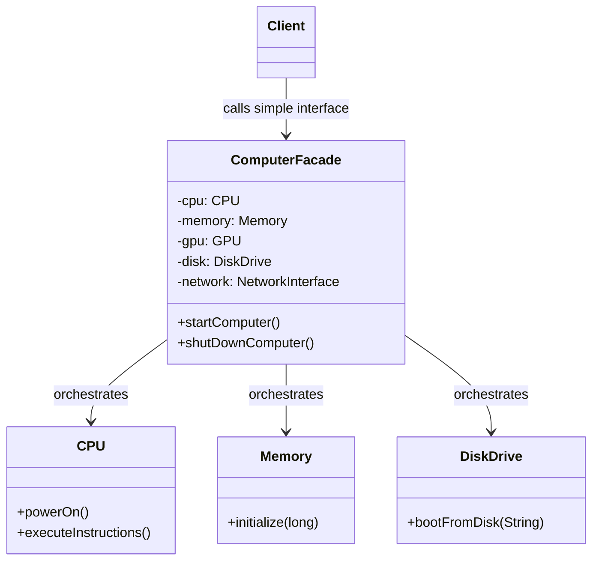

# 🎭 Facade Design Pattern

## 📖 1. The Core Concept (The "Why")
The **Facade** is a structural design pattern that provides a simplified, higher-level interface to a complex subsystem containing many moving parts.

Imagine walking into a restaurant and ordering a combo meal. You interact only with the Cashier (the Facade). You don't have to go into the kitchen, operate the deep fryer, build the burger, portion the fries, and pour the soda yourself. The cashier orchestrates the underlying subsystems for you.

### ⚠️ The Problem
Modern software depends on dozens of libraries, external systems, or complex class hierarchies. If client code needs to initialize 5 different database handlers, set up caches, and establish network streams just to "save a record", the client becomes tightly coupled to the underlying infrastructure. This makes the code brittle, hard to read, and impossible to reuse.

### ✅ The Solution
Introduce a **Facade** class. The client talks only to the Facade via simple methods (`startComputer()`, `saveRecord()`). The Facade internally understands the complex order of operations, delegates to the correct subsystems, and shields the client from the underlying chaos.

---

## 🏗️ 2. Architectural Blueprint


*Notice: The client doesn't even know the subsystems exist. It only knows about the Facade.*

---

## 💻 3. Implementation Deep Dive (Java)

Our Java implementation mimics booting a computer.

### The Subsystems (Complex)
There are multiple classes: `CPU`, `Memory`, `DiskDrive`, `GPU`, `NetworkInterface`.
Booting requires specific ordering (power CPU -> initialize RAM -> boot Disk -> execute).

### The Facade (Simple)
```java
public class ComputerFacade {
    private final CPU cpu = new CPU();
    private final Memory memory = new Memory();
    // ... other subsystems

    public void startComputer() {
        // High-level wrapper over multiple complex subsystems
        cpu.powerOn();
        memory.initialize(32);
        diskDrive.bootFromDisk("Linux OS");
        cpu.executeInstructions();
    }
}
```

### The Client (Clean)
```java
ComputerFacade computer = new ComputerFacade();
computer.startComputer();  // Done! One line instead of 5+.
```

---

## 🎭 4. Junior vs. Senior Implementation

| Concern | Junior Developer | Senior Developer |
|---|---|---|
| **Boundary** | Client code instantiates all internal components manually and wires them together. | Wraps complex wiring in a Facade. Instantiates only the Facade in the client. |
| **Encapsulation** | Believes Facade means "hide everything." Prevents clients from accessing the subsystems directly. | Understands Facade is an *optional* convenience. Power users can still bypass the Facade to fine-tune subsystems if necessary. |
| **SRP** | Puts business logic formatting/data manipulation inside the Facade. | Keeps Facade strictly as an orchestrator/delegator. It just forwards calls; it doesn't process data heavily. |

---

## 🏢 5. Real-World System Design

1. **Spring framework's `RestTemplate` / `WebClient`**: Under the hood, these orchestrate HTTP connections, Thread Pools, TLS handshaking, and JSON deseralization. We just call `.getForObject()`.
2. **Video Conversion Libraries (FFmpeg)**: A video transcoder API acts as a Facade over dozens of audio/video codec libraries, multiplexers, and file format processors.
3. **Database Driver Managers**: Provide a simple `getConnection()` method while shielding you from protocol mapping, caching, and network socket management.

---

## 🧠 6. FAANG Interview Q&A

**Q: Is the Facade a Singleton?**
> **A:** It can be, but it doesn't have to be. Often, a single Facade instance is enough to orchestrate the underlying subsystem (like a global Application config Facade). But if the Facade manages state scoped to a user/request, you would instantiate multiple Facades. 

**Q: What is the difference between Facade and Adapter?**
> **A:** **Adapter** is about making a specific incompatible interface compatible (changing the "shape" of the plug). **Facade** is about defining a *new*, simpler interface to wrap a multitude of complex interfaces (hiding the entire electrical board).

**Q: Can a subsystem have multiple Facades?**
> **A:** Absolutely. You might have a complex `BillingSystem`. You could create an `InvoiceFacade` for the accounting department clients, and a `PaymentFacade` for the customer portal clients. Different facades for different contexts masking the same underlying complexity.

---

## 🚀 SDE-2+ Pragmatic Perspective: The "Gateway" Architect

In a senior-level architecture, the **Facade Pattern** is often implemented as an **API Gateway** or a **BFF (Backend for Frontend)**.
*   **The Problem:** Microservices lead to "Chatty Clients." A mobile app might need to make 10 network calls to 10 different services to render a single "Order Details" page. This increases latency and drains battery.
*   **The Solution:** A Facade aggregates those 10 calls into 1. It provides a **Coarse-Grained API** over multiple **Fine-Grained** services.

### 🏗️ Why it matters for Scaling (10k+ Concurrency)
In your experience as a Founding Engineer:
1.  **Network Optimization:** Every network hop has a cost. By using a Facade (Gateway), you reduce the number of requests hitting your internal mesh from the outside world.
2.  **Security Boundary:** The Facade is the perfect place to implement **Authentication**, **Rate Limiting**, and **Request Validation** before passing the traffic to internal services.
3.  **Graceful Degradation:** If the `Analytics` service is down, the Facade can catch that error and still return the `OrderInfo`, ensuring the user isn't blocked.

---

## 🎓 Interview Tips: Creating "Strong Hire" Impact

### 1. "Least Knowledge (Law of Demeter)"
*   **What to say:** *"The Facade pattern is a direct application of the **Law of Demeter**. The Client only needs to know about the Facade; it should have zero knowledge of the internal workings of the Payment or Inventory subsystems."*

### 2. "Facade vs. Mediator"
*   **What to say:** *"A **Facade** provides a simplified interface to a subsystem (One-way communication). A **Mediator** centralizes communication between multiple objects (Two-way communication). Facade is about simplification; Mediator is about decoupling peer objects."*

### 3. "The BFF Pattern"
*   **What to say:** *"In my previous company, we used the **Backend For Frontend (BFF)** pattern, which is essentially a Facade tailored for a specific client (Mobile vs. Web). This allowed us to keep the client code extremely lean."*

---

## ⚠️ Edge Cases & Pitfalls
*   **The "God Facade":** Don't let your Facade become a "God Object" that contains all your business logic. The Facade should only **delegate**; the actual work stays in the subsystems.
*   **Performance Bottleneck:** If your Facade is synchronous and slow, it becomes a bottleneck for the entire system. Senior engineers often make Facades **Asynchronous** or use **Reactive Programming (Spring WebFlux)**.

---

## ✅ SDE-2+ Readiness Check
*   [ ] Can you explain the difference between a Facade and an Adapter?
*   [ ] What is the "BFF" pattern and how does it relate to Facade?
*   [ ] Why is a Facade the best place to implement Rate Limiting?

---

## 🧠 Tracker Integration

*   **Trigger Phrases:** "Simplify complex subsystem", "Single entry point", "Hide implementation complexity", "BFF (Backend for Frontend)".
*   **SOLID Connection:** Addresses **SRP** (orchestration logic in one place) and **Least Knowledge (Law of Demeter)**.
*   **Confuses With:** 
    *   **Adapter:** (Hook: Facade simplifies many interfaces into one; Adapter changes one interface into another).
    *   **Mediator:** (Hook: Facade is a one-way entry point to a subsystem; Mediator is a many-to-many communication hub).
*   **Anti-Freeze Starter Code:** 
    ```java
    public class Facade {
        private SubsystemA a;
        private SubsystemB b;
        public void simpleOperation() { a.start(); b.init(); }
    }
    ```
*   **Self-Assessment Prompts:** 
    1. Does a Facade *prevent* clients from using the subsystems directly?
    2. What is the "God Facade" anti-pattern?
    3. How does the Facade pattern relate to the "Backend for Frontend" (BFF) architectural pattern?


---

## 🌍 7. Cross-Language: Facade

### 🐍 Python
Python commonly uses modules `__init__.py` to create Facades. You hide 20 complex internal `.py` files, and expose only 3 clean functions from the package's main entry point.
```python
# The client only imports this Facade
from my_complex_module import process_order 

# Under the hood, process_order orchestrates tax, inventory, and shipping
```

### 🐹 Go
Go leverages packages to hide complexity. By using lower-case internal structures (unexported) and exposing a single upper-case struct/function (exported), you natively build Facades.
```go
// Facade function
func StartComputer() {
    cpu := newCPU()       // internal, lower-case
    mem := newMemory()    // internal, lower-case
    cpu.powerOn()
    mem.init()
}
```
