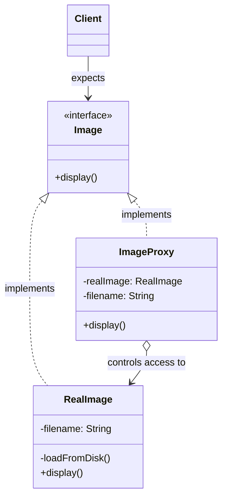

# 🛡️ Proxy Design Pattern

## 📖 1. The Core Concept (The "Why")
The **Proxy** is a structural design pattern that provides a surrogate or placeholder for another object to control access to it.

A real-world analogy: A credit card is a proxy for a bank account, which is a proxy for a bundle of cash. They all implement the same interface: they can be used to make a payment. But the credit card provides added control (fraud protection, deferred loading of the actual cash).

### ⚠️ The Problem
Sometimes you have a massive, heavy object that consumes a huge amount of system resources (e.g., establishing a database connection, or loading a 100MB video file). If you eagerly load 50 of these objects at app startup, your application will freeze and run out of memory—especially if the user never even accesses those specific objects.

Alternatively, you have a sensitive object, and you want to ensure that only authenticated admins can invoke its methods.

### ✅ The Solution
Create a new **Proxy** class that implements the exact same interface as the Real Object. 
- The client talks to the Proxy, believing it's the real object.
- The Proxy intercepts the requests, performs its specific duty (lazy loading, checking permissions, caching data), and then passes the request through to the Real Object.

---

## 🏗️ 2. Architectural Blueprint


*Notice how the Proxy holds a reference to the Real Object and implements the same interface.*

---

## 💻 3. Implementation Deep Dive (Java)

There are three main types of Proxies. Our code demonstrates the **Virtual Proxy** (Lazy Loading).

### Stage 1: The Heavy Object
```java
public class RealImage implements Image {
    public RealImage(String filename) {
        // Warning: Takes 5 seconds and 50MB of RAM!
        loadFromDisk(); 
    }
    public void display() { ... }
}
```

### Stage 2: The Virtual Proxy (Lazy Init)
```java
public class ImageProxy implements Image {
    private RealImage realImage; // Kept null until needed

    public void display() {
        if (realImage == null) {
            // Only pay the heavy cost when absolutely necessary
            realImage = new RealImage(filename);
        }
        realImage.display();
    }
}
```

### Other Types of Proxies
1. **Protection Proxy:** Controls access based on permissions.
   ```java
   public void display() {
       if (currentUser.isAdmin()) realImage.display();
       else throw new AccessDeniedException();
   }
   ```
2. **Caching Proxy:** Caches the result of an expensive operation.
   ```java
   public Data getData() {
       if (cache.isExpired()) realObject.fetchData(); 
       return cache.get();
   }
   ```

---

## 🎭 4. Junior vs. Senior Implementation

| Concern | Junior Developer | Senior Developer |
|---|---|---|
| **Eager vs Lazy** | Instantiates everything at application start `new RealImage()`. Freezes the UI. | Uses a **Virtual Proxy** so dependencies are constructed infinitely fast, delaying heavy lifting until interaction time. |
| **Separation of Concerns** | Puts security checks or caching logic directly inside the heavy object's domain code. | Keeps domain code pure. Puts all security/caching logic inside the Proxy class. |
| **Type Leaking** | The client expects type `ImageProxy` specifically. | The client expects the interface `Image`. The client has no idea a proxy is involved. |

---

## 🏢 5. Real-World System Design

1. **Spring AOP / `@Transactional`**: When you annotate a Spring bean with `@Transactional`, Spring doesn't inject your class. It injects a **CGLIB Proxy** of your class. The proxy starts a DB transaction, calls your real method, and then commits the transaction afterward.
2. **Hibernate / JPA Lazy Loading**: Entities with `@OneToMany(fetch = FetchType.LAZY)` inject a Proxy list. The moment you call `.size()` or `.get()`, the Proxy secretly fires a SQL query to the database to populate itself.
3. **NGINX / Reverse Proxies**: Literally proxies! They sit in front of your real web server, intercept the request, handle SSL termination, caching, blocking bad IPs (Protection Proxy), and then forward to the real backend.

---

## 🧠 6. FAANG Interview Q&A

**Q: What is the exact difference between Proxy and Decorator? They look identical structurally!**
> **A:** Structurally, yes, they both wrap an object and implement its interface. But they have completely different *Intents*. 
> - **Decorator** is used to dynamically *add* new behaviors to an object. The client explicitly stacks them (`new ExtraCheese(new Pizza())`).
> - **Proxy** is used to *control access* to an object. The client rarely instantiates the proxy wrapped around the object manually; the factory or framework just hands the client a Proxy and says "Here is the object."

**Q: What is the difference between Proxy and Facade?**
> **A:** **Facade** simplifies a complex subsystem by providing a different, smaller interface. **Proxy** provides the exact same interface as the object it is protecting. 

**Q: How do you mock a Proxy in unit testing?**
> **A:** Because a well-written Proxy implements an interface (e.g., `Image`), you can simply mock the interface. However, if you are testing the Proxy logic itself (e.g., verifying the Protection Proxy correctly blocks non-admins), you inject a Mock Real Object into the Proxy.

---

## 🚀 SDE-2+ Pragmatic Perspective: The "Controller" of the Object

In a senior-level system, the **Proxy Pattern** is the primary tool for **Interception**. It allows you to inject system-level logic (Infrastructure) without the client or the real object knowing.

### 🏗️ The Three Pillars of Proxy
1.  **Virtual Proxy (Performance):** Handles **Lazy Loading**. For example, in a 10k user app, you don't load a user's entire profile/history until they click "View Profile."
2.  **Protection Proxy (Security):** Handles **Access Control**. It checks permissions (RBAC) before delegating the call to the sensitive real object.
3.  **Remote Proxy (Networking):** Handles **RPC/Microservices**. It makes a remote service call (over network) look like a local method call. (e.g., gRPC stubs or Java RMI).

---

## 🎓 Interview Tips: Creating "Strong Hire" Impact

### 1. "Proxy vs. Decorator"
*   **What to say:** *"This is a common question. A **Proxy** controls the lifecycle of its subject (it might create or destroy it). A **Decorator** is passed its subject from the outside. Proxy has 'Control' intent; Decorator has 'Enhancement' intent."*

### 2. "Dynamic Proxies in Spring"
*   **What to say:** *"In production Java apps, we rarely write Proxies manually. We use **Java Dynamic Proxies** or **CGLIB**. This is how Spring implements `@Transactional`—it creates a Proxy around your service to start a transaction before your method runs and commit it after."*

### 3. "The Smart Reference"
*   **What to say:** *"Proxies can be used for **Reference Counting** or **Rate Limiting**. If 10k users hit a heavy API, the Proxy can track usage and reject requests if they exceed a quota, protecting the RealSubject from crashing."*

---

## ⚠️ Edge Cases & Pitfalls
*   **Performance Overhead:** If you have 5 nested proxies, your method calls become slow. Be careful with "Proxy Chains."
*   **Serialization Issues:** If you use Proxies with frameworks like Hibernate, you might encounter `LazyInitializationException` if the proxy tries to load data after the session is closed.

---

## ✅ SDE-2+ Readiness Check
*   [ ] Can you explain the difference between a Virtual Proxy and a Protection Proxy?
*   [ ] How does Spring use Proxies to handle Transactions?
*   [ ] What is the "Smart Reference" use case for a Proxy?

---

## 🧠 Tracker Integration

*   **Trigger Phrases:** "Control access", "Lazy initialization", "Placeholder/Surrogate", "Protection/Caching/Remote proxy".
*   **SOLID Connection:** Primarily addresses **SRP** (isolates infrastructure concerns like security/caching from business logic).
*   **Confuses With:** 
    *   **Decorator:** (Hook: Proxy controls *access/lifecycle*; Decorator adds *behavior*).
    *   **Facade:** (Hook: Proxy has the *same interface*; Facade has a *different/simpler interface*).
*   **Anti-Freeze Starter Code:** 
    ```java
    public class Proxy implements Interface {
        private RealObject real;
        public void request() {
            if (real == null) real = new RealObject();
            real.request();
        }
    }
    ```
*   **Self-Assessment Prompts:** 
    1. What is the difference between a "Virtual Proxy" and a "Protection Proxy"?
    2. How does Spring use Proxies to implement the `@Transactional` behavior?
    3. How does the Proxy pattern help in implementing an "Anti-Corruption Layer"?

---

## 🌍 7. Cross-Language: Proxy

### 🐍 Python
Python can use the magic `__getattr__` method to build dynamic proxies incredibly easily without needing to explicitly implement every method in an interface.
```python
class ProxyLogger:
    def __init__(self, target):
        self._target = target
        
    def __getattr__(self, name):
        # Intercepts ANY method call and logs it!
        print(f"Intercepted call to {name}")
        return getattr(self._target, name)
```

### 🟦 TypeScript / JavaScript
JavaScript has a native built-in `Proxy` object designed specifically for this pattern!
```typescript
const realObject = {
    secretData: "42"
};

const proxy = new Proxy(realObject, {
    get: function(target, prop) {
        console.log(`Accessing ${prop}...`);
        return target[prop];
    }
});

console.log(proxy.secretData); // Handled by the proxy trap natively
```
