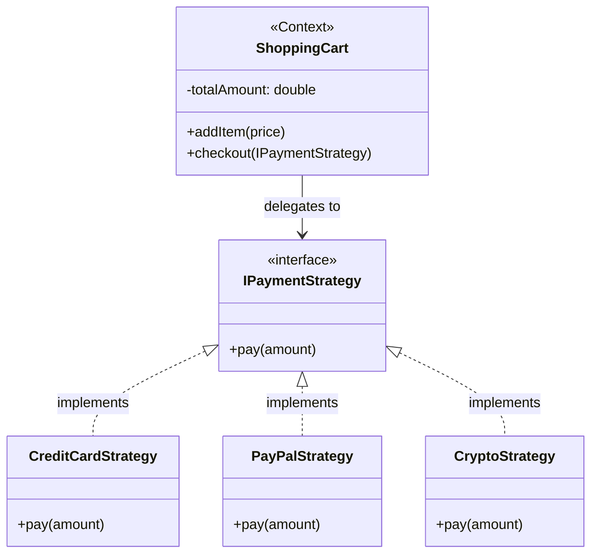

# ♟️ Strategy Design Pattern

## 📖 1. The Core Concept (The "Why")
The **Strategy** is a behavioral design pattern that allows you to define a family of algorithms, put each of them into a separate class, and make their objects interchangeable at runtime.

Imagine a Navigation app. You want to go to the airport. You can get there by walking, driving, or taking public transit. The routing algorithm is vastly different for each, but the ultimate goal (getting a route from A to B) is the same. The Strategy pattern lets the user swap the routing algorithm dynamically without changing the code of the map application itself.

### ⚠️ The Problem
If you don't use the Strategy pattern, your `Context` class (e.g., `ShoppingCart` or `MapNavigator`) will inevitably become bloated with massive `if/else` or `switch` statements.
```java
// Anti-pattern
public void pay(String method, double amount) {
    if (method.equals("CC")) {
        // 50 lines of Credit Card logic
    } else if (method.equals("PAYPAL")) {
        // 50 lines of PayPal logic
    } else if (method.equals("CRYPTO")) {
        // 50 lines of Crypto logic
    }
}
```
Every time the marketing team adds a new payment method (like Apple Pay), you have to modify the core `ShoppingCart` class, violating the **Open/Closed Principle**.

### ✅ The Solution
Extract the distinct behaviors into their own classes implementing a common interface (`IPaymentStrategy`). The original class (`ShoppingCart`) only maintains a reference to the interface, allowing you to pass in *any* concrete strategy object dynamically at runtime.

---

## 🏗️ 2. Architectural Blueprint



---

## 💻 3. Implementation Deep Dive (Java)

1. **The Strategy Interface:** Defines the method all algorithms must implement.
```java
public interface IPaymentStrategy {
    void pay(double amount);
}
```
2. **Concrete Strategies:** The actual algorithms extracted out.
```java
// Each of these classes contains ONLY the logic for its specific domain.
public class CreditCardStrategy implements IPaymentStrategy { ... }
public class CryptoStrategy implements IPaymentStrategy { ... }
```
3. **The Context:** Holds a reference, delegates the work.
```java
public class ShoppingCart {
    public void checkout(IPaymentStrategy strategy) {
        // Delegation! The cart doesn't know HOW it's being paid.
        strategy.pay(this.totalAmount); 
    }
}
```

---

## 🚀 4. SDE-2+ Pragmatic Perspective: The Refactoring Weapon

In a senior-level system, the **Strategy Pattern** is arguably the most common tool used to clean up legacy code. 

*   **The Problem:** Over time, junior developers add `isX == true` boolean flags to a core service. A single method grows to 2,000 lines of `if/else` spaghetti. This destroys testability and invites endless merge conflicts.
*   **The Solution:** You apply "Refactor to Strategy". You slice those `if` blocks into separate classes. 

### 🏗️ Why it matters for Scaling 
1.  **Dependency Isolation:** If your PayPal integration requires 5 heavy Maven dependencies, your basic Credit Card code shouldn't have to import them. Strategy allows you to isolate infrastructure dependencies tightly inside the specific Strategy class.
2.  **Runtime Flexibility:** In microservices, you might use a feature flag (e.g., LaunchDarkly). If `FF_USE_NEW_ROUTING == true`, you inject `NewRoutingStrategy`. If it fails in production, you flip the switch, and the factory injects `LegacyRoutingStrategy` without a redeploy.
3.  **Trivial Unit Testing:** You can test `CreditCardStrategy` entirely on its own without needing to construct a massive `ShoppingCart` mock.

---

## 🎓 5. Interview Tips: Creating "Strong Hire" Impact

### 1. "Strategy vs. State Pattern"
*   **What to say:** *"Structurally they look identical (a Context delegating to an Interface). But the intent is different! A **Strategy** represents a single algorithm or behavior that the Client actively chooses and injects (e.g., choosing PayPal). In the **State** pattern, the state object itself dictates what happens next, and often automatically transitions the Context to a new State."*

### 2. "Strategy vs. Constructor Injection"
*   **What to say:** *"I often combine Strategy with Spring's Dependency Injection. However, pure Strategy usually involves passing the algorithm to the specific **method** (`checkout(new PayPalStrategy())`) to swap it dynamically, rather than locking it into the constructor for the lifetime of the application."*

### 3. "Java 8 Lambda Strategies"
*   **What to say:** *"If the Strategy interface only has one method (a Functional Interface), I don't even create classes. I just pass a lambda expression! E.g., `cart.checkout(amount -> System.out.println("Paid with magic!"));`"*

---

## ⚠️ 6. Edge Cases & Pitfalls
*   **Data Hunger:** Sometimes the Strategy needs data to do its job. Do you pass the parameters into the `.pay()` method? Or do you pass a back-reference to the `Context` so it can fetch what it needs? Be careful not to create circular dependencies.
*   **Too Many Classes:** If the algorithms are just one-liners, making 10 classes is overkill. Use Lambdas or keep it as an IF statement until it proves overly complex.

---

## ✅ SDE-2+ Readiness Check
*   [ ] Can you explain how Strategy upholds the Open/Closed Principle?
*   [ ] When would you use Strategy over a simple `switch`/`if-else` statement?
*   [ ] How can you implement Strategy purely using Java 8 Lambdas?

---

## 🧠 Tracker Integration

*   **Trigger Phrases:** "Multiple algorithms", "Interchangeable algorithms", "Replace if-else/switch with OOP", "Runtime algorithm selection".
*   **SOLID Connection:** Primarily addresses **OCP** (adding new strategy = new class) and **SRP** (each strategy encapsulates one algorithm).
*   **Confuses With:** 
    *   **State Pattern:** (Hook: Strategy is about *how* to do a task, chosen by the client; State is about *what* behavior happens based on internal state, often transitioning automatically).
    *   **Template Method:** (Hook: Strategy uses **Composition** (inject the algorithm); Template uses **Inheritance** (subclass to fill in steps)).
*   **Anti-Freeze Starter Code:** 
    ```java
    public interface Strategy {
        void execute();
    }
    public class Context {
        private Strategy strategy;
        public void setStrategy(Strategy s) { this.strategy = s; }
    }
    ```
*   **Self-Assessment Prompts:** 
    1. How does the Strategy pattern reduce "Class Explosion" compared to Inheritance?
    2. Can you explain how to use a `Map<Type, Strategy>` as a "Registry" to eliminate the final switch statement?
    3. How do you pass data from the `Context` to the `Strategy` without causing tight coupling?


---

## 🌍 7. Cross-Language: Strategy

### 🐍 Python
In Python, functions are first-class citizens. You rarely build classes for the strategies; you just pass functions!
```python
def strategy_add(a, b): return a + b
def strategy_sub(a, b): return a - b

def calculate(a, b, strategy_func):
    return strategy_func(a, b)

# Dynamic swapping!
calculate(5, 3, strategy_add) # 8
calculate(5, 3, strategy_sub) # 2
```

### 🐹 Go
Go leverages interfaces naturally for this.
```go
type PaymentStrategy interface {
    Pay(amount float64)
}

// Implementations...
type Stripe struct{}
func (s *Stripe) Pay(amount float64) { fmt.Println("Stripe") }

type Context struct {
    strategy PaymentStrategy
}
// Inject strategy
func (c *Context) SetPaymentStrategy(s PaymentStrategy) { c.strategy = s }
```
