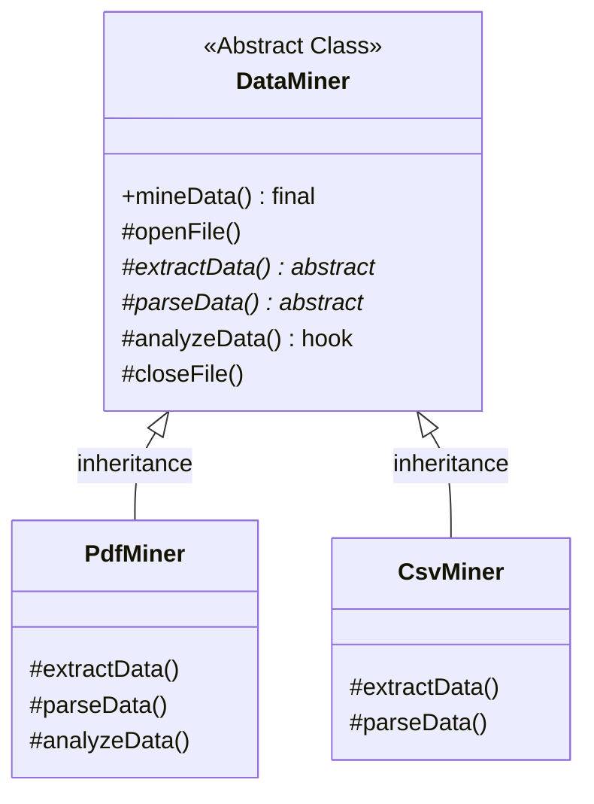

# 📝 Template Method Design Pattern

## 📖 1. The Core Concept (The "Why")
The **Template Method** is a behavioral design pattern that defines the skeleton of an algorithm in the superclass but lets subclasses override specific steps of the algorithm without changing its overall structure.

Imagine baking a cake. The overarching steps are always the same:
1. Make batter.
2. Bake at 350°C.
3. Add toppings.

However, a `ChocolateCake` makes chocolate batter and adds fudge toppings, while a `VanillaCake` makes vanilla batter and adds sprinkles. The "baking at 350°C" is identical for both. The **Template Method** locks in the 3 steps, allowing subclasses to specify *how* step 1 and step 3 are executed.

### ⚠️ The Problem
If you have multiple classes that process data (e.g., `PdfMiner`, `CsvMiner`, `DocMiner`), they often share 80% of the same code. They all open a file wrapper, they all close the connection at the end, and they all write the final results to a Database. If you duplicate this logic across all three classes, any change to the Database connection requires editing three files (violating DRY - Don't Repeat Yourself).

### ✅ The Solution
Create an `AbstractDataMiner` superclass. Put the shared 80% logic inside it. 
Define a `final` method called `mineData()` (the template method) that calls the exact sequence of steps. Declare the unique steps (`extractData()`, `parseData()`) as `abstract`. Force the concrete subclasses (`PdfMiner`) to implement ONLY those abstract steps. 

---

## 🏗️ 2. Architectural Blueprint



---

## 💻 3. Implementation Deep Dive (Java)

1. **The Abstract Template:**
```java
public abstract class DataMiner {
    // The Template Method (Locked down with 'final')
    public final void mineData(String path) {
        openFile(path);       // Shared default step
        byte[] b = extractData(); // Specific abstract step
        String s = parseData(b);  // Specific abstract step
        analyze(s);           // Optional hook step
        closeFile();          // Shared default step
    }

    protected abstract byte[] extractData(); // Must be overridden
    protected abstract String parseData(byte[] b); // Must be overridden
    
    // A Hook! Subclasses can override if they want, but don't have to.
    protected void analyze(String data) { print("Standard DB Save"); }
}
```

---

## 🚀 4. SDE-2+ Pragmatic Perspective: The Framework Architect

In senior-level architecture, the Template Method is the foundation of **Application Frameworks** (like Spring, Angular, or JUnit).

### 🏗️ Why it matters for Scaling 
1.  **Inversion of Control (IoC):** Unlike a normal library where *your* code calls the library, in a framework, you write a subclass and the *framework* calls your code. This is known as the **Hollywood Principle** ("Don't call us, we'll call you"). The Template Method is the architectural mechanism that implements this.
2.  **API Gateways & Filter Chains:** Often, Base Controllers use a Template Method for `handleRequest()`. They enforce the skeleton: `validateAuth() -> doBusinessLogic() -> formatResponse()`. You, as the developer writing an endpoint, only implement `doBusinessLogic()`.
3.  **Hooks for Extensibility:** Hooks (`protected void onBeforeSave() {}`) are empty or default methods in the template. They allow third-party developers to inject Custom Logic into a rigid CI/CD pipeline or build pipeline without needing to hack the core framework source code.

---

## 🎓 5. Interview Tips: Creating "Strong Hire" Impact

### 1. "Template Method vs. Strategy"
*   **What to say:** *"These two patterns solve identical problems (varying algorithms) but use entirely different mechanics. **Template Method** relies on **Inheritance**—it alters *parts* of an algorithm at compile-time. **Strategy** relies on **Composition**—it alters the *entire* algorithm dynamically at runtime. As a general rule, favor Strategy over Template Method to avoid deep, fragile inheritance trees (Composition over Inheritance)."*

### 2. "The Liskov Substitution Principle"
*   **What to say:** *"Template Method must strictly adhere to the **Liskov Substitution Principle**. A subclass must not implement an abstract step in a way that violates the implicit expectations of the base class's Template Method (e.g., returning `null` when the template immediately calls `.length()` on the result)."*

### 3. "The Final Keyword"
*   **What to say:** *"In Java, it is crucial to use the `final` keyword on the actual Template Method (e.g., `public final void mineData()`). This prevents a rogue Junior developer from overriding the orchestrating method and accidentally deleting the mandatory security checks or file closures."*

---

## ⚠️ 6. Edge Cases & Pitfalls
*   **The Fragile Base Class Problem:** If the superclass changes the signature of an abstract step, every single subclass across the entire codebase breaks. Template Methods are notoriously rigid.
*   **Too Many Abstract Steps:** If an algorithm has 15 steps and 10 of them are abstract, creating a subclass becomes a monumental chore. Keep the abstract steps to a minimum (2 or 3).

---

## ✅ SDE-2+ Readiness Check
*   [ ] What is the "Hollywood Principle" and how does it relate to this pattern?
*   [ ] Why is the Template Method considered a breach of "Composition over Inheritance"?
*   [ ] What is a "Hook" step versus an "Abstract" step?

---

## 🧠 Tracker Integration

*   **Trigger Phrases:** "Skeleton of an algorithm", "Vary steps not structure", "Hollywood Principle", "Hook methods".
*   **SOLID Connection:** Primarily addresses **OCP** (extend steps via subclassing) and **LSP** (ensure subclasses don't break the template).
*   **Confuses With:** 
    *   **Strategy Pattern:** (Hook: Template Method uses **Inheritance** (compile-time); Strategy uses **Composition** (runtime)).
*   **Anti-Freeze Starter Code:** 
    ```java
    public abstract class Template {
        public final void execute() { 
            step1(); 
            step2(); 
        }
        protected abstract void step2();
    }
    ```
*   **Self-Assessment Prompts:** 
    1. Why is the `final` keyword important for the template method itself?
    2. What is a "Hook" method and how does it differ from an "Abstract" method?
    3. How do you adhere to the Liskov Substitution Principle when overriding steps?

---

## 🌍 7. Cross-Language: Template Method

### 🐍 Python
Python does not have `final` methods native to the syntax, nor does it have strict `abstract` methods natively (without importing `abc`). It relies heavily on developer discipline.
```python
from abc import ABC, abstractmethod

class DataMiner(ABC):
    def mine_data(self): # Do not override this!
        self.open_file()
        self.extract_data()

    @abstractmethod
    def extract_data(self): pass
```
