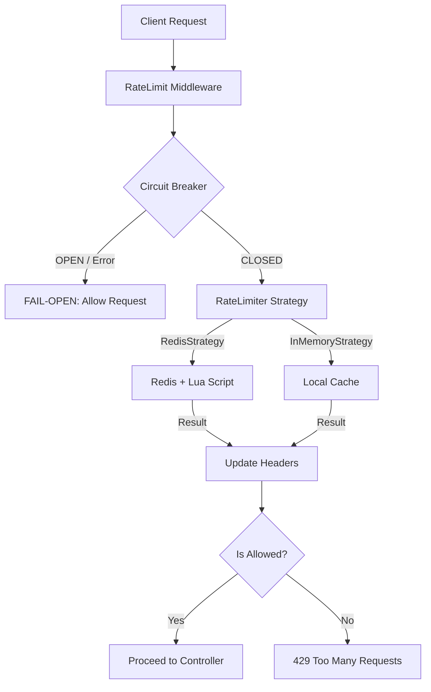

# 🛡️ Distributed Rate Limiting Subsystem

> **Case Study:** High-Availability API Protection for SDE-2 Interviews

This module demonstrates a production-grade rate-limiting subsystem designed for horizontal scalability, resilience, and operational excellence. It goes beyond basic "Token Bucket" algorithms to address distributed state, race conditions, and infrastructure failures.

---

## 🏗️ Architecture Overview

The system is built on four core pillars:
1.  **Strategy Pattern**: Decoupling enforcement from storage.
2.  **Distributed Consistency**: Using Redis with Atomic Lua scripts.
3.  **Resilience (Fail-Open)**: Integrated Circuit Breaker to prioritize availability.
4.  **Identity Awareness**: Context-aware keying for precise protection.



---

## 🎙️ Interview Narrative: The SDE-2 Perspective

### 1. The LLD Round: "Clean Code & Patterns"
"I designed a pluggable rate-limiting subsystem using the **Strategy Pattern**. The middleware is decoupled from the storage strategy via an `IRateLimiter` interface. This allows us to swap `RedisRateLimiter` for `InMemoryRateLimiter` (for local dev or CI) without changing a single line of business logic. I used a **Factory Pattern** to encapsulate instantiation complexity based on environment configuration."

### 2. The HLD Round: "Scalability & Resilience"
"To handle horizontal scaling, I used **Redis** to centralize request counts. To prevent race conditions, I implemented **Lua scripts** that make the `INCR` and `EXPIRE` operations atomic. 

The 'Pro Move' here is the **Fail-Open Strategy**. I wrapped the Redis calls in a **Circuit Breaker** (using Opossum). If Redis goes down or exceeds latency thresholds, the system doesn't crash or block all users; it 'fails open,' allowing requests through. High availability is more important than 100% strict rate limiting during a database failure."

### 3. Operational Excellence: "Observability"
"The system is identity-aware. It uses **Context-Aware Keying**: `uid:<id>` for authenticated users to prevent account-based attacks, and `ip:<address>` for anonymous users to prevent DDoS-style volume. I also integrated **Prometheus metrics** to track 'Allowed' vs 'Blocked' ratios and **OpenTelemetry** to monitor rate-limiter latency."

---

## 🛠️ Key Technical Features

### Atomic Lua Script (Race Condition Protection)
In high-concurrency environments, separate `GET`, `INCR`, and `EXPIRE` calls lead to race conditions where keys might never expire.
```lua
local current = redis.call('GET', KEYS[1])
if current and tonumber(current) >= tonumber(ARGV[1]) then
    return {0, tonumber(current)}
end
local newVal = redis.call('INCR', KEYS[1])
if newVal == 1 then
    redis.call('EXPIRE', KEYS[1], ARGV[2])
end
return {1, newVal}
```

### Fail-Open Middleware
```typescript
try {
    const result = await circuitBreaker.fire(key, limit, window);
    if (!result.allowed) return res.status(429).send();
    next();
} catch (error) {
    // FAIL-OPEN: Infrastructure failure should not cause API outage
    console.warn('Redis down, allowing request through.');
    next();
}
```

---

## ⚖️ Trade-offs & Considerations

| Feature | Trade-off | Rationale |
| :--- | :--- | :--- |
| **Redis vs In-Memory** | Consistency vs Latency | Redis adds network hop but ensures consistency across 50+ backend nodes. |
| **Window Type** | Fixed vs Sliding | Fixed window (implemented here) is simpler and more performant in Redis; Sliding window provides better protection against bursts at window boundaries but requires Redis Sorted Sets (higher CPU). |
| **Fail-Open** | Security vs Availability | Choosing Availability ensures the business keeps running if the cache layer fails. |

---

## 🚀 How to use this as a reference
1.  **Read [IRateLimiter.ts](./IRateLimiter.ts)** to see the interface definition.
2.  **Review [RedisRateLimiter.ts](./RedisRateLimiter.ts)** for the Lua logic.
3.  **Analyze [RateLimitMiddleware.ts](./RateLimitMiddleware.ts)** for the Circuit Breaker and Keying logic.
