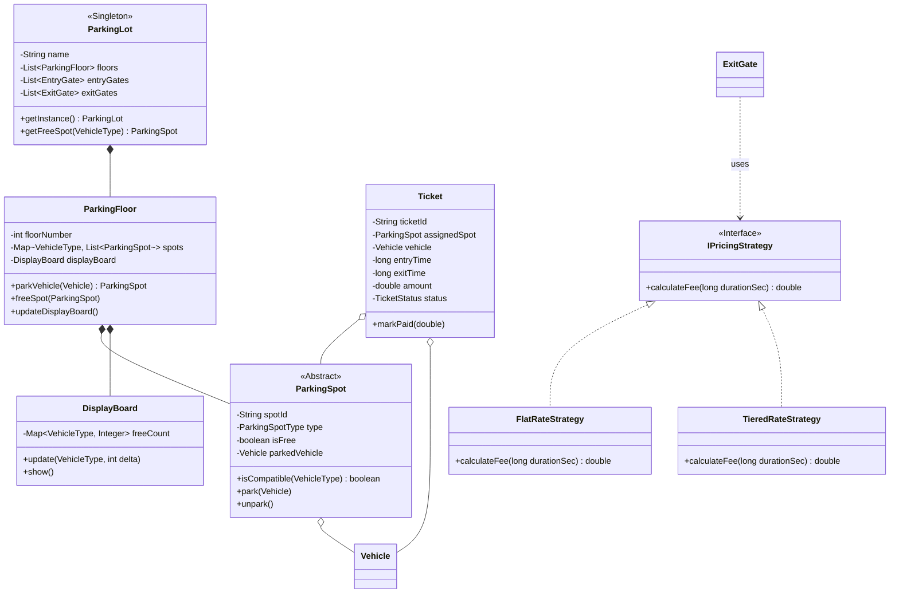

# 🚗 LLD Problem: Advanced Parking Lot System

> **Patterns:** Strategy · Factory · Observer · Singleton

---

## 📋 Tracker Metadata
| Column | Value / Status |
| :--- | :--- |
| **Difficulty** | 🟡 Medium |
| **SDE-2 Mandatory** | ✅ Yes |
| **Patterns** | Strategy, Factory, Observer, Singleton |
| **Status** | Not Started |
| **Times Practiced** | 0 |
| **Last Practiced** | YYYY-MM-DD |
| **Next Review** | YYYY-MM-DD |

---


## 📋 Problem Statement

Design a multi-floor, multi-gate Parking Lot System for an enterprise facility (e.g., mall, airport). The system must handle high traffic and support complex business constraints:

1. **Multi-Floor & Spot Types**: The parking lot contains multiple floors. Each floor has a collection of parking spots of various sizes:
   * `MotorcycleSpot` (for motorcycles)
   * `CompactSpot` (for compact cars)
   * `LargeSpot` (for trucks, SUVs, or buses)
2. **Vehicle Compatibility**: 
   * Motorcycles can park in any spot.
   * Compact cars can park in compact or large spots.
   * Large vehicles can only park in large spots.
3. **Pluggable Pricing Strategy**: The parking charge must support various dynamic billing rules:
   * **Flat Rate**: $5 per hour flat.
   * **Hourly Tiered**: $4 for the first hour, $6 for the second hour, $10 for subsequent hours.
   * **Special Event/Weekend**: Surcharge based on peak hours.
4. **Gates & Payment Terminals**: The parking lot has multiple entry and exit gates.
   * **Entry Gate**: Dispenses a ticket with an entry timestamp and assigns a compatible spot.
   * **Exit Gate**: Calculates fees using the pricing strategy, processes payment, releases the spot, and logs the exit.
5. **Real-time Availability Display**: Each floor must have a display board showing the count of free spots per type. This board must update automatically when a vehicle parks or exits.
6. **Scale & Concurrency (Senior Constraint)**: Multiple gates can issue tickets and allocate spots concurrently. You must prevent race conditions (e.g., two cars getting assigned the same spot, double booking, or incorrect availability counts).

---

## 🧩 Pattern Mapping

| Sub-Problem | Pattern | Why |
|---|---|---|
| Pluggable pricing rules (Flat, Tiered, Event-based) | **Strategy** | Keeps the billing logic decoupled from the ticket/gate system. Adding a new pricing scheme requires creating a new strategy class rather than modifying the payment service. |
| Instantiating spots/vehicles by type | **Factory** | Simplifies the creation of spots and vehicles, centralizing parsing logic and decoupling client code from concrete vehicle subclasses. |
| Updating display boards dynamically when spots are occupied/freed | **Observer** | Decouples the `ParkingFloor` state changes from the physical display board or dashboard systems. |
| Single point of synchronization for parking lot metadata | **Singleton** | Ensures there is one global, thread-safe manager (`ParkingLot`) coordinating floors, gates, and global state. |

---

## 🏗️ Architecture



---

## 🎭 Junior vs. Senior Design Decisions

| Concern | Junior Approach | Senior Approach |
|---|---|---|
| **Spot Allocation** | Big nested loops over all floors and spots with zero locking. | Thread-safe allocation using concurrent locks or atomic checks. Spot search is partitioned by spot type. |
| **Pricing Rules** | Large `if/else` checks based on days/hours inside the payment class. | Pluggable `IPricingStrategy` injected at runtime depending on current time or event status. |
| **Real-time Display** | Manually iterating through all spots to count free ones on every update. | Event-driven tracking via the Observer pattern using pre-aggregated atomic integers. |
| **Vehicle Types** | Integer constants (`1 = Car, 2 = Bike`) representing vehicles. | Strong type safety via `enum VehicleType` combined with inheritance for vehicle-specific dimensions. |

---

## 🔒 Concurrency Design

To handle multiple gates allocating spots in parallel under a 10k concurrent user scale:
1. **Thread-Safe Spot Allocation**: We use a `ReentrantLock` per floor to serialize spot searching and allocation. This prevents two threads from searching, finding, and marking the same `ParkingSpot` as occupied.
2. **Lock Partitioning**: Rather than locking the entire `ParkingLot` object (which would choke throughput across 20 gates), we lock on a **per-floor** basis. If Gate 1 is parking a car on Floor 1, Gate 2 can simultaneously park a car on Floor 2 without thread contention.
3. **Atomic Operations**: Availability counts on the display boards are managed using `AtomicInteger` to ensure thread-safe increments and decrements without heavy locking.

---

## 💻 How to Run

Reference solutions are located in `solutions/java/`.

Compile the files:
```bash
javac solutions/java/parking/*.java solutions/java/Main.java
```

Run the demo:
```bash
java -cp solutions/java Main
```
