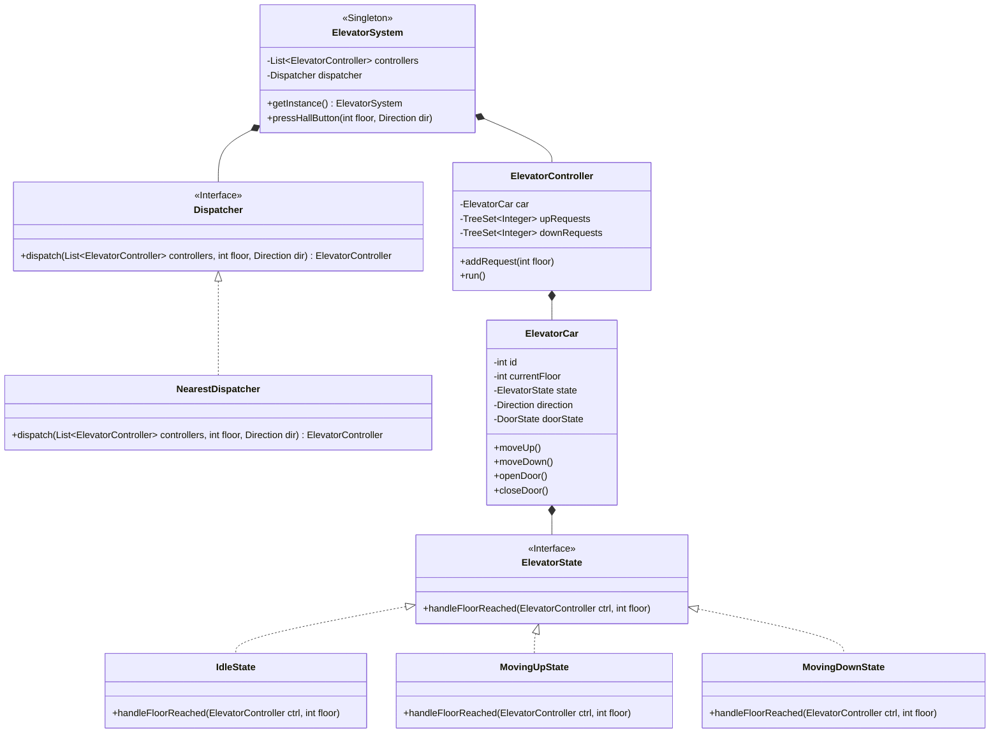

# 🛗 LLD Problem: Multi-Elevator System

> **Patterns:** State · Mediator · Strategy · Singleton

---

## 📋 Tracker Metadata
| Column | Value / Status |
| :--- | :--- |
| **Difficulty** | 🟡 Medium |
| **SDE-2 Mandatory** | ✅ Yes |
| **Patterns** | State, Mediator, Strategy, Singleton |
| **Status** | Not Started |
| **Times Practiced** | 0 |
| **Last Practiced** | YYYY-MM-DD |
| **Next Review** | YYYY-MM-DD |

---


## 📋 Problem Statement

Design a Multi-Elevator Control System for a high-rise building. The system must coordinate multiple elevator cars to transport passengers efficiently while satisfying various scheduling constraints:

1. **Floors & Elevators**: The building has $N$ floors and $M$ elevator cars.
2. **Elevator Requests**:
   * **External Request (Hall Call)**: A passenger on floor $X$ presses a button indicating their desired direction (UP or DOWN).
   * **Internal Request (Car Call)**: A passenger inside Elevator $Y$ presses a button to select a destination floor.
3. **Elevator States**:
   * `IDLE`: Not moving. Doors may open or close.
   * `MOVING_UP`: Traveling to higher floors, servicing UP requests.
   * `MOVING_DOWN`: Traveling to lower floors, servicing DOWN requests.
4. **Door Control & Safety**:
   * Open doors -> wait -> close doors.
   * Do not move when doors are open.
   * Emergency stop and weight limit alert simulation.
5. **Dispatching Algorithm**: When a hall call is made, the central Dispatcher must assign the request to the "best" elevator based on a strategy:
   * **SCAN (Elevator Algorithm)**: Elevators continue moving in their current direction, servicing all requests in that path, until there are no more requests in that direction. They then reverse direction or go idle.
   * **Nearest Elevator First**: Dispatch the idle elevator closest to the source floor.
6. **Scale & Concurrency (Senior Constraint)**: Each elevator car operates as an independent, concurrent actor (simulated via thread loops). Multiple hall calls and car calls can be submitted simultaneously. You must ensure thread safety when modifying elevator request queues and states.

---

## 🧩 Pattern Mapping

| Sub-Problem | Pattern | Why |
|---|---|---|
| Elevator movement state transitions (`IDLE` ⇆ `MOVING_UP` ⇆ `MOVING_DOWN`) | **State** | Encourages modular handling of floor transitions. Moving UP vs. IDLE vs. Moving DOWN changes how floor requests are validated and processed. |
| Coordinating external hall requests and assigning them to elevator cars | **Mediator** | The `ElevatorController` or `Dispatcher` acts as a mediator, decoupling individual elevator cars and hall buttons. Cars do not talk to each other directly. |
| Custom dispatch scheduling strategies (e.g. Nearest, SCAN) | **Strategy** | Allows the elevator system to dynamically swap dispatch algorithms based on traffic (e.g., morning peak vs. night-time) without modifying the elevator car logic. |
| Global entry point for the building | **Singleton** | Ensures a single `ElevatorSystem` monitors status and manages global state. |

---

## 🏗️ Architecture



---

## 🎭 Junior vs. Senior Design Decisions

| Concern | Junior Approach | Senior Approach |
|---|---|---|
| **Elevator Control Loop** | A single main thread loops over all cars, updating their floors sequentially. | Each elevator runs in its own **worker thread** (`Runnable`/`Executor`), simulating real-world independent velocity and delays. |
| **Request Management** | Storing requests in a simple `ArrayList` and sorting it repeatedly. | Utilizing sorted set data structures (`TreeSet` or `PriorityQueue`) partitioned by direction (`upRequests` vs `downRequests`) to execute the **SCAN algorithm** efficiently. |
| **Dispatcher Synchronization** | Synchronizing the entire dispatcher, bottlenecking user inputs. | Thread-safe message passing or fine-grained locks. Request lists use concurrent or synchronized sets. |
| **State Checking** | Massive switch-statements `switch(state)` inside a floor checking loop. | Decoupled classes implementing an `ElevatorState` interface to encapsulate state-specific actions. |

---

## 🔒 Concurrency Design

To coordinate multiple moving elevators safely:
1. **Request Queue Synchronization**: Each `ElevatorController` maintains two sorted sets of requested floors: `upRequests` (sorted ascending) and `downRequests` (sorted descending). Access to these collections is protected by synchronizing on the controller instance.
2. **Independent Elevator Runners**: Each elevator runs in a separate thread. It periodically sleeps (simulating travel time between floors) and queries its synchronized queue for target floors.
3. **Lock-Free Read Operations**: Volatile states (like `currentFloor` and `direction`) allow the dispatcher to read elevator statuses lock-free, ensuring split-second dispatch assignments without blocking the elevators.

---

## 💻 How to Run

Reference solutions are located in `solutions/java/`.

Compile the files:
```bash
javac solutions/java/elevator/*.java solutions/java/Main.java
```

Run the demo:
```bash
java -cp solutions/java Main
```
