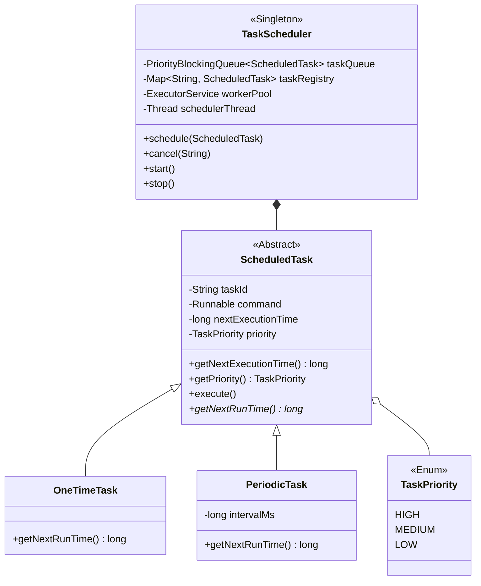

# ⏰ LLD Problem: High-Performance Task Scheduler

> **Patterns:** Command · Producer-Consumer · Factory · Observer · Singleton

---

## 📋 Tracker Metadata
| Column | Value / Status |
| :--- | :--- |
| **Difficulty** | 🟡 Medium |
| **SDE-2 Mandatory** | ❌ No |
| **Patterns** | Command, Producer-Consumer, Factory, Observer, Singleton |
| **Status** | Not Started |
| **Times Practiced** | 0 |
| **Last Practiced** | YYYY-MM-DD |
| **Next Review** | YYYY-MM-DD |

---


## 📋 Problem Statement

Design a thread-safe, priority-based in-memory Task Scheduler capable of scheduling and executing tasks concurrently:

1. **Task Properties**: Each task has:
   * A unique ID.
   * A execution timestamp (when it should run).
   * A priority level (`HIGH`, `MEDIUM`, `LOW`).
   * Pluggable execution logic (a runnable script).
2. **Scheduling Types**:
   * **One-time execution**: Run once after a specific delay or at a specific time.
   * **Periodic execution**: Run repeatedly at a fixed rate or delay.
3. **Priority Execution**: If multiple tasks are scheduled for the exact same time, the task with the higher priority must execute first.
4. **Dynamic Lifecycle Management**:
   * Add new tasks dynamically.
   * Cancel pending tasks using their ID.
   * Pause and resume the scheduler thread pool.
5. **Execution Thread Pool**: Use a background worker thread pool to execute tasks concurrently. The main scheduler thread should poll the queue for tasks whose execution time has arrived, hand them off to workers, and proceed.
6. **Scale & Concurrency (Senior Constraint)**: The system must handle concurrent task submissions and cancellations under load. You must use thread-safe data structures (`PriorityBlockingQueue`, `ConcurrentHashMap`) to avoid locks bottlenecking throughput.

---

## 🧩 Pattern Mapping

| Sub-Problem | Pattern | Why |
|---|---|---|
| Encapsulating the execution script, priority, timing, and repetition of tasks | **Command** | Bundles the action (runnable) and execution context (metadata) into a single object. The scheduler doesn't need to know the task internals. |
| Decoupling task submission from execution workers | **Producer-Consumer** | A thread-safe Priority Queue acts as the buffer. Clients (producers) submit tasks, and scheduler threads (consumers) poll and execute them. |
| Instantiating One-time vs. Periodic tasks | **Factory** | Simplifies task creation and enforces correct default configurations for each schedule type. |
| Reporting task execution events (success, failure, retries) to monitoring systems | **Observer** | Decouples task execution execution loops from external logging, dashboard, or alert systems. |

---

## 🏗️ Architecture



---

## 🎭 Junior vs. Senior Design Decisions

| Concern | Junior Approach | Senior Approach |
|---|---|---|
| **Task Polling** | Busy-waiting (`while(true)`) checking the first element of a list, causing high CPU spikes. | Using a **Blocking Queue** (`PriorityBlockingQueue`) and calling `take()` or sleeping dynamically based on the time remaining for the next task. |
| **Concurrency** | Locking the entire task list during execution, stopping new tasks from being scheduled. | Lock-free structures like `ConcurrentHashMap` for task cancellations, combined with a `PriorityBlockingQueue` for scheduled execution. |
| **Worker Decoupling** | Scheduler thread executes tasks itself, blocking the queue check for subsequent tasks. | Scheduler thread acts strictly as a **Dispatcher**, offloading task runs to an `ExecutorService` pool and immediately returning to poll. |
| **Resiliency** | Ignoring task errors, causing the scheduler thread to crash. | Enclosing worker executions in robust `try/catch` wrappers, logging issues, and invoking retry/alert handlers. |

---

## 🔒 Concurrency & Polling Design

1. **The Polling Loop**: The scheduler runs on a dedicated dispatcher thread. It checks the head of the `PriorityBlockingQueue`:
   * If empty, it waits for a task to be added.
   * If a task is present, it compares `nextExecutionTime` with `System.currentTimeMillis()`.
   * If the execution time has arrived, it polls the task, submits it to the `ExecutorService` thread pool, and loops.
   * If the time has not arrived yet, the dispatcher thread sleeps or waits for the difference (`executionTime - currentTime`), waking up early if a newer, higher-priority task gets prepended.
2. **Thread-Safe Cancellation**: A `ConcurrentHashMap` maintains a registry of active tasks. If a task is cancelled, its reference is flagged as `cancelled`. When polled, the scheduler simply discards flagged tasks, avoiding expensive linear searches to delete items from a priority queue.

---

## 💻 How to Run

Reference solutions are located in `solutions/java/`.

Compile the files:
```bash
javac solutions/java/scheduler/*.java solutions/java/Main.java
```

Run the demo:
```bash
java -cp solutions/java Main
```
