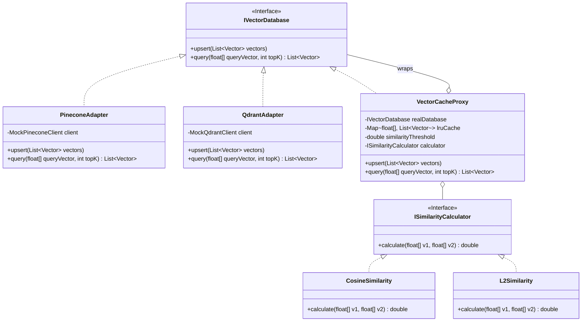

# 🤖 LLD Problem: Unified Vector Database SDK / Client (AI LLD)

> **Patterns:** Adapter · Strategy · Proxy · Singleton

---

## 📋 Tracker Metadata
| Column | Value / Status |
| :--- | :--- |
| **Difficulty** | 🟡 Medium |
| **SDE-2 Mandatory** | ❌ No |
| **Patterns** | Adapter, Strategy, Proxy, Singleton |
| **Status** | Not Started |
| **Times Practiced** | 0 |
| **Last Practiced** | YYYY-MM-DD |
| **Next Review** | YYYY-MM-DD |

---

## 📋 Problem Statement

Design an enterprise-grade client SDK for interacting with multiple vector database backends (e.g., Pinecone, Qdrant, ChromaDB). The SDK must provide a unified interface to downstream applications while supporting pluggable similarity calculators and thread-safe caching.

### 🛠️ Core Requirements
1. **Unified API (Adapter Pattern)**: Wrap disparate third-party vector databases into a common interface (`IVectorDatabase`) supporting `upsert(List<Vector>)` and `query(float[] queryVector, int topK)`.
2. **Similarity Metrics (Strategy Pattern)**: Enable switching between vector distance calculation algorithms dynamically (`ISimilarityCalculator` interface supporting `Cosine`, `L2Distance`, and `DotProduct`).
3. **Similarity Caching (Proxy Pattern)**: Protect the remote vector database instances using a local caching proxy (`VectorCacheProxy`). The proxy must intercept queries and return cached results if a query vector is highly similar to a cached query (e.g., similarity threshold $\ge 0.99$).
4. **LRU Eviction**: The local cache must have a thread-safe maximum capacity limit (e.g. 100 queries) and evict least recently used items.

---

## 🏗️ Architecture

---

## ✅ Self-Evaluation Checklist
- [ ] **Interface Unification**: Are third-party vector database payload structures completely hidden behind the unified adapter interface?
- [ ] **Semantic Caching**: Does your caching proxy evaluate queries by vector similarity rather than exact array matching?
- [ ] **Thread-Safe Cache**: Did you lock cache read/write/eviction operations safely using `ReentrantLock` or `synchronized` collections?
- [ ] **Strategy Decoupling**: Is the distance metric calculation algorithm swappable at runtime?

---

## 📂 Practice
Go to the `practice/` folder and implement the `VectorCacheProxy` and `IVectorDatabase` adapter interfaces.
- **Reference Solution**: Check the `solutions/` folder for a compilable Java reference solution.
