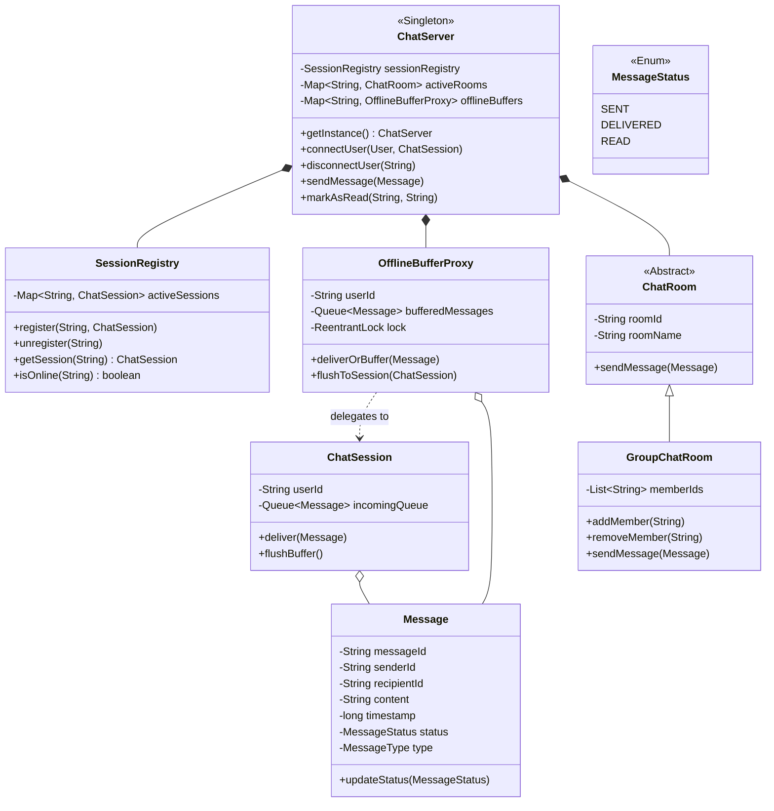

# 💬 LLD Problem: Enterprise Chat System (WhatsApp / Slack)

> **Patterns:** Observer · Mediator · Proxy · Singleton

---

## 📋 Tracker Metadata
| Column | Value / Status |
| :--- | :--- |
| **Difficulty** | 🔴 Hard |
| **SDE-2 Mandatory** | ❌ No |
| **Patterns** | Observer, Mediator, Proxy, Singleton |
| **Status** | Not Started |
| **Times Practiced** | 0 |
| **Last Practiced** | YYYY-MM-DD |
| **Next Review** | YYYY-MM-DD |

---


## 📋 Problem Statement

Design a thread-safe, high-concurrency real-time Chat System (similar to WhatsApp or Slack). The system must handle thousands of concurrent users, manage active sessions, route individual/group messages, and buffer messages for offline users.

### Core Requirements
1. **User Connection & Session Management**:
   * Users can connect (go online) and disconnect (go offline).
   * Active connections are represented by thread-safe `ChatSession` objects simulating WebSocket connections.
2. **Message Routing**:
   * **Individual (1-to-1) Chats**: Direct messaging between two users.
   * **Group Chats**: Broadcast messaging where a message sent to a group is propagated to all online group members.
3. **Message Status Registry**:
   * Every message must transition through status cycles: `SENT` (received by server), `DELIVERED` (pushed to recipient's active session), and `READ` (acknowledged by recipient).
4. **Offline Message Buffering (Backpressure)**:
   * If a user is offline when a message is sent to them, the system must buffer the message in an offline storage queue.
   * When the user reconnects, all buffered messages must be delivered atomically and flushed.
5. **Scale & Concurrency (Senior Constraint)**:
   * Multiple users can connect, disconnect, send messages, and mark messages as read simultaneously.
   * You must prevent race conditions (e.g., sending messages while a session is disconnecting, race conditions during group member joins, or offline flush anomalies) using appropriate locks.

---

## 🧩 Pattern Mapping

| Sub-Problem | Pattern | Why |
|---|---|---|
| Decoupling direct peer connections and routing messages | **Mediator** | The `ChatServer` acts as the central mediator. Users and groups do not communicate directly; instead, they route all events through the server, simplifying $O(N^2)$ direct connections to a manageable $O(N)$ architecture. |
| Group broadcast messaging | **Observer** | The `GroupChatRoom` maintains a list of member users. When a message is published to the group, the group notifies each online member (observer) dynamically. |
| Intercepting delivery for offline users | **Proxy** | An `OfflineBufferProxy` wraps the communication channel. It implements the message receiver interface and handles offline message buffering transparently, redirecting traffic to storage if the active session is absent. |
| Central server coordinator | **Singleton** | Ensures there is a single, globally accessible server manager (`ChatServer`) coordinating registries and message routing. |

---

## 🏗️ Architecture



---

## 🎭 Junior vs. Senior Design Decisions

| Concern | Junior Approach | Senior Approach |
|---|---|---|
| **Active Status** | Running active polling database checks to see if users are online. | Storing memory-mapped persistent sessions in a concurrent registry (`ConcurrentHashMap`). |
| **Group Broadcast** | Loop over all users in the system and filter by group subscription. | Object-oriented Observer pattern using dynamic member list registers in `GroupChatRoom`. |
| **Offline Handling** | Discarding messages or writing heavy blocking DB records synchronously during routing. | transparent buffering using a **Proxy Pattern** (`OfflineBufferProxy`) with isolation locks, flushing asynchronously upon reconnection. |
| **Message Delivery** | Fire-and-forget message routing with no acknowledgment flows. | Explicit ACK flow transitioning state (`SENT -> DELIVERED -> READ`) with atomic updates. |
| **Thread Safety** | Using global `synchronized` blocks on the whole chat server, choking performance. | Fine-grained lock partitioning using `ReentrantLock` on individual offline buffers and concurrent collections. |

---

## 🔒 Concurrency Design

1. **Session Registry**: Active connections are stored in a `ConcurrentHashMap`. This allows thread-safe registration/lookup of active websocket simulations without locking the whole system.
2. **Offline Proxy Locking**: Each user has an `OfflineBufferProxy` with a dedicated `ReentrantLock`. This ensures that if a user is logging in (flushing offline buffer) while another user is concurrently sending them a message, the operations are synchronized per-user, preventing race conditions or out-of-order deliveries.
3. **Group Member Modification Safety**: Group rooms protect their member lists using `CopyOnWriteArrayList` or synchronizing on mutation, ensuring that group broadcasts do not throw `ConcurrentModificationException` if users join/leave the group during active messaging.

---

## 💻 How to Run

Reference solutions are located in `solutions/java/`.

Compile the files:
```powershell
$files = Get-ChildItem -Path lld/05-Machine-Coding-Guide/LEVEL-3-Advanced/02-chat-system/solutions/java/chatsystem/*.java | ForEach-Object { $_.FullName }
& "C:\Program Files\JetBrains\IntelliJ IDEA 2025.2.4\jbr\bin\javac.exe" -d bin $files lld/05-Machine-Coding-Guide/LEVEL-3-Advanced/02-chat-system/solutions/java/Main.java
```

Run the demo:
```powershell
& "C:\Program Files\JetBrains\IntelliJ IDEA 2025.2.4\jbr\bin\java.exe" -cp bin Main
```
