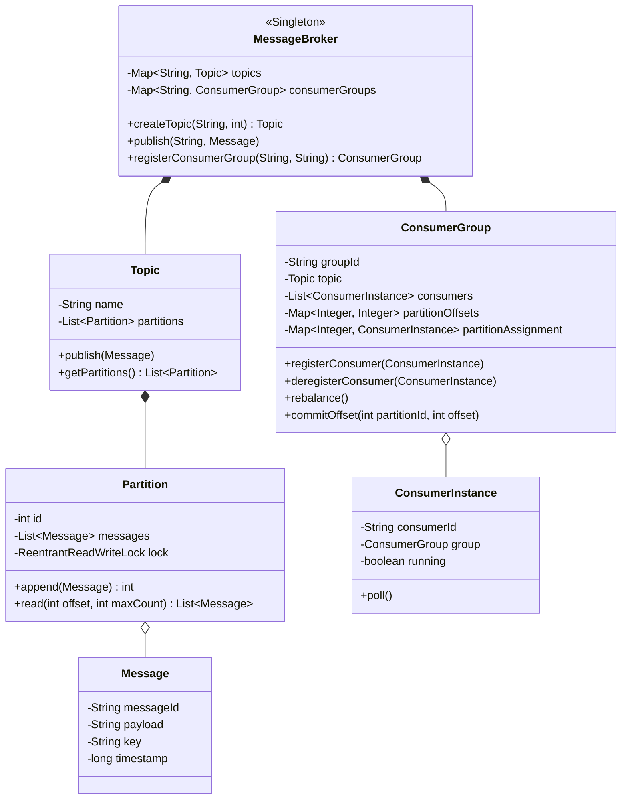

# 📨 LLD Problem: In-Memory Message Queue (Pub-Sub with Consumer Groups)

> **Patterns:** Observer · Command · Singleton · Iterator

---

## 📋 Tracker Metadata
| Column | Value / Status |
| :--- | :--- |
| **Difficulty** | 🔴 Hard |
| **SDE-2 Mandatory** | ✅ Yes |
| **Patterns** | Observer, Command, Singleton |
| **Status** | Not Started |
| **Times Practiced** | 0 |
| **Last Practiced** | YYYY-MM-DD |
| **Next Review** | YYYY-MM-DD |

---

## 📋 Problem Statement

Design a thread-safe, high-throughput **In-Memory Message Queue** (similar to Apache Kafka or RabbitMQ) supporting partition sharding and consumer group rebalancing.

1. **Topics & Partitions**: A Topic consists of $N$ partitions. Each Partition acts as an append-only sequence of messages. Each message gets assigned a sequential offset ID.
2. **Publishing**: Producers can publish messages to a specific topic. Messages can have an optional partition key. If a key is provided, the message is routed to `hash(key) % N` partition. Otherwise, it is routed round-robin.
3. **Consumer Groups**: Multiple consumers can form a Consumer Group to read messages from a Topic concurrently.
   * **Exclusive Consumption**: Within a consumer group, each partition is assigned to exactly one consumer instance. No two consumers in the same group can read from the same partition simultaneously.
   * **Rebalancing**: If a consumer joins or leaves the group, the system must dynamically rebalance partition assignments among the active consumers.
4. **Offset Commits**: Consumers read messages and periodically commit their offset for each partition. If a consumer dies and rebalancing occurs, the new consumer assigned to that partition must resume reading from the last committed offset.
5. **Scale & Concurrency (Senior Constraint)**: The system must handle high-throughput concurrent reads and writes. You must avoid global locks on the topic. Use fine-grained `ReentrantReadWriteLock` on each partition log to allow multiple concurrent readers but synchronize writers.

---

## 🏗️ Architecture

---

## 🔒 Concurrency Design

1. **Partition Level Locking**: Using a `ReentrantReadWriteLock` per partition ensures that multiple consumers can concurrently read from different offsets of the same partition log (`readLock()`) without blocking each other. Writers appending new messages acquire the `writeLock()`, ensuring thread safety and minimal lock contention.
2. **Atomic Offset Tracking**: Consumer group offsets are stored in a `ConcurrentHashMap` and updated atomically, ensuring that offsets committed by different consumer threads do not conflict.
3. **Thread-Safe Rebalancing**: Partition reassignments must acquire a rebalance lock on the consumer group to prevent consumers from polling while partitions are being reassigned.

---

## ✅ Self-Evaluation Checklist
- [ ] **Lock Contention**: Did you avoid locking the entire `Topic` or `Broker` on reads/writes? (You must lock at the `Partition` level).
- [ ] **Consumer Partition Mapping**: Did you enforce that a partition is consumed by at most one consumer inside a group?
- [ ] **Offset Commit Reliability**: When a consumer instance dies, does the rebalanced successor resume from the correct committed offset?
- [ ] **Hashing Logic**: Did you implement key-based routing and fall back to round-robin for null keys?

---

## 📂 Practice
Go to the `practice/` folder and implement the core `MessageBroker` and `ConsumerGroup` classes.
- **Reference Solution**: Check the `solutions/` folder for a compilable Java reference solution.
