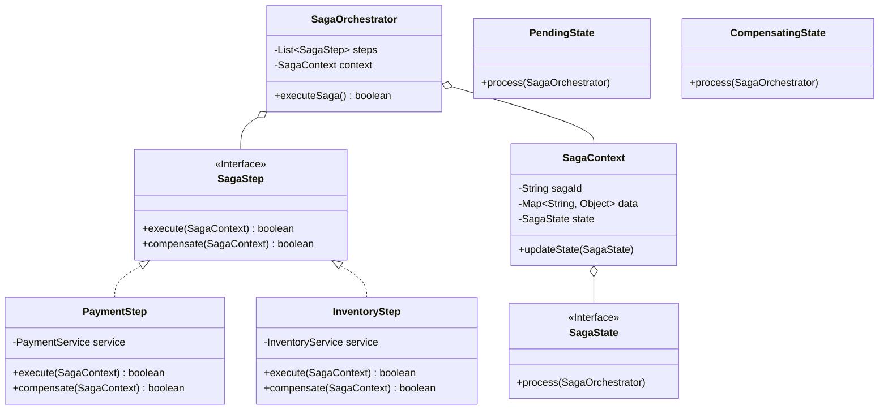

# 🔗 LLD Problem: Saga Distributed Transaction Orchestrator

> **Patterns:** State · Command · Mediator · Builder

---

## 📋 Tracker Metadata
| Column | Value / Status |
| :--- | :--- |
| **Difficulty** | 🔴 Hard |
| **SDE-2 Mandatory** | ✅ Yes |
| **Patterns** | State, Command, Mediator, Builder |
| **Status** | Not Started |
| **Times Practiced** | 0 |
| **Last Practiced** | YYYY-MM-DD |
| **Next Review** | YYYY-MM-DD |

---

## 📋 Problem Statement

Design a thread-safe, resilient **Saga Distributed Transaction Orchestrator** to coordinate multi-step transactions across decoupled, independent microservices (e.g. Payment, Inventory, and Shipping services) without database-level 2PC.

### 🛠️ Core Requirements
1. **Mediator Orchestrator**: The central `SagaOrchestrator` coordinates sequentially invoking steps on target services. The individual services must not know about each other.
2. **Command Steps**: Represent each service invocation as a `SagaStep` (Command Pattern). Each step must expose:
   * `execute(SagaContext)`: Invokes the positive action (e.g., deduct money, reserve item). Returns success/failure.
   * `compensate(SagaContext)`: Invokes the compensating rollback action (e.g., refund money, release item) if subsequent steps fail.
3. **Transaction State Transitions (State Pattern)**: The Saga context moves through defined states:
   * `PendingState`: Running steps sequentially.
   * `CompletedState`: All steps executed successfully.
   * `CompensatingState`: A step failed; sequentially executing compensating rollbacks in *reverse order*.
   * `FailedState`: Rollbacks completed.
4. **Idempotency & Resiliency**: Services may fail transiently. The orchestrator must support configuring step retries before initiating a compensation rollback.

---

## 🏗️ Architecture

---

## ✅ Self-Evaluation Checklist
- [ ] **State Encapsulation**: Did you encapsulate transition logic inside State classes, avoiding complex outer state conditionals?
- [ ] **Reverse Compensation**: Do compensating rollbacks execute in the exact reverse order of successful execution?
- [ ] **Idempotent Service Design**: Are compensating operations designed to be idempotent (e.g. refunding multiple times does not duplicate refund)?
- [ ] **Context Decoupling**: Is the Saga execution context passed dynamically, allowing multiple parallel transactions?

---

## 📂 Practice
Go to the `practice/` folder and implement the orchestrator loops and state transitions.
- **Reference Solution**: Check the `solutions/` folder for a compilable Java reference solution.
