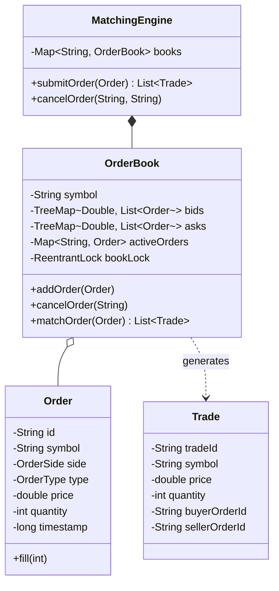

# 📈 LLD Problem: Low-Latency Stock Order Matching Engine

> **Patterns:** Flyweight · Command · Strategy · Singleton

---

## 📋 Tracker Metadata
| Column | Value / Status |
| :--- | :--- |
| **Difficulty** | 🔴 Hard |
| **SDE-2 Mandatory** | ❌ No |
| **Patterns** | Flyweight, Command, Strategy |
| **Status** | Not Started |
| **Times Practiced** | 0 |
| **Last Practiced** | YYYY-MM-DD |
| **Next Review** | YYYY-MM-DD |

---

## 📋 Problem Statement

Design a high-performance, low-latency **Stock Order Matching Engine** to maintain an order book and match buy and sell orders (limit and market orders) based on **Price-Time Priority**.

### 🛠️ Core Requirements
1. **Order Book Data Structure**: Organize orders by price-time priority:
   * **Bids (Buy Orders)**: Sorted by price descending (highest price first). For equal prices, sorted by timestamp ascending (earliest first).
   * **Asks (Sell Orders)**: Sorted by price ascending (lowest price first). For equal prices, sorted by timestamp ascending (earliest first).
   * Selection: Use a combination of `TreeMap` for fast $O(\log N)$ access to price levels and `LinkedList` / `Queue` for $O(1)$ time-priority insertion at each price level.
2. **Order Types**:
   * **LIMIT Order**: Match at the specified price or better. If not fully filled, add the remaining quantity to the order book.
   * **MARKET Order**: Match immediately against the best available prices in the book. If not fully filled, cancel the remaining quantity.
3. **Execution & Trades**: Match orders atomically and generate a `Trade` transaction containing the execution price, quantity, buyer order ID, and seller order ID.
4. **Cancellations**: Allow orders currently on the book to be cancelled by ID.
5. **Scale & Concurrency (Senior Constraint)**: Multiple threads will submit orders concurrently. You must ensure thread-safety on the order book without global locking bottlenecks.

---

## 🏗️ Architecture

---

## 🔒 Concurrency Design

1. **Lock Partitioning**: Instead of locking the entire `MatchingEngine` or sharing a single lock, we maintain an `OrderBook` instance per stock ticker symbol (e.g. AAPL, GOOG). Each `OrderBook` has its own `ReentrantLock`. This allows trading of AAPL and GOOG concurrently without thread contention.
2. **Double Map Sorting**: The `OrderBook` uses `TreeMap<Double, LinkedList<Order>>` to partition orders by price level. The `TreeMap` is sorted using `Collections.reverseOrder()` for bids and normal order for asks. Within each price level, a `LinkedList` preserves FIFO time priority.
3. **Lock-free Read Metrics**: Use volatile variables or atomic types for published trade price indexes so that reading tick-data/last-prices is non-blocking.

---

## ✅ Self-Evaluation Checklist
- [ ] **Price-Time Priority**: Did you verify that buy orders match against the lowest ask, and sell orders match against the highest bid?
- [ ] **Market Order Logic**: Does the system immediately discard the unfilled portion of a market order if the order book is depleted?
- [ ] **Granular Locking**: Did you avoid synchronizing the whole matching engine, using per-symbol locks instead?
- [ ] **FIFO Priority**: Within the same price level, is the oldest order matched first?

---

## 📂 Practice
Go to the `practice/` folder and implement the order book matching loop.
- **Reference Solution**: Check the `solutions/` folder for a compilable Java reference solution.
