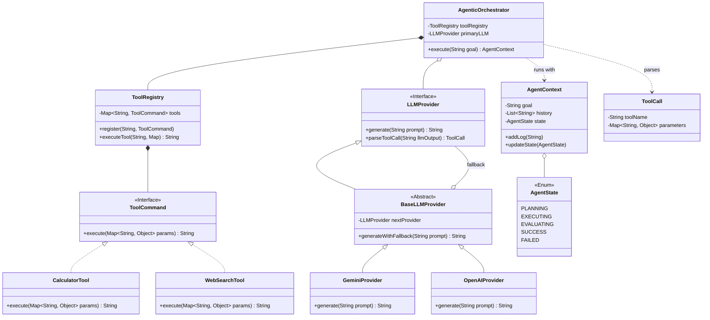

# 🤖 LLD Problem: AI Agentic Workflow Orchestrator

> **Patterns:** Command · Chain of Responsibility · Strategy · State

---

## 📋 Tracker Metadata
| Column | Value / Status |
| :--- | :--- |
| **Difficulty** | 🔴 Hard |
| **SDE-2 Mandatory** | ❌ No |
| **Patterns** | Command, Chain of Responsibility, Strategy, State |
| **Status** | Not Started |
| **Times Practiced** | 0 |
| **Last Practiced** | YYYY-MM-DD |
| **Next Review** | YYYY-MM-DD |

---


## 📋 Problem Statement

Design a robust, thread-safe **AI Agentic Workflow Orchestrator** that executes reasoning loops (ReAct/Plan-and-Solve style), registers and triggers external tools, maintains execution histories, and tolerates backend API failures through provider fallback chains.

### Core Requirements
1. **Tool Execution Registry (Command Pattern)**:
   * Pluggable tool registry allowing tools (e.g. `CalculatorTool`, `WebSearchTool`) to be added dynamically.
   * Tools must accept inputs and return outputs as strings.
2. **Simulated LLM Provider Strategy (Strategy Pattern)**:
   * Interface for LLM clients (`LLMProvider`) supporting text generation and tool call parsing.
   * Pluggable strategies representing different LLM engines (e.g. Gemini, OpenAI, Anthropic).
3. **Resilient Provider Fallback (Chain of Responsibility Pattern)**:
   * A chain of providers where if the primary provider fails (e.g. timeout, rate limit), the orchestrator automatically routes the query to the fallback provider.
4. **Agent State Transitions (State Pattern)**:
   * The agent reasoning loop moves through defined lifecycle states: `PLANNING` (querying LLM for plan/next steps), `EXECUTING` (running tool command), `EVALUATING` (sending tool output back to LLM), `SUCCESS` (goal achieved), and `FAILED` (error or limit exceeded).
5. **Scale & Concurrency (Senior Constraint)**:
   * Multiple execution contexts must run concurrently without sharing or corrupting history memory.
   * Tool execution must be sandboxable, thread-safe, and independent.

---

## 🧩 Pattern Mapping

| Sub-Problem | Pattern | Why |
|---|---|---|
| Pluggable tool execution | **Command** | Encapsulates tools (`ToolCommand`) as independent objects, standardizing their signatures (`execute(params)`) and allowing the agent to trigger them without knowing concrete tool implementation. |
| LLM Provider Selection | **Strategy** | Enables different LLM models and APIs to be swapped at runtime, keeping agent orchestration decoupled from vendor details. |
| Robust API Error Handling | **Chain of Responsibility** | Links multiple LLM providers. If a provider encounters a transient failure or rate limit, it delegates the query to the next provider in the chain transparently. |
| Managing Reasoning State Transitions | **State** | Represents the agent's logical phase (Planning, Execution, Evaluation) as separate states, enforcing strict transitions and handling actions depending on the current phase. |

---

## 🏗️ Architecture



---

## 🎭 Junior vs. Senior Design Decisions

| Concern | Junior Approach | Senior Approach |
|---|---|---|
| **Tool Execution** | Massive `switch` block parsing input text strings and calling hardcoded java methods. | Command pattern registration (`ToolCommand`) with isolated execution contexts. |
| **Resilience** | Wrapping every LLM API call in heavy `try/catch` blocks and crashing if the API fails. | Chain of Responsibility pattern allowing automated failover fallback routes between providers. |
| **State Loop** | Mixing planning, execution, and output handling inside a single huge `while(true)` block. | State-machine transitions capturing lifecycle (`PLANNING -> EXECUTING -> EVALUATING -> SUCCESS`). |
| **History & Context** | Utilizing single global static list variables for logs, causing thread-safety collisions. | Custom isolated encapsulation (`AgentContext`) passed per execution thread. |

---

## 🔒 Concurrency Design

1. **Isolated Agent Contexts**: Every workflow execution creates a new `AgentContext` containing its own private query history and variables. This allows multi-threaded runs of the agent (e.g., executing multiple client agent workflows in parallel) without state contamination.
2. **Thread-Safe Tool Registry**: Tools are stored in a `ConcurrentHashMap` in the `ToolRegistry`. Since tools themselves are stateless commands, they can be shared safely across all threads.
3. **Synchronization in Fallbacks**: Provider failovers are stateless, thread-safe navigations of the Chain of Responsibility chain, avoiding read/write lock contention.

---

## 💻 How to Run

Reference solutions are located in `solutions/java/`.

Compile the files:
```powershell
$files = Get-ChildItem -Path lld/05-Machine-Coding-Guide/LEVEL-4-Architect/01-ai-agentic-workflow/solutions/java/agentic/*.java | ForEach-Object { $_.FullName }
& "C:\Program Files\JetBrains\IntelliJ IDEA 2025.2.4\jbr\bin\javac.exe" -d bin $files lld/05-Machine-Coding-Guide/LEVEL-4-Architect/01-ai-agentic-workflow/solutions/java/Main.java
```

Run the demo:
```powershell
& "C:\Program Files\JetBrains\IntelliJ IDEA 2025.2.4\jbr\bin\java.exe" -cp bin Main
```
