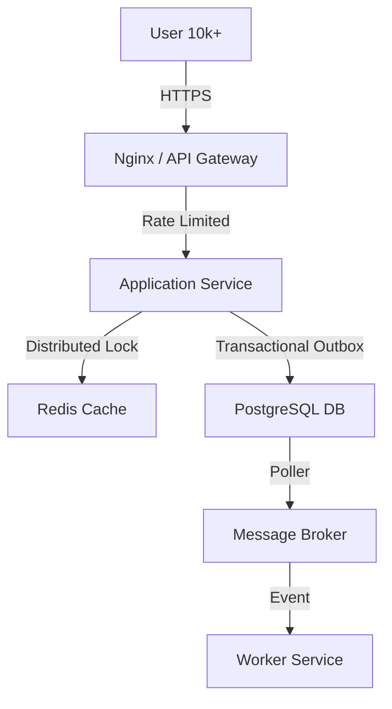

# 🏗️ Architectural Case Study: [System Name]

> **Founding Engineer Perspective: Scaling from 0 to 10k Concurrent Users**

## 🎯 The Mission
*Briefly describe the product and the business goal.*
*Example: "Build a real-time ticketing platform that survives the '10-minute rush' of 10k users booking seats simultaneously."*

## 📉 The Challenge (0 to 10k)
*Describe the technical bottlenecks you faced as the system scaled.*
*   **Concurrency**: Handling 10k simultaneous writes to the database.
*   **Latency**: P99 response time staying under 200ms during peak load.
*   **Reliability**: How to handle a node crash without losing customer data.

## 🏗️ The Architecture (Simplified)

## 🛠️ The "Founding Engineer" Solutions

### 1. Solving Concurrency with Distributed Locks
*   **Problem**: Race conditions during ticket selection.
*   **Solution**: Implemented a Redis-based **Distributed Lock** with heartbeats.
*   **Impact**: Zero double-booking errors during the peak 10k user window.

### 2. Event Reliability via Transactional Outbox
*   **Problem**: Orders being created but confirmation emails failing due to broker downtime.
*   **Solution**: Adopted the **Transactional Outbox Pattern** to ensure "At-Least-Once" delivery.
*   **Impact**: 100% order-to-email consistency rate.

### 3. Adaptive Load Shedding
*   **Problem**: High analytics traffic crashing the core booking engine.
*   **Solution**: Built a **Load Shedder** that rejects non-critical analytics pings when CPU hits 80%.
*   **Impact**: Core booking path remained stable even during 150% traffic surges.

## 🚀 Key Results & Metrics
- **Throughput**: 5,000+ Requests Per Second (RPS) sustained.
- **P99 Latency**: 180ms during 10k peak concurrency.
- **Uptime**: 99.95% during the first 6 months.

---

> **"A Senior Engineer doesn't just build a system that works in the lab; they build a system that survives the real world."**
